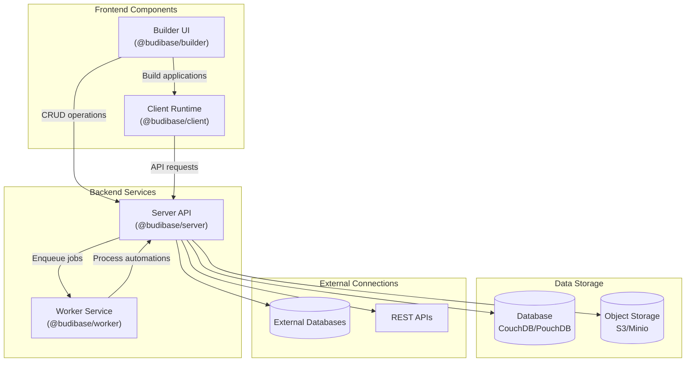
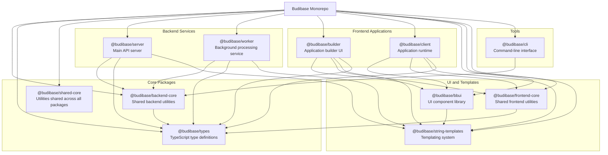
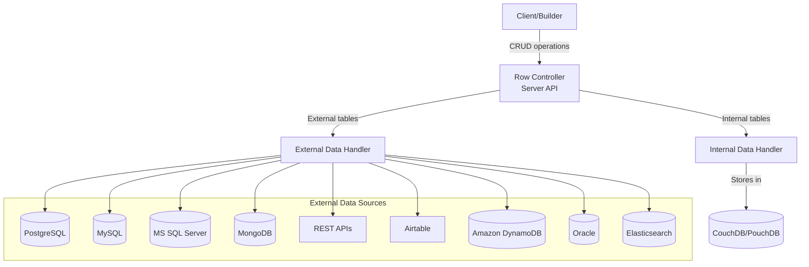
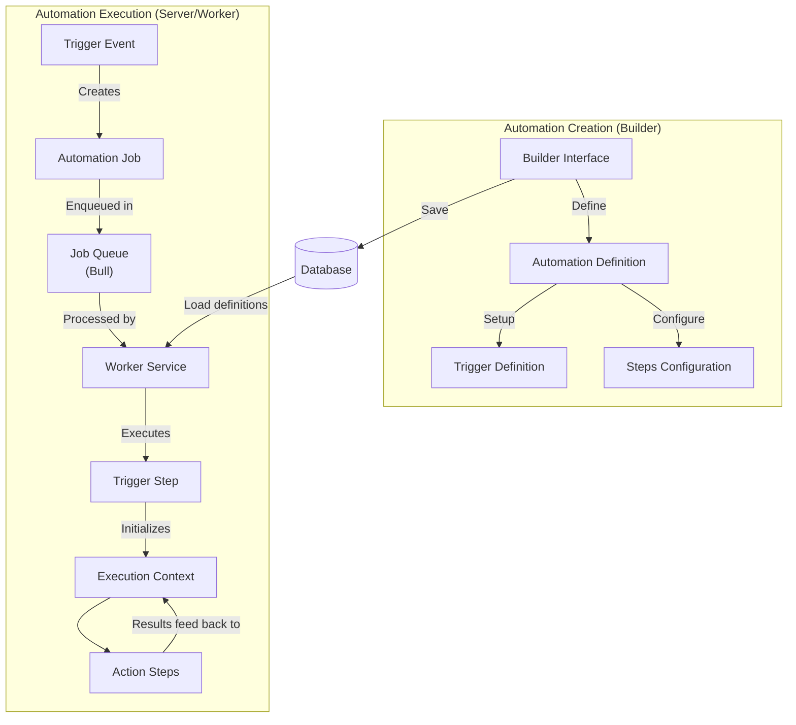
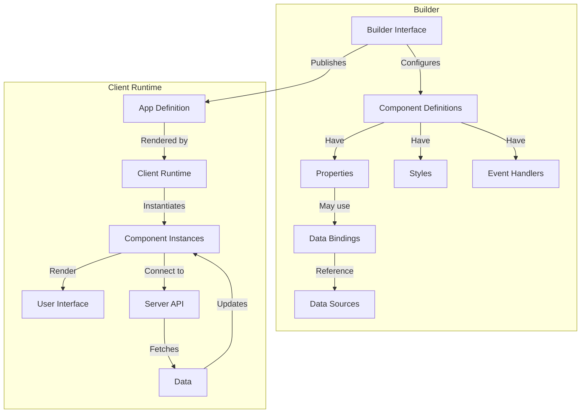
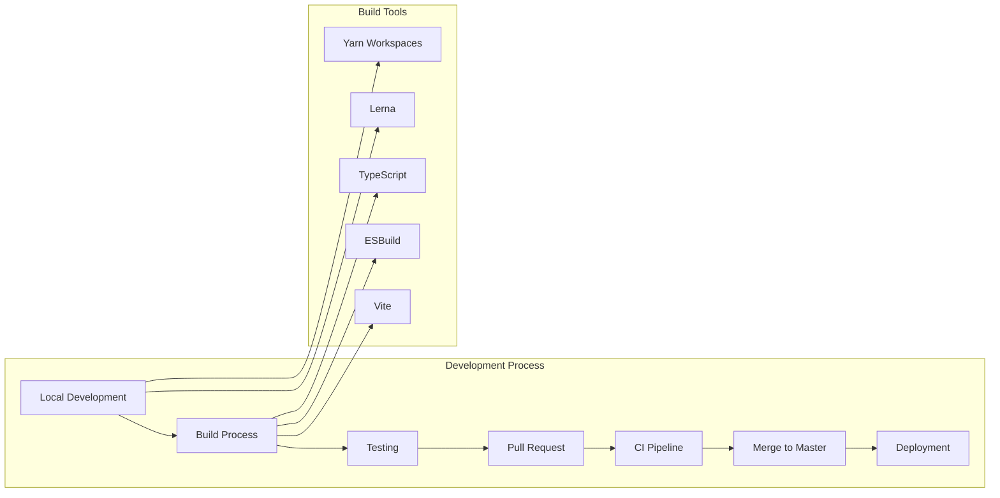

# Overview

Relevant source files

The following files were used as context for generating this wiki page:

- [.github/workflows/budibase_ci.yml](https://github.com/Budibase/budibase/blob/e981536b/.github/workflows/budibase_ci.yml)
- [.github/workflows/deploy-qa.yml](https://github.com/Budibase/budibase/blob/e981536b/.github/workflows/deploy-qa.yml)
- [hosting/scripts/linux/install-docker-compose.sh](https://github.com/Budibase/budibase/blob/e981536b/hosting/scripts/linux/install-docker-compose.sh)
- [hosting/scripts/linux/install-docker.sh](https://github.com/Budibase/budibase/blob/e981536b/hosting/scripts/linux/install-docker.sh)
- [lerna.json](https://github.com/Budibase/budibase/blob/e981536b/lerna.json)
- [package.json](https://github.com/Budibase/budibase/blob/e981536b/package.json)
- [packages/backend-core/package.json](https://github.com/Budibase/budibase/blob/e981536b/packages/backend-core/package.json)
- [packages/bbui/package.json](https://github.com/Budibase/budibase/blob/e981536b/packages/bbui/package.json)
- [packages/builder/CONTRIBUTING.md](https://github.com/Budibase/budibase/blob/e981536b/packages/builder/CONTRIBUTING.md)
- [packages/builder/package.json](https://github.com/Budibase/budibase/blob/e981536b/packages/builder/package.json)
- [packages/builder/src/pages/builder/app/[application]/settings/automations/index.svelte](packages/builder/src/pages/builder/app/[application]/settings/automations/index.svelte)
- [packages/cli/package.json](https://github.com/Budibase/budibase/blob/e981536b/packages/cli/package.json)
- [packages/client/package.json](https://github.com/Budibase/budibase/blob/e981536b/packages/client/package.json)
- [packages/frontend-core/package.json](https://github.com/Budibase/budibase/blob/e981536b/packages/frontend-core/package.json)
- [packages/server/package.json](https://github.com/Budibase/budibase/blob/e981536b/packages/server/package.json)
- [packages/string-templates/package.json](https://github.com/Budibase/budibase/blob/e981536b/packages/string-templates/package.json)
- [packages/types/package.json](https://github.com/Budibase/budibase/blob/e981536b/packages/types/package.json)
- [packages/worker/package.json](https://github.com/Budibase/budibase/blob/e981536b/packages/worker/package.json)
- [yarn.lock](https://github.com/Budibase/budibase/blob/e981536b/yarn.lock)

Budibase is an open-source low-code platform designed for building and deploying web applications with minimal coding. This document provides a high-level overview of the Budibase repository architecture, its core components, and how they interconnect to form a complete application development platform.

## Introduction to Budibase

Budibase enables users to rapidly build internal tools, CRUD applications, portals, and workflows through a visual builder interface. The platform consists of backend services, a builder UI, and a client runtime that together provide:

- Visual application design
- Data management and connections to external data sources
- Automated workflow creation and execution
- Component-based UI building
- User authentication and access control
- Application deployment and hosting

Sources: [packages/server/package.json:1-10](https://github.com/Budibase/budibase/blob/e981536b/packages/server/package.json#L1-L10), [packages/builder/package.json:1-7](https://github.com/Budibase/budibase/blob/e981536b/packages/builder/package.json#L1-L7), [packages/client/package.json:1-9](https://github.com/Budibase/budibase/blob/e981536b/packages/client/package.json#L1-L9)

## System Architecture

Budibase employs a microservices-like architecture that separates concerns between different components. The system is organized around two main backend services (server and worker) and two main frontend components (builder and client).

### Key Components:

1. **Server API (@budibase/server)**
   - Handles HTTP requests from both builder and client
   - Manages data operations (CRUD)
   - Connects to databases and external services
   - Provides authentication and authorization

2. **Worker Service (@budibase/worker)**
   - Processes background tasks
   - Handles automation execution
   - Manages scheduled operations
   - Processes email notifications and other asynchronous tasks

3. **Builder UI (@budibase/builder)**
   - Interface for designing applications
   - Configures screens, components, and data models
   - Sets up automations and workflows
   - Manages deployment and publishing

4. **Client Runtime (@budibase/client)**
   - Runtime for published applications
   - Renders application UI based on the app definition
   - Handles client-side data binding and events
   - Communicates with server API for data operations

Sources: [packages/server/package.json:1-45](https://github.com/Budibase/budibase/blob/e981536b/packages/server/package.json#L1-L45), [packages/worker/package.json:1-37](https://github.com/Budibase/budibase/blob/e981536b/packages/worker/package.json#L1-L37), [packages/builder/package.json:1-15](https://github.com/Budibase/budibase/blob/e981536b/packages/builder/package.json#L1-L15), [packages/client/package.json:1-18](https://github.com/Budibase/budibase/blob/e981536b/packages/client/package.json#L1-L18)

## Monorepo Structure

The Budibase codebase is organized as a monorepo using Yarn workspaces and Lerna for managing multiple packages. The repository contains several packages with well-defined responsibilities.

### Package Dependencies:

The following table outlines the key packages and their dependencies:

| Package | Purpose | Key Dependencies |
|---------|---------|------------------|
| @budibase/server | Main API server | backend-core, types, string-templates |
| @budibase/worker | Background processing | backend-core, types, string-templates |
| @budibase/builder | Application builder UI | bbui, frontend-core, string-templates, types |
| @budibase/client | Application runtime | bbui, frontend-core, string-templates, types |
| @budibase/backend-core | Shared backend utilities | types, shared-core |
| @budibase/frontend-core | Shared frontend utilities | bbui, types, shared-core |
| @budibase/bbui | UI component library | string-templates, shared-core |
| @budibase/types | TypeScript type definitions | - |
| @budibase/string-templates | Templating system | - |
| @budibase/cli | Command-line interface | backend-core, types |

Sources: [lerna.json:1-20](https://github.com/Budibase/budibase/blob/e981536b/lerna.json#L1-L20), [package.json:100-104](https://github.com/Budibase/budibase/blob/e981536b/package.json#L100-L104), [packages/server/package.json:51-139](https://github.com/Budibase/budibase/blob/e981536b/packages/server/package.json#L51-L139), [packages/worker/package.json:40-78](https://github.com/Budibase/budibase/blob/e981536b/packages/worker/package.json#L40-L78), [packages/builder/package.json:50-85](https://github.com/Budibase/budibase/blob/e981536b/packages/builder/package.json#L50-L85), [packages/client/package.json:22-38](https://github.com/Budibase/budibase/blob/e981536b/packages/client/package.json#L22-L38), [packages/bbui/package.json:31-83](https://github.com/Budibase/budibase/blob/e981536b/packages/bbui/package.json#L31-L83)

## Data Management System

Budibase applications can connect to a variety of data sources, both internal and external. The data management system provides a unified approach to handling data across these different sources.

Budibase stores its own application definitions, user data, and internal tables in CouchDB/PouchDB, while providing connectors to various external data sources. This allows applications to interact with existing systems and databases.

Sources: [packages/server/package.json:78-125](https://github.com/Budibase/budibase/blob/e981536b/packages/server/package.json#L78-L125)

## Automation System

One of Budibase's key features is its automation capability, which allows workflow automation without writing code. The automation system is primarily managed by the worker service.

The automation system consists of two main parts:
1. **Automation Definition** - Created in the Builder UI, defining triggers and steps
2. **Automation Execution** - Processed by the Worker service, executing the defined steps

Sources: [packages/worker/package.json:52-77](https://github.com/Budibase/budibase/blob/e981536b/packages/worker/package.json#L52-L77), [packages/server/package.json:66-67](https://github.com/Budibase/budibase/blob/e981536b/packages/server/package.json#L66-L67)

## Component System

The Budibase UI is built using a component-based approach, allowing users to construct interfaces by combining and configuring pre-built components.

The component system uses:
- **BBUI Library** - Base UI components from the `@budibase/bbui` package
- **Client Runtime** - Framework for rendering components in the `@budibase/client` package
- **Data Binding** - System for connecting components to data sources

Sources: [packages/bbui/package.json:31-83](https://github.com/Budibase/budibase/blob/e981536b/packages/bbui/package.json#L31-L83), [packages/client/package.json:22-38](https://github.com/Budibase/budibase/blob/e981536b/packages/client/package.json#L22-L38), [packages/builder/package.json:50-85](https://github.com/Budibase/budibase/blob/e981536b/packages/builder/package.json#L50-L85)

## Development Workflow

Budibase follows a structured development workflow managed through its monorepo structure. For more details about the development process, see [Development Workflow](#1.3).

The development workflow is supported by various tools and scripts defined in the package.json files. Common commands include:

- `yarn build` - Build all packages
- `yarn dev` - Start development servers
- `yarn test` - Run tests across packages

Sources: [package.json:38-98](https://github.com/Budibase/budibase/blob/e981536b/package.json#L38-L98), [.github/workflows/budibase_ci.yml:1-316](https://github.com/Budibase/budibase/blob/e981536b/.github/workflows/budibase_ci.yml#L1-L316)

## Conclusion

Budibase is a comprehensive low-code platform built with a modular architecture that separates concerns between server-side processing, background tasks, UI building, and application runtime. The monorepo structure facilitates development across multiple packages while maintaining clear dependencies.

For more detailed information about specific aspects of the system, refer to the following pages:
- [Architecture](#1.1) - Detailed system architecture
- [Package Structure](#1.2) - In-depth look at the package organization
- [Backend System](#2) - Server and worker architecture
- [Data Management](#3) - Data handling and storage
- [Automation System](#4) - Workflow automation