# Architecture

Relevant source files

The following files were used as context for generating this wiki page:

- [lerna.json](https://github.com/Budibase/budibase/blob/e981536b/lerna.json)
- [packages/backend-core/package.json](https://github.com/Budibase/budibase/blob/e981536b/packages/backend-core/package.json)
- [packages/backend-core/src/context/index.ts](https://github.com/Budibase/budibase/blob/e981536b/packages/backend-core/src/context/index.ts)
- [packages/backend-core/src/db/couch/index.ts](https://github.com/Budibase/budibase/blob/e981536b/packages/backend-core/src/db/couch/index.ts)
- [packages/backend-core/src/db/index.ts](https://github.com/Budibase/budibase/blob/e981536b/packages/backend-core/src/db/index.ts)
- [packages/backend-core/src/index.ts](https://github.com/Budibase/budibase/blob/e981536b/packages/backend-core/src/index.ts)
- [packages/bbui/package.json](https://github.com/Budibase/budibase/blob/e981536b/packages/bbui/package.json)
- [packages/bbui/src/Form/Core/index.js](https://github.com/Budibase/budibase/blob/e981536b/packages/bbui/src/Form/Core/index.js)
- [packages/builder/package.json](https://github.com/Budibase/budibase/blob/e981536b/packages/builder/package.json)
- [packages/cli/package.json](https://github.com/Budibase/budibase/blob/e981536b/packages/cli/package.json)
- [packages/client/package.json](https://github.com/Budibase/budibase/blob/e981536b/packages/client/package.json)
- [packages/client/tsconfig.json](https://github.com/Budibase/budibase/blob/e981536b/packages/client/tsconfig.json)
- [packages/frontend-core/package.json](https://github.com/Budibase/budibase/blob/e981536b/packages/frontend-core/package.json)
- [packages/server/package.json](https://github.com/Budibase/budibase/blob/e981536b/packages/server/package.json)
- [packages/string-templates/package.json](https://github.com/Budibase/budibase/blob/e981536b/packages/string-templates/package.json)
- [packages/types/package.json](https://github.com/Budibase/budibase/blob/e981536b/packages/types/package.json)
- [packages/worker/package.json](https://github.com/Budibase/budibase/blob/e981536b/packages/worker/package.json)

This document describes the high-level architecture of Budibase, explaining its component structure, service organization, and data flow. It focuses on how the various services and components interact to form the complete Budibase platform. For specific details about the package structure, see [Package Structure](#1.2).

## Overview

Budibase is a low-code platform built with a microservices-like architecture. The system is organized as a monorepo containing several interconnected packages that make up the full platform. At its core, Budibase uses a server-worker architecture pattern for backend operations and a builder-client model for frontend functionality.

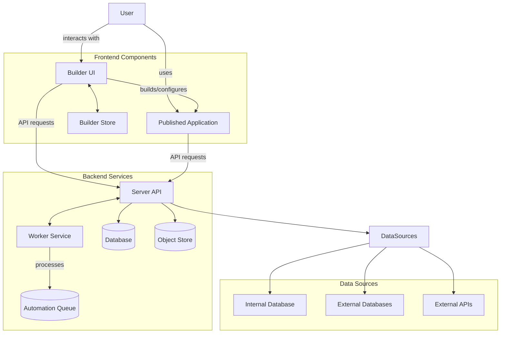

Sources: 
- `packages/server/package.json`
- `packages/worker/package.json`
- `packages/builder/package.json`
- `packages/client/package.json`

## Core Services

Budibase consists of two main backend services that handle all server-side operations.

### Server Service

The Server service is the primary API interface that handles client requests, data operations, and resource management. It serves as the central hub for all Budibase operations.

Key responsibilities:
- API endpoints for data operations
- Authentication and authorization
- Database connections and data management
- User management
- App deployment and publishing
- Serving web assets

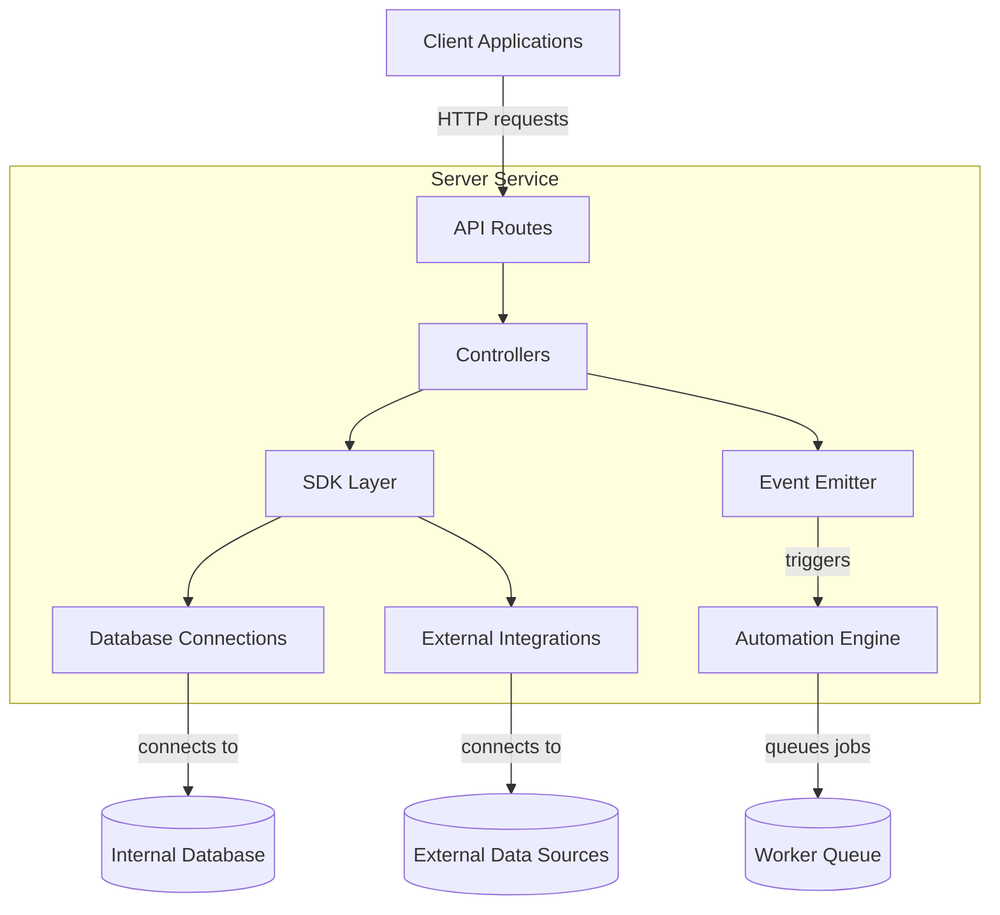

Sources:
- `packages/server/package.json`
- `packages/backend-core/src/index.ts`
- `packages/backend-core/src/db/index.ts`

### Worker Service

The Worker service handles background tasks, scheduled jobs, and automation processing. It operates independently from the Server service but shares common backend code.

Key responsibilities:
- Processing automation jobs
- Handling scheduled tasks
- Email sending
- Background data processing
- Long-running operations

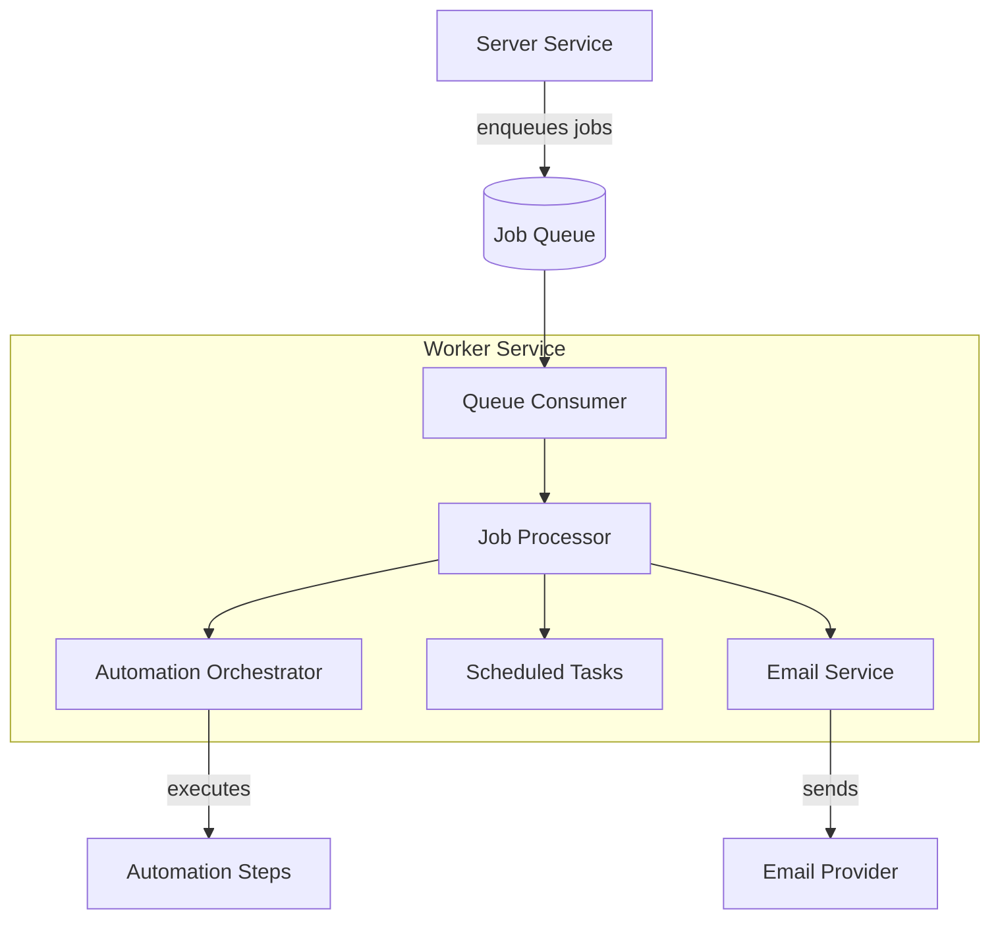

Sources:
- `packages/worker/package.json`
- `packages/backend-core/src/index.ts`

## Data Management

Budibase uses a sophisticated data management system that can work with both internal and external data sources.

### Database Architecture

The platform utilizes CouchDB/PouchDB as its primary internal database system, with the ability to connect to various external databases through integrations.

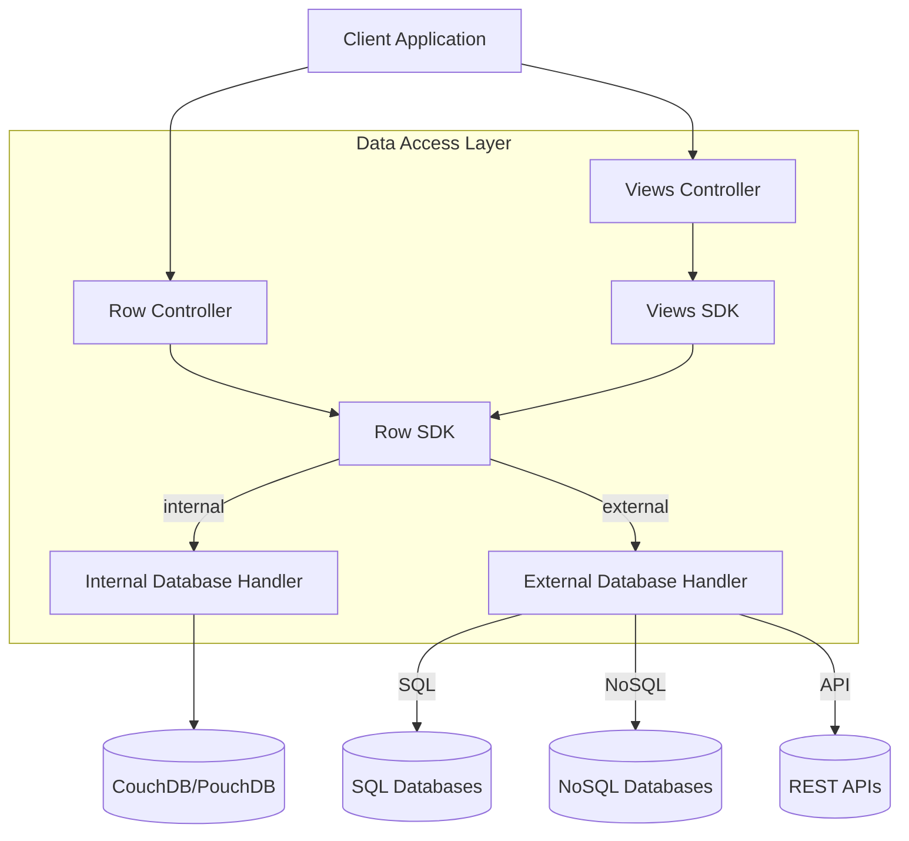

Sources:
- `packages/backend-core/src/db/index.ts`
- `packages/backend-core/src/db/couch/index.ts`

### Object Storage

For larger binary files and assets, Budibase uses an object storage system that can connect to S3-compatible storage providers.

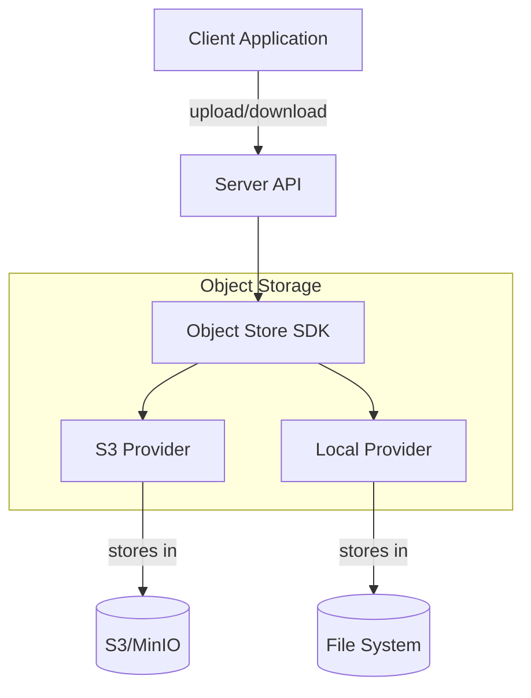

Sources:
- `packages/backend-core/src/index.ts` (references objectStore)

## Frontend Architecture

The frontend of Budibase consists of two main components: the Builder and the Client.

### Builder

The Builder is the application creation interface that developers use to design, configure, and deploy applications.

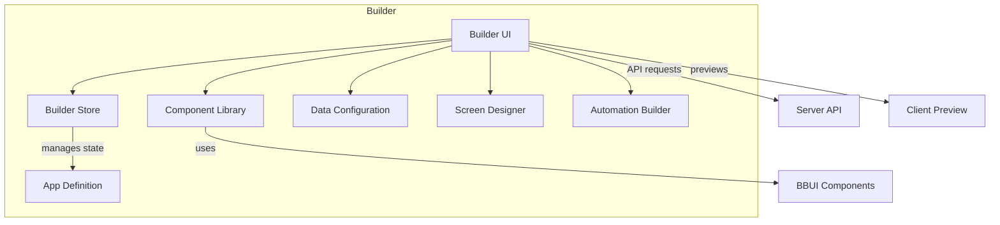

Sources:
- `packages/builder/package.json`
- `packages/bbui/package.json`
- `packages/bbui/src/Form/Core/index.js`

### Client

The Client is the runtime environment for published Budibase applications, responsible for rendering the application UI and handling user interactions.

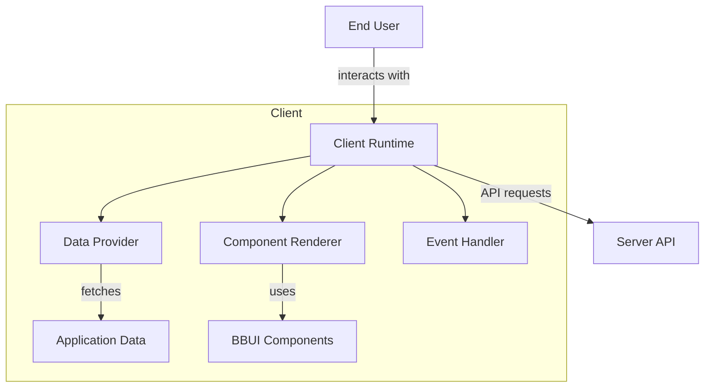

Sources:
- `packages/client/package.json`
- `packages/client/tsconfig.json`

## Automation System

The automation system allows users to create workflows that can be triggered by events, schedules, or manually.

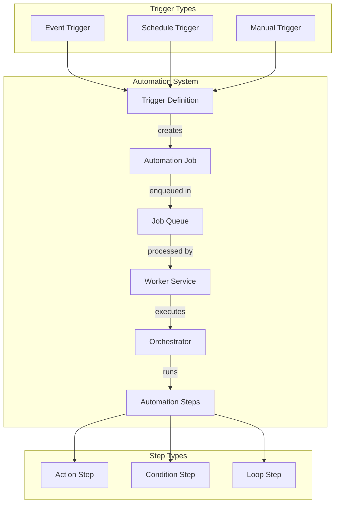

Sources:
- `packages/worker/package.json`
- `packages/backend-core/src/index.ts` (references queue)

## Component System

The component system is the foundation of the user interface in Budibase applications. It provides a library of pre-built components that can be configured and composed to create application screens.

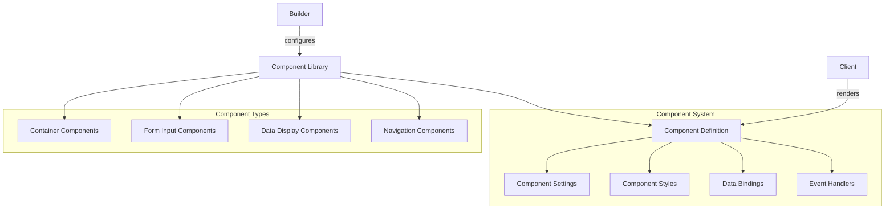

Sources:
- `packages/bbui/package.json`
- `packages/bbui/src/Form/Core/index.js`

## Data Binding and Templates

Budibase uses a data binding system that connects UI components to data sources and a templating system for dynamic content.

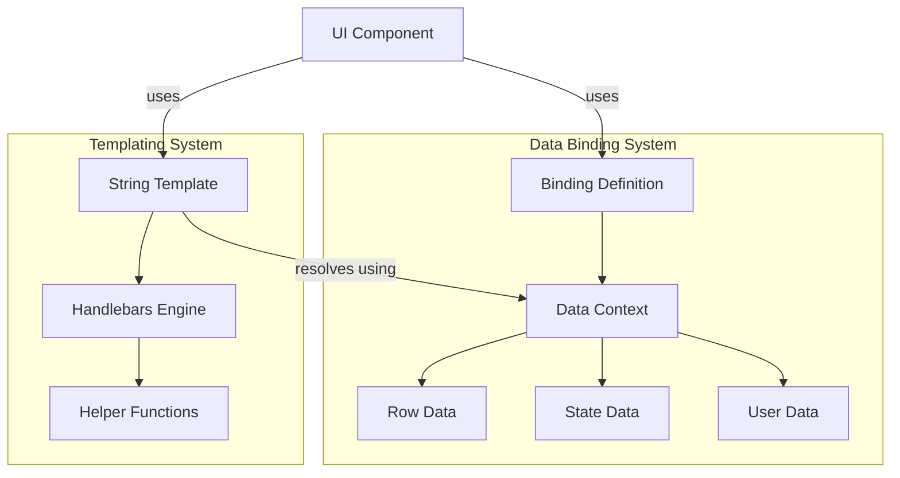

Sources:
- `packages/string-templates/package.json`
- `packages/frontend-core/package.json`

## Authentication and Authorization

Budibase includes a comprehensive security system for user authentication and authorization.

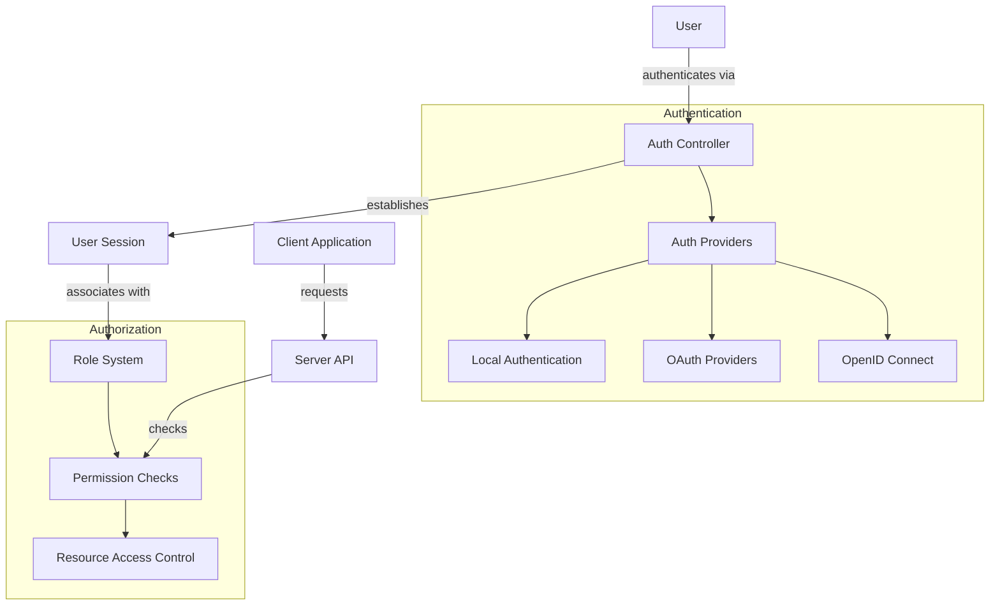

Sources:
- `packages/backend-core/src/index.ts` (references auth, roles, permissions)
- `packages/worker/package.json` (passport dependencies)

## Multi-tenancy and Environments

Budibase supports multi-tenancy for hosting multiple organizations and applications on a single installation.

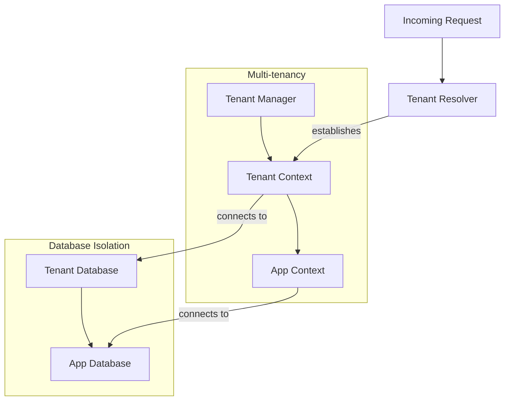

Sources:
- `packages/backend-core/src/context/index.ts`
- `packages/server/package.json` (multi-tenancy scripts)
- `packages/worker/package.json` (multi-tenancy scripts)

## Deployment Options

Budibase supports different deployment options, including self-hosting and cloud deployment.

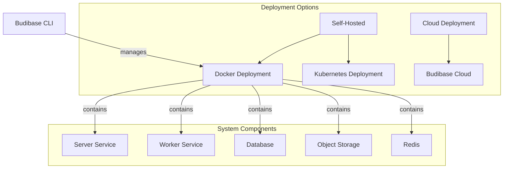

Sources:
- `packages/cli/package.json`
- `packages/server/package.json` (docker scripts)
- `packages/worker/package.json` (docker scripts)

## Summary

Budibase's architecture combines multiple specialized services that work together to provide a complete low-code application platform. The separation between server and worker services allows for efficient handling of both synchronous and asynchronous operations, while the builder and client components provide intuitive interfaces for application development and usage.