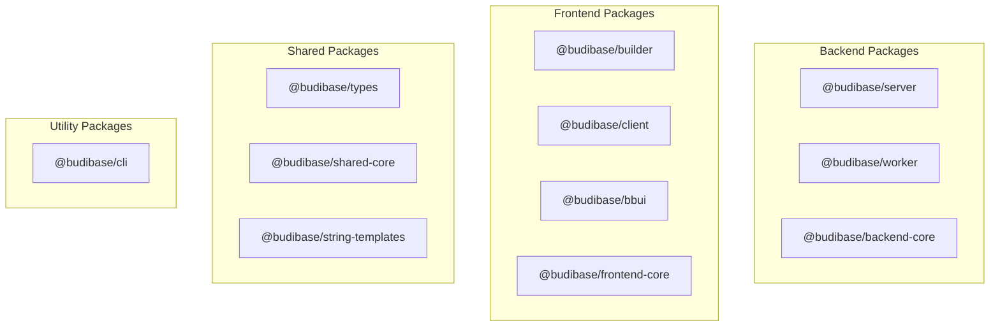
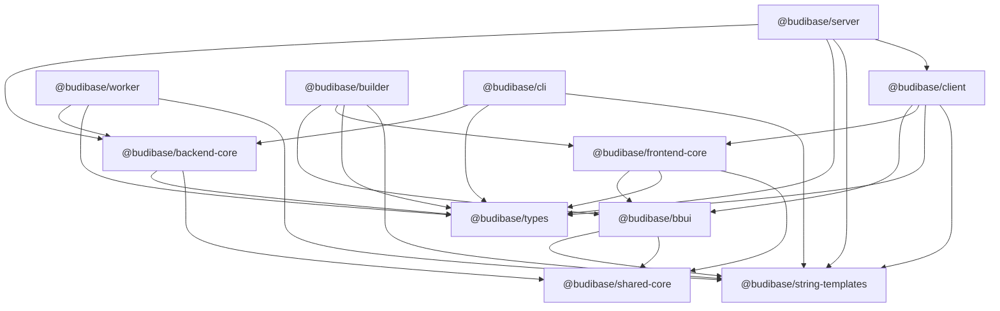
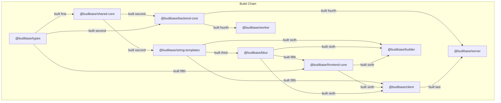

# Package Structure

<details>
<summary>Relevant source files</summary>

The following files were used as context for generating this wiki page:

- [lerna.json](https://github.com/Budibase/budibase/blob/e981536b/lerna.json)
- [packages/backend-core/package.json](https://github.com/Budibase/budibase/blob/e981536b/packages/backend-core/package.json)
- [packages/bbui/package.json](https://github.com/Budibase/budibase/blob/e981536b/packages/bbui/package.json)
- [packages/bbui/src/Form/Core/index.js](https://github.com/Budibase/budibase/blob/e981536b/packages/bbui/src/Form/Core/index.js)
- [packages/builder/package.json](https://github.com/Budibase/budibase/blob/e981536b/packages/builder/package.json)
- [packages/cli/package.json](https://github.com/Budibase/budibase/blob/e981536b/packages/cli/package.json)
- [packages/client/package.json](https://github.com/Budibase/budibase/blob/e981536b/packages/client/package.json)
- [packages/client/tsconfig.json](https://github.com/Budibase/budibase/blob/e981536b/packages/client/tsconfig.json)
- [packages/frontend-core/package.json](https://github.com/Budibase/budibase/blob/e981536b/packages/frontend-core/package.json)
- [packages/server/package.json](https://github.com/Budibase/budibase/blob/e981536b/packages/server/package.json)
- [packages/string-templates/package.json](https://github.com/Budibase/budibase/blob/e981536b/packages/string-templates/package.json)
- [packages/types/package.json](https://github.com/Budibase/budibase/blob/e981536b/packages/types/package.json)
- [packages/worker/package.json](https://github.com/Budibase/budibase/blob/e981536b/packages/worker/package.json)

</details>


This page details the monorepo structure of Budibase, the organization of its packages, and the dependencies between them. It provides technical information about how the codebase is structured and how the different components relate to each other. For information about the high-level architecture, see [Architecture](#1.1).

## Overview

Budibase is organized as a monorepo containing multiple packages managed with Lerna. This approach allows for code sharing between packages while maintaining clear boundaries between components. The packages are divided into several categories:

- **Backend Packages**: Server-side components that handle API requests, data storage, and background processing
- **Frontend Packages**: Client-side components for the application builder and runtime environments
- **Shared Packages**: Common utilities and type definitions used across both backend and frontend
- **Utility Packages**: Supporting tools and libraries



Sources: [lerna.json](https://github.com/Budibase/budibase/blob/e981536b/lerna.json), [packages/server/package.json](https://github.com/Budibase/budibase/blob/e981536b/packages/server/package.json), [packages/worker/package.json](https://github.com/Budibase/budibase/blob/e981536b/packages/worker/package.json), [packages/builder/package.json](https://github.com/Budibase/budibase/blob/e981536b/packages/builder/package.json), [packages/client/package.json](https://github.com/Budibase/budibase/blob/e981536b/packages/client/package.json), [packages/bbui/package.json](https://github.com/Budibase/budibase/blob/e981536b/packages/bbui/package.json), [packages/backend-core/package.json](https://github.com/Budibase/budibase/blob/e981536b/packages/backend-core/package.json), [packages/frontend-core/package.json](https://github.com/Budibase/budibase/blob/e981536b/packages/frontend-core/package.json), [packages/types/package.json](https://github.com/Budibase/budibase/blob/e981536b/packages/types/package.json), [packages/string-templates/package.json](https://github.com/Budibase/budibase/blob/e981536b/packages/string-templates/package.json), [packages/cli/package.json](https://github.com/Budibase/budibase/blob/e981536b/packages/cli/package.json)

## Package Dependencies

The dependency relationships between packages form a directed graph. The following diagram illustrates these dependencies, showing how packages build upon each other.



Sources: [packages/server/package.json:59-66](https://github.com/Budibase/budibase/blob/e981536b/packages/server/package.json#L59-L66), [packages/worker/package.json:41-45](https://github.com/Budibase/budibase/blob/e981536b/packages/worker/package.json#L41-L45), [packages/builder/package.json:51-56](https://github.com/Budibase/budibase/blob/e981536b/packages/builder/package.json#L51-L56), [packages/client/package.json:22-27](https://github.com/Budibase/budibase/blob/e981536b/packages/client/package.json#L22-L27), [packages/bbui/package.json:33-35](https://github.com/Budibase/budibase/blob/e981536b/packages/bbui/package.json#L33-L35), [packages/backend-core/package.json:38-39](https://github.com/Budibase/budibase/blob/e981536b/packages/backend-core/package.json#L38-L39), [packages/frontend-core/package.json:12-14](https://github.com/Budibase/budibase/blob/e981536b/packages/frontend-core/package.json#L12-L14), [packages/cli/package.json:18-21](https://github.com/Budibase/budibase/blob/e981536b/packages/cli/package.json#L18-L21)

## Core Packages

### Backend Packages

#### @budibase/server

The main server component that handles API requests, database operations, and serves the frontend applications. It implements the core API endpoints, manages database connections, and handles authentication and authorization.

**Key Dependencies:**
- Node.js server frameworks (Koa)
- Database adapters (PouchDB, MongoDB, PostgreSQL, etc.)
- Redis for caching and pub/sub
- Various external integrations

Sources: [packages/server/package.json:51-138](https://github.com/Budibase/budibase/blob/e981536b/packages/server/package.json#L51-L138)

#### @budibase/worker

A background processing service that handles asynchronous tasks, such as automation executions, scheduled jobs, email sending, and long-running operations. It helps offload work from the main server to ensure responsiveness.

**Key Dependencies:**
- Bull for job queue management
- Email sending libraries
- Automation execution engine

Sources: [packages/worker/package.json:40-78](https://github.com/Budibase/budibase/blob/e981536b/packages/worker/package.json#L40-L78)

#### @budibase/backend-core

Shared backend utilities and functionality used by both the server and worker. This includes database access methods, authentication helpers, caching utilities, and other common functionality.

**Key Dependencies:**
- PouchDB and database utilities
- Authentication libraries
- Redis clients
- AWS SDK for S3 storage

Sources: [packages/backend-core/package.json:32-74](https://github.com/Budibase/budibase/blob/e981536b/packages/backend-core/package.json#L32-L74)

### Frontend Packages

#### @budibase/builder

The application builder interface used by developers to create Budibase applications. This is a Svelte application that provides a visual editor for building screens, defining data sources, and configuring application behavior.

**Key Dependencies:**
- Svelte
- UI component library (@budibase/bbui)
- Code editors and visual design tools

Sources: [packages/builder/package.json:51-85](https://github.com/Budibase/budibase/blob/e981536b/packages/builder/package.json#L51-L85)

#### @budibase/client

The runtime for published Budibase applications. This is what end-users interact with when using applications created with Budibase. It handles data binding, component rendering, and interaction with the server API.

**Key Dependencies:**
- Svelte
- UI component library (@budibase/bbui)
- Data visualization libraries

Sources: [packages/client/package.json:22-38](https://github.com/Budibase/budibase/blob/e981536b/packages/client/package.json#L22-L38)

#### @budibase/bbui

A UI component library based on Adobe Spectrum design system. It provides reusable components used by both the builder and client applications.

**Key Dependencies:**
- Adobe Spectrum CSS components
- Svelte component wrappers

Sources: [packages/bbui/package.json:31-83](https://github.com/Budibase/budibase/blob/e981536b/packages/bbui/package.json#L31-L83), [packages/bbui/src/Form/Core/index.js](https://github.com/Budibase/budibase/blob/e981536b/packages/bbui/src/Form/Core/index.js)

#### @budibase/frontend-core

Shared frontend utilities and functionality used by both the builder and client applications. This includes state management, data binding helpers, and common UI utilities.

**Key Dependencies:**
- State management utilities
- Common UI helpers
- Communication with server API

Sources: [packages/frontend-core/package.json:11-19](https://github.com/Budibase/budibase/blob/e981536b/packages/frontend-core/package.json#L11-L19)

### Shared Packages

#### @budibase/types

TypeScript type definitions used across the entire codebase. This package ensures type consistency between frontend and backend components.

Sources: [packages/types/package.json](https://github.com/Budibase/budibase/blob/e981536b/packages/types/package.json)

#### @budibase/string-templates

A library for handling string templates using Handlebars. This is used for dynamic content generation, such as email templates, automation steps, and UI component text.

**Key Dependencies:**
- Handlebars templating engine
- Helper libraries for date formatting, string manipulation, etc.

Sources: [packages/string-templates/package.json:24-29](https://github.com/Budibase/budibase/blob/e981536b/packages/string-templates/package.json#L24-L29)

### Utility Packages

#### @budibase/cli

Command-line interface tools for Budibase, useful for developers, self-hosting, and database migrations.

**Key Dependencies:**
- Command parsing libraries
- Docker management tools
- Database migration utilities

Sources: [packages/cli/package.json:17-37](https://github.com/Budibase/budibase/blob/e981536b/packages/cli/package.json#L17-L37)

## Build System and Dependencies

The build process for each package is defined in its package.json file. Most packages use TypeScript for type checking and compilation. The general build process for a package includes:

1. Cleaning the output directory
2. Compiling TypeScript to JavaScript
3. Bundling assets (for frontend packages)
4. Copying necessary files



The build dependencies are managed through Nx configuration in package.json files, which ensures that dependent packages are built in the correct order.

Sources: [packages/server/package.json:190-223](https://github.com/Budibase/budibase/blob/e981536b/packages/server/package.json#L190-L223), [packages/worker/package.json:108-122](https://github.com/Budibase/budibase/blob/e981536b/packages/worker/package.json#L108-L122), [packages/builder/package.json:108-144](https://github.com/Budibase/budibase/blob/e981536b/packages/builder/package.json#L108-L144), [packages/client/package.json:48-73](https://github.com/Budibase/budibase/blob/e981536b/packages/client/package.json#L48-L73), [packages/bbui/package.json:88-101](https://github.com/Budibase/budibase/blob/e981536b/packages/bbui/package.json#L88-L101), [packages/backend-core/package.json:104-119](https://github.com/Budibase/budibase/blob/e981536b/packages/backend-core/package.json#L104-L119)

## Development Dependencies and Configuration

Each package defines its own development dependencies and configuration for tasks like:

- Type checking
- Testing
- Building
- Development mode with hot reloading

TypeScript configuration is managed in each package's tsconfig.json file, which often includes path mappings to allow importing from other packages in the monorepo.

```json
// Example path mapping from client's tsconfig.json
"paths": {
  "@budibase/*": [
    "../*/src/index.ts",
    "../*/src/index.js",
    "../*",
    "../../node_modules/@budibase/*"
  ]
}
```

Sources: [packages/client/tsconfig.json:11-17](https://github.com/Budibase/budibase/blob/e981536b/packages/client/tsconfig.json#L11-L17)

## Package Resolution

The Budibase monorepo uses Yarn workspaces and Lerna to manage package dependencies and versioning. This allows packages to depend on each other using the `*` version syntax, which simplifies development and ensures that all components always use compatible versions of shared packages.

For example:
```json
"dependencies": {
  "@budibase/backend-core": "*",
  "@budibase/types": "*"
}
```

This ensures that during development, changes to one package are immediately available to dependent packages without requiring version bumps.