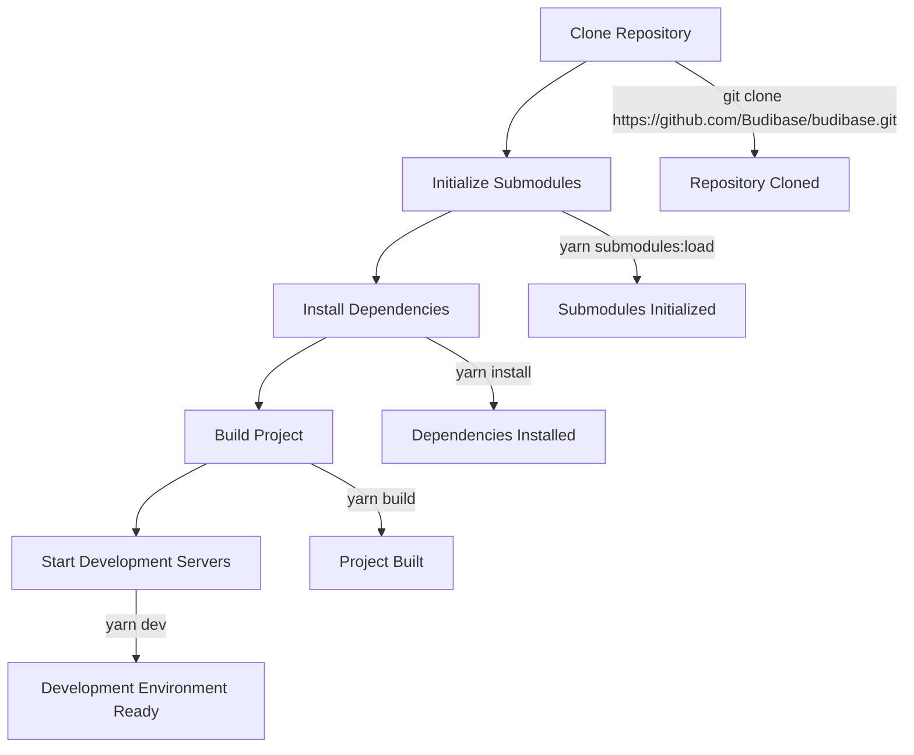
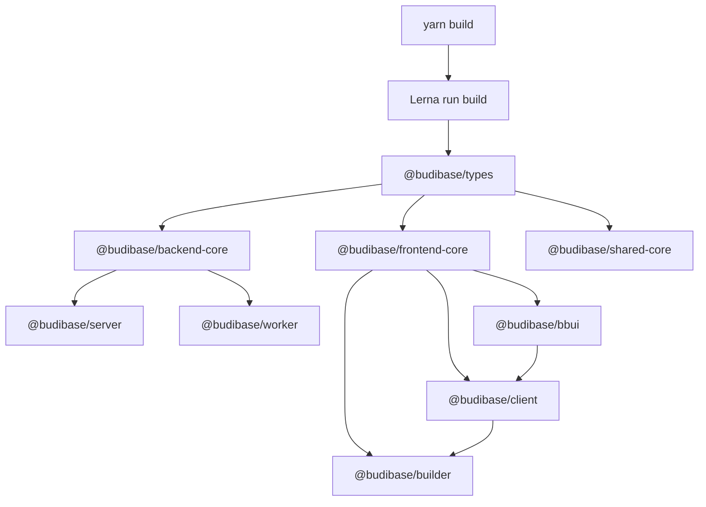
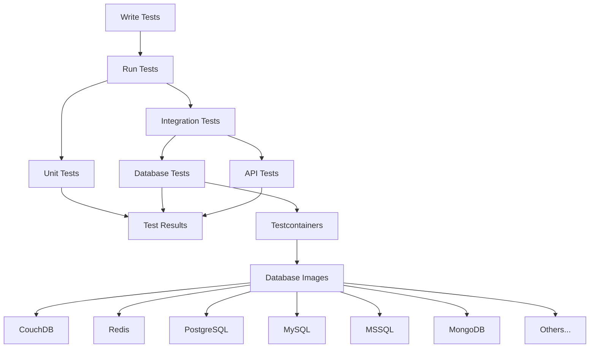
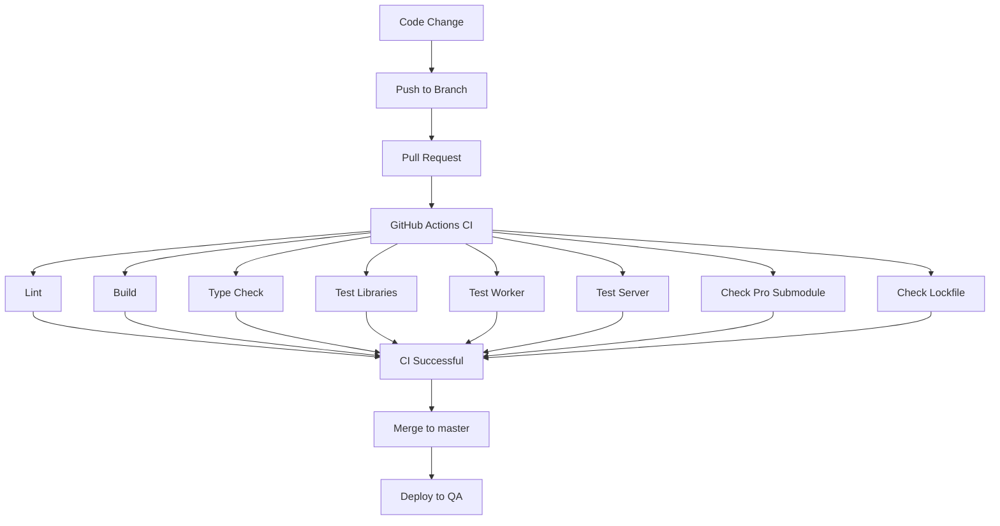

# Development Workflow

<details>
<summary>Relevant source files</summary>

The following files were used as context for generating this wiki page:

- [.github/workflows/budibase_ci.yml](https://github.com/Budibase/budibase/blob/e981536b/.github/workflows/budibase_ci.yml)
- [.github/workflows/deploy-qa.yml](https://github.com/Budibase/budibase/blob/e981536b/.github/workflows/deploy-qa.yml)
- [hosting/scripts/linux/install-docker-compose.sh](https://github.com/Budibase/budibase/blob/e981536b/hosting/scripts/linux/install-docker-compose.sh)
- [hosting/scripts/linux/install-docker.sh](https://github.com/Budibase/budibase/blob/e981536b/hosting/scripts/linux/install-docker.sh)
- [package.json](https://github.com/Budibase/budibase/blob/e981536b/package.json)
- [packages/bbui/src/Form/Core/index.js](https://github.com/Budibase/budibase/blob/e981536b/packages/bbui/src/Form/Core/index.js)
- [packages/builder/CONTRIBUTING.md](https://github.com/Budibase/budibase/blob/e981536b/packages/builder/CONTRIBUTING.md)
- [packages/builder/src/pages/builder/app/[application]/settings/automations/index.svelte](packages/builder/src/pages/builder/app/[application]/settings/automations/index.svelte)
- [packages/client/tsconfig.json](https://github.com/Budibase/budibase/blob/e981536b/packages/client/tsconfig.json)
- [yarn.lock](https://github.com/Budibase/budibase/blob/e981536b/yarn.lock)

</details>


This document outlines the development, build, testing, and deployment processes for the Budibase codebase. It provides guidance on setting up a development environment, explains daily development workflows, describes the build and test processes, and details how the CI/CD pipeline works.

For information about the architecture and system design, see [Architecture](#1.1). For details about the package structure, see [Package Structure](#1.2).

## Development Environment Setup

### Prerequisites

Before starting development on Budibase, ensure you have:

- Node.js 20.x (as specified in package.json engines)
- Yarn package manager
- Git
- Docker and Docker Compose (optional, for containerized development)

### Setup Process

The easiest way to set up a development environment is to use the provided setup script:

```bash
yarn setup
```

This script performs the following actions:
1. Configures Git submodules
2. Updates submodules
3. Runs the setup script
4. Installs dependencies with Yarn
5. Builds the project
6. Starts development servers



Sources: [package.json:40](https://github.com/Budibase/budibase/blob/e981536b/package.json#L40), [package.json:96-97](https://github.com/Budibase/budibase/blob/e981536b/package.json#L96-L97)

## Development Workflow

### Starting Development Servers

The main development command starts all necessary services:

```bash
yarn dev
```

This command:
1. Kills any running processes on the relevant ports
2. Runs prebuild tasks across packages
3. Starts all development servers in parallel using Lerna

Alternative development commands for specific use cases:

| Command | Purpose |
|---------|---------|
| `yarn dev:noserver` | Start only frontend services |
| `yarn dev:server` | Start only backend services |
| `yarn dev:built` | Start using pre-built services |
| `yarn dev:docker` | Start services in Docker containers |

Sources: [package.json:59-63](https://github.com/Budibase/budibase/blob/e981536b/package.json#L59-L63)

### Development Modes

Budibase supports different environment configurations:

| Command | Configuration |
|---------|---------------|
| `yarn mode:self` | Self-hosted mode |
| `yarn mode:cloud` | Cloud mode |
| `yarn mode:account` | Account portal mode |

Sources: [package.json:91-93](https://github.com/Budibase/budibase/blob/e981536b/package.json#L91-L93)

## Build System

### Build Process

Budibase uses Lerna to manage the build process across packages, ensuring they're built in the correct dependency order.



The main build commands:

| Command | Purpose |
|---------|---------|
| `yarn build` | Build all packages |
| `yarn build:apps` | Build only server and worker |
| `yarn build:client` | Build only the client package |
| `yarn build:dev` | Build with watch mode for development |

Sources: [package.json:41-48](https://github.com/Budibase/budibase/blob/e981536b/package.json#L41-L48)

### Type Checking

TypeScript type checking is performed independently from the build process:

```bash
yarn check:types
```

For pull requests, the CI system only checks types in packages affected by changes:

```bash
yarn check:types --since=$NX_BASE_BRANCH
```

Sources: [.github/workflows/budibase_ci.yml:70-76](https://github.com/Budibase/budibase/blob/e981536b/.github/workflows/budibase_ci.yml#L70-L76)

## Testing

### Running Tests

Tests are executed using Jest. The main test command runs tests across all packages:

```bash
yarn test
```

To test a specific package:

```bash
yarn test -- --scope=@budibase/server
```



Sources: [package.json:64-66](https://github.com/Budibase/budibase/blob/e981536b/package.json#L64-L66), [.github/workflows/budibase_ci.yml:91-257](https://github.com/Budibase/budibase/blob/e981536b/.github/workflows/budibase_ci.yml#L91-L257)

### Test Strategy

The CI process divides tests into three main jobs:

1. **Test Libraries** - Tests for utility packages and libraries
2. **Test Worker** - Tests specific to the worker package
3. **Test Server** - Tests server components across multiple datasource configurations

The server tests are run against multiple database backends including:
- PostgreSQL
- MySQL
- MSSQL
- MongoDB
- MariaDB
- Oracle
- SQS
- Elasticsearch
- DynamoDB

Sources: [.github/workflows/budibase_ci.yml:155-170](https://github.com/Budibase/budibase/blob/e981536b/.github/workflows/budibase_ci.yml#L155-L170)

## CI/CD Pipeline

Budibase uses GitHub Actions for continuous integration and deployment.



Sources: [.github/workflows/budibase_ci.yml:1-341](https://github.com/Budibase/budibase/blob/e981536b/.github/workflows/budibase_ci.yml#L1-L341), [.github/workflows/deploy-qa.yml:1-22](https://github.com/Budibase/budibase/blob/e981536b/.github/workflows/deploy-qa.yml#L1-L22)

### CI Workflow

The CI workflow runs on pull requests and pushes to the master branch. It includes the following jobs:

1. **Lint** - Enforces code style and formatting
2. **Build** - Ensures all packages can be built successfully
3. **Test Libraries** - Runs tests for shared packages
4. **Test Worker** - Tests automation worker functionality
5. **Test Server** - Tests server functionality against multiple datasources
6. **Check Pro Submodule** - Verifies pro submodule state (internal contributors)
7. **Check Lockfile** - Ensures yarn.lock is correctly maintained

Sources: [.github/workflows/budibase_ci.yml:32-341](https://github.com/Budibase/budibase/blob/e981536b/.github/workflows/budibase_ci.yml#L32-L341)

For pull requests, the CI system executes tests only on affected packages to optimize build times:

```yaml
if ${{ env.ONLY_AFFECTED_TASKS }}; then
  yarn test -- --ignore=@budibase/worker --ignore=@budibase/server --ignore=@budibase/builder --no-prefix --since=${{ env.NX_BASE_BRANCH }} -- --verbose --reporters=default --reporters=github-actions
  yarn test -- --scope=@budibase/builder --since=${{ env.NX_BASE_BRANCH }}
else
  yarn test -- --ignore=@budibase/worker --ignore=@budibase/server --ignore=@budibase/builder --no-prefix -- --verbose --reporters=default --reporters=github-actions
  yarn test -- --scope=@budibase/builder --no-prefix
fi
```

Sources: [.github/workflows/budibase_ci.yml:115-122](https://github.com/Budibase/budibase/blob/e981536b/.github/workflows/budibase_ci.yml#L115-L122)

### Deployment Process

When changes are merged to the master branch, a deployment workflow is triggered:

1. The workflow dispatches an event to the `budibase/budibase-deploys` repository
2. This triggers a deployment to the QA environment with the current commit SHA

Sources: [.github/workflows/deploy-qa.yml:10-22](https://github.com/Budibase/budibase/blob/e981536b/.github/workflows/deploy-qa.yml#L10-L22)

## Dependency Management

### Monorepo Structure

Budibase uses Yarn workspaces and Lerna to manage its monorepo structure:

```json
"workspaces": {
  "packages": [
    "packages/*"
  ]
}
```

Sources: [package.json:100-104](https://github.com/Budibase/budibase/blob/e981536b/package.json#L100-L104)

### Dependency Resolutions

Dependency versions are controlled at the root level through resolutions:

```json
"resolutions": {
  "@budibase/backend-core": "*",
  "@budibase/shared-core": "*",
  "@budibase/string-templates": "*",
  "@budibase/types": "*",
  "tough-cookie": "4.1.3",
  "node-fetch": "2.6.7",
  "semver": "7.5.3",
  // Other dependencies...
}
```

Sources: [package.json:105-123](https://github.com/Budibase/budibase/blob/e981536b/package.json#L105-L123)

### Managing Submodules

The project uses Git submodules for proprietary code components:

```bash
# Load submodules
yarn submodules:load

# Remove submodules
yarn submodules:unload
```

Sources: [package.json:96-97](https://github.com/Budibase/budibase/blob/e981536b/package.json#L96-L97)

## Linting and Code Style

### Linting Commands

The project uses ESLint and Prettier for code styling:

```bash
# Run all linting checks
yarn lint

# Fix linting issues automatically
yarn lint:fix
```

ESLint configuration files control code style rules, and the CI pipeline enforces these standards.

Sources: [package.json:66-71](https://github.com/Budibase/budibase/blob/e981536b/package.json#L66-L71)

## Troubleshooting

Common development issues can be resolved with the following commands:

| Command | Purpose |
|---------|---------|
| `yarn kill-builder` | Stop the builder process |
| `yarn kill-server` | Stop the server processes |
| `yarn kill-accountportal` | Stop the account portal |
| `yarn kill-all` | Stop all processes |
| `yarn restore` | Clean and rebuild the project |
| `yarn nuke` | Complete reset including Docker containers |
| `yarn test:containers:kill` | Kill any running test containers |

Sources: [package.json:55-58](https://github.com/Budibase/budibase/blob/e981536b/package.json#L55-L58), [package.json:50-54](https://github.com/Budibase/budibase/blob/e981536b/package.json#L50-L54), [package.json:66](https://github.com/Budibase/budibase/blob/e981536b/package.json#L66)

## Docker Development

For Docker-based development, the project includes various scripts:

```bash
# Start development with Docker
yarn dev:docker

# Build Docker images
yarn build:docker:single      # Build single image
yarn build:docker:dependencies # Build dependencies image
```

For Linux users, helper scripts are available to install Docker:

```bash
./hosting/scripts/linux/install-docker.sh
./hosting/scripts/linux/install-docker-compose.sh
```