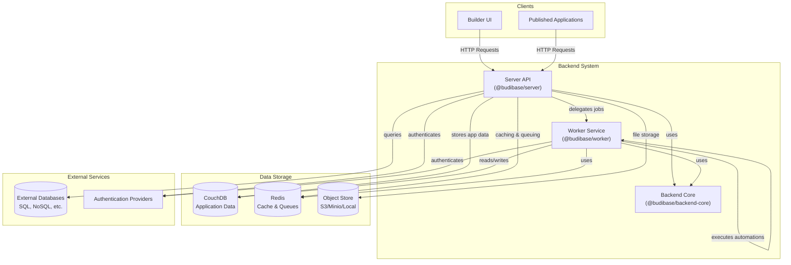
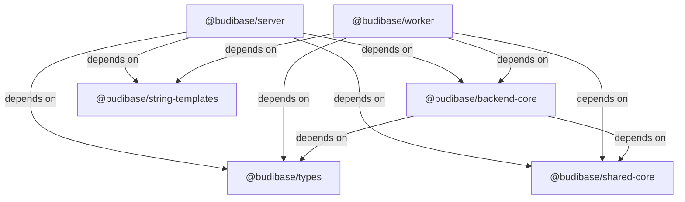
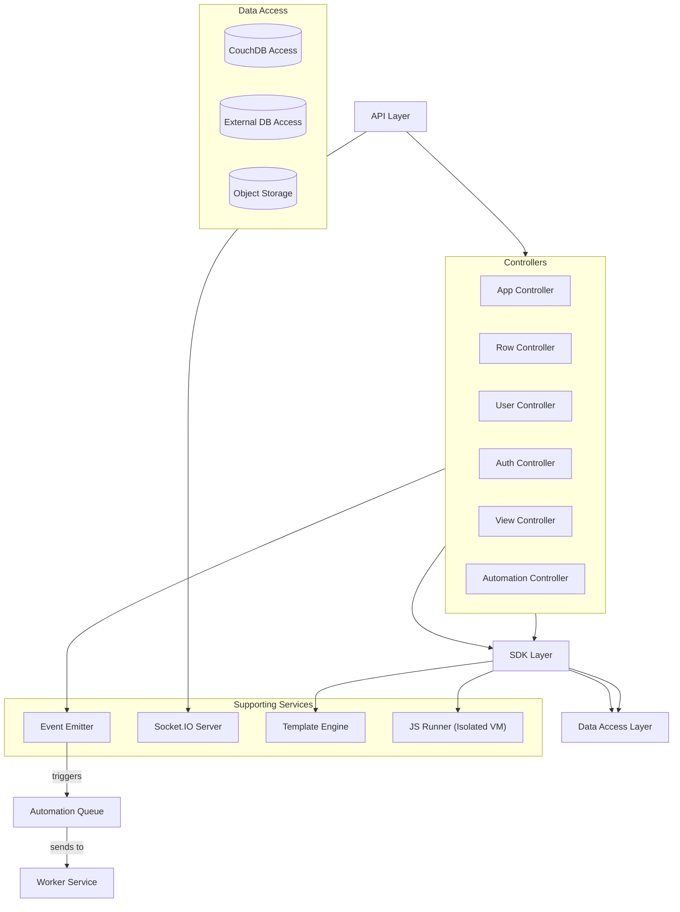
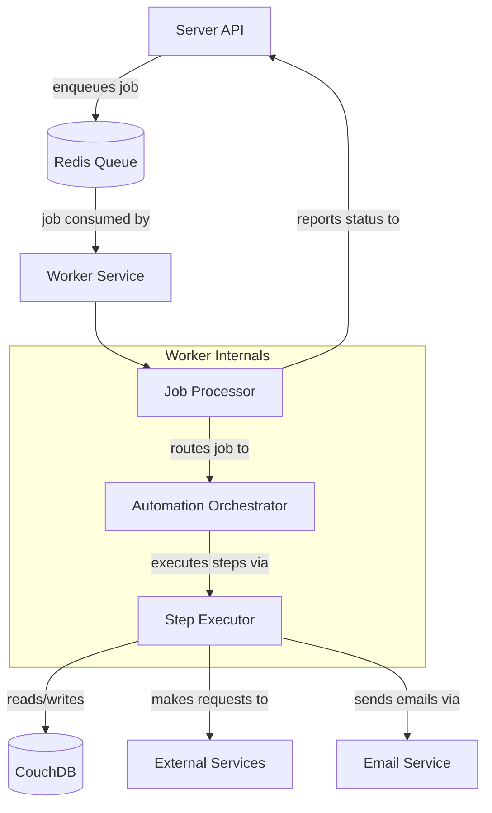
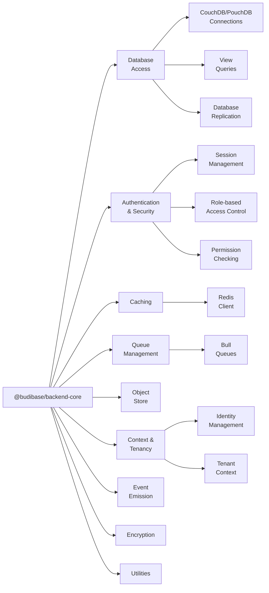
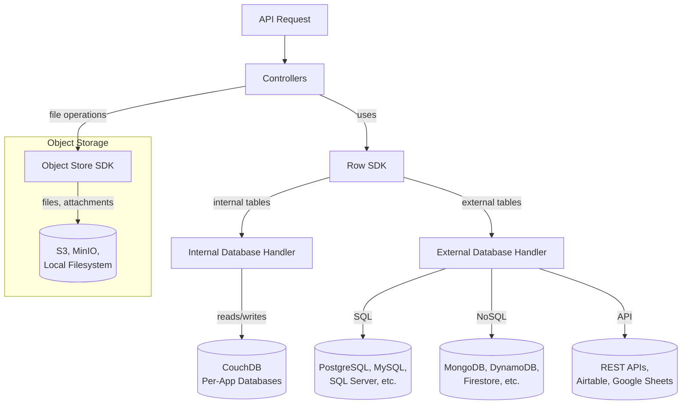
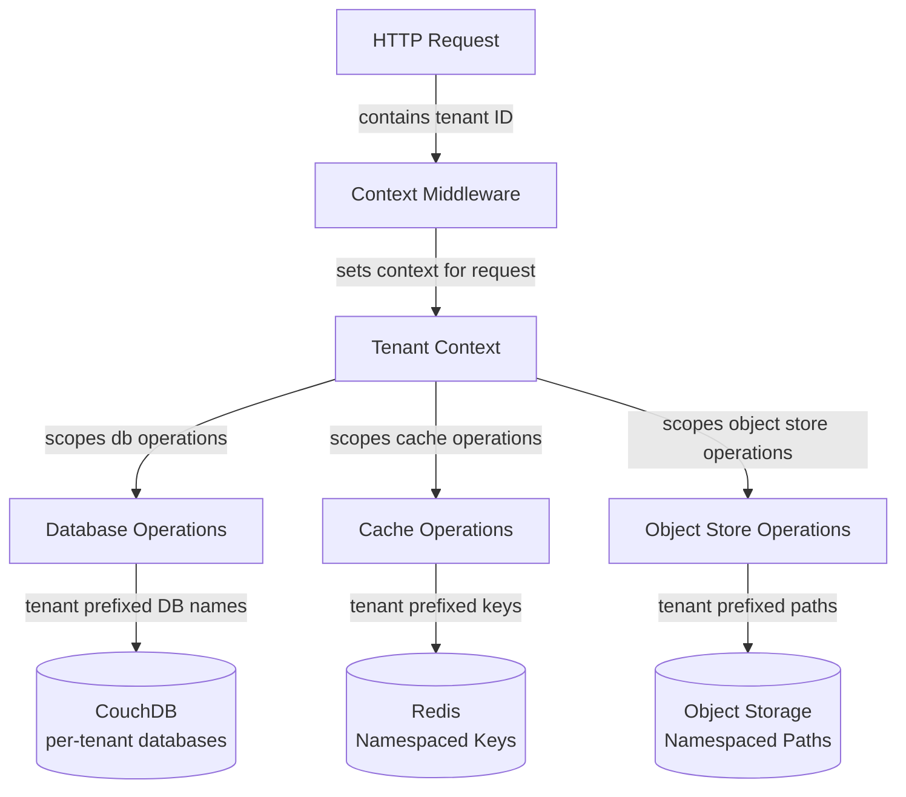
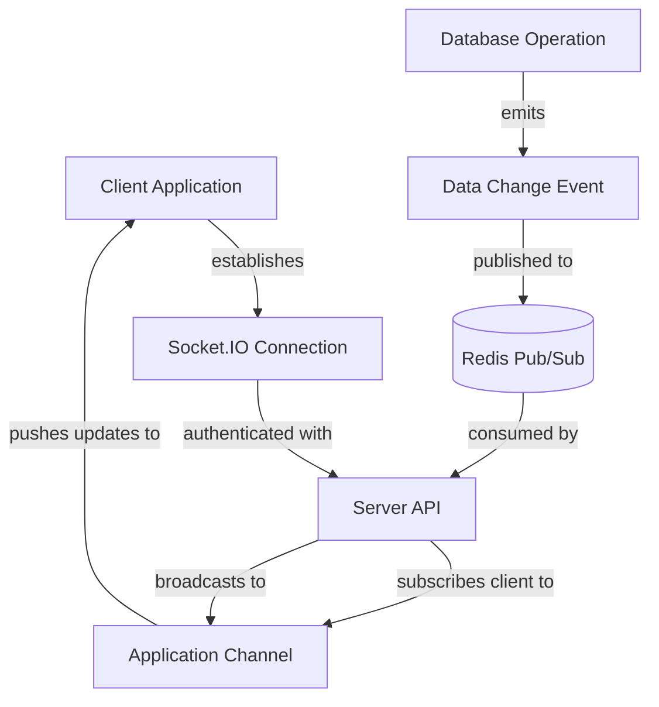

# Backend System

Relevant source files

The following files were used as context for generating this wiki page:

- [lerna.json](https://github.com/Budibase/budibase/blob/e981536b/lerna.json)
- [packages/backend-core/package.json](https://github.com/Budibase/budibase/blob/e981536b/packages/backend-core/package.json)
- [packages/backend-core/src/context/index.ts](https://github.com/Budibase/budibase/blob/e981536b/packages/backend-core/src/context/index.ts)
- [packages/backend-core/src/db/couch/index.ts](https://github.com/Budibase/budibase/blob/e981536b/packages/backend-core/src/db/couch/index.ts)
- [packages/backend-core/src/db/index.ts](https://github.com/Budibase/budibase/blob/e981536b/packages/backend-core/src/db/index.ts)
- [packages/backend-core/src/index.ts](https://github.com/Budibase/budibase/blob/e981536b/packages/backend-core/src/index.ts)
- [packages/bbui/package.json](https://github.com/Budibase/budibase/blob/e981536b/packages/bbui/package.json)
- [packages/builder/package.json](https://github.com/Budibase/budibase/blob/e981536b/packages/builder/package.json)
- [packages/cli/package.json](https://github.com/Budibase/budibase/blob/e981536b/packages/cli/package.json)
- [packages/client/package.json](https://github.com/Budibase/budibase/blob/e981536b/packages/client/package.json)
- [packages/frontend-core/package.json](https://github.com/Budibase/budibase/blob/e981536b/packages/frontend-core/package.json)
- [packages/server/package.json](https://github.com/Budibase/budibase/blob/e981536b/packages/server/package.json)
- [packages/string-templates/package.json](https://github.com/Budibase/budibase/blob/e981536b/packages/string-templates/package.json)
- [packages/types/package.json](https://github.com/Budibase/budibase/blob/e981536b/packages/types/package.json)
- [packages/worker/package.json](https://github.com/Budibase/budibase/blob/e981536b/packages/worker/package.json)

The Backend System of Budibase forms the core server-side infrastructure that powers the low-code platform. This document describes the architecture and components of the backend system, which consists of the Server API, Worker Service, and shared backend modules. For information about data management and operations, see [Data Management](#3), and for automation details, see [Automation System](#4).

## Overview

Budibase's backend system uses a microservices-like architecture with two primary components:

- **Server API**: Handles HTTP requests, manages application data, and provides API endpoints for the builder and published applications
- **Worker Service**: Processes background tasks, executes automation jobs, and handles resource-intensive operations

Both components share common functionality through the `@budibase/backend-core` package, which provides utilities for database access, authentication, caching, and more.

Sources:
- [packages/server/package.json:1-225](https://github.com/Budibase/budibase/blob/e981536b/packages/server/package.json#L1-L225)
- [packages/worker/package.json:1-123](https://github.com/Budibase/budibase/blob/e981536b/packages/worker/package.json#L1-L123)
- [packages/backend-core/package.json:1-119](https://github.com/Budibase/budibase/blob/e981536b/packages/backend-core/package.json#L1-L119)

## Backend Architecture

### High-Level Architecture

The Server and Worker components share a common architecture pattern:
- Both run as Node.js services
- Both use the same core libraries from `@budibase/backend-core`
- Both interact with CouchDB for data storage and Redis for caching/messaging

The primary difference is their responsibility: the Server handles real-time API requests while the Worker processes background tasks.

Sources:
- [packages/server/package.json:50-138](https://github.com/Budibase/budibase/blob/e981536b/packages/server/package.json#L50-L138)
- [packages/worker/package.json:40-78](https://github.com/Budibase/budibase/blob/e981536b/packages/worker/package.json#L40-L78)
- [packages/backend-core/package.json:32-74](https://github.com/Budibase/budibase/blob/e981536b/packages/backend-core/package.json#L32-L74)

### Package Dependencies

The backend packages form a hierarchy with `@budibase/types` providing common type definitions, `@budibase/backend-core` providing shared functionality, and `@budibase/server` and `@budibase/worker` implementing specific services.

Sources:
- [packages/server/package.json:51-138](https://github.com/Budibase/budibase/blob/e981536b/packages/server/package.json#L51-L138)
- [packages/worker/package.json:40-78](https://github.com/Budibase/budibase/blob/e981536b/packages/worker/package.json#L40-L78)
- [packages/backend-core/package.json:32-74](https://github.com/Budibase/budibase/blob/e981536b/packages/backend-core/package.json#L32-L74)
- [lerna.json:1-20](https://github.com/Budibase/budibase/blob/e981536b/lerna.json#L1-L20)

## Server Component

The Server component (`@budibase/server`) is the primary entry point for API requests from both the builder interface and published applications. It provides RESTful APIs for:

- Application management (CRUD operations)
- Data management (tables, rows, views)
- User authentication and authorization
- File management
- Real-time data synchronization

### Key Modules

The Server exposes numerous modules for handling different aspects of the application:

The Server includes several specialized components:
- **JS Runner**: Executes JavaScript in isolated environments using `isolated-vm`
- **Template Engine**: Processes Handlebars templates using `@budibase/string-templates`
- **Socket.IO**: Provides real-time updates to clients

Sources:
- [packages/server/package.json:51-138](https://github.com/Budibase/budibase/blob/e981536b/packages/server/package.json#L51-L138)
- [packages/backend-core/src/index.ts:1-59](https://github.com/Budibase/budibase/blob/e981536b/packages/backend-core/src/index.ts#L1-L59)

## Worker Component

The Worker component (`@budibase/worker`) handles background tasks and resource-intensive operations to prevent blocking the main server. Its primary responsibilities include:

- Executing automation workflows
- Processing queued jobs using Bull
- Handling email notifications
- User management and authentication-related tasks
- Scheduled tasks

### Automation Processing Architecture

The Worker leverages Bull (backed by Redis) for job queue management, ensuring:
- Job persistence in case of crashes
- Retries for failed jobs
- Job scheduling
- Job prioritization

Sources:
- [packages/worker/package.json:40-78](https://github.com/Budibase/budibase/blob/e981536b/packages/worker/package.json#L40-L78)
- [packages/backend-core/package.json:32-74](https://github.com/Budibase/budibase/blob/e981536b/packages/backend-core/package.json#L32-L74)

## Backend Core

The `@budibase/backend-core` package provides shared functionality used by both the Server and Worker components. It contains modules for:

Key functionality provided by Backend Core:

1. **Database Access**: CouchDB/PouchDB connections, query building, replication
2. **Authentication**: User management, session handling, role-based access control
3. **Caching**: Redis-based caching for performance optimization
4. **Queue Management**: Bull queues backed by Redis
5. **Context Management**: Multi-tenant context handling
6. **Object Storage**: S3-compatible storage abstraction

Sources:
- [packages/backend-core/src/index.ts:1-59](https://github.com/Budibase/budibase/blob/e981536b/packages/backend-core/src/index.ts#L1-L59)
- [packages/backend-core/src/context/index.ts:1-4](https://github.com/Budibase/budibase/blob/e981536b/packages/backend-core/src/context/index.ts#L1-L4)
- [packages/backend-core/src/db/index.ts:1-13](https://github.com/Budibase/budibase/blob/e981536b/packages/backend-core/src/db/index.ts#L1-L13)
- [packages/backend-core/src/db/couch/index.ts:1-5](https://github.com/Budibase/budibase/blob/e981536b/packages/backend-core/src/db/couch/index.ts#L1-L5)

## Database Architecture

Budibase uses a multi-database architecture:

1. **CouchDB/PouchDB**: Primary data store for application data
   - Each application has its own database
   - Global database for tenant/user management
   
2. **Redis**: Used for:
   - Caching
   - Job queues
   - Session storage
   - Pub/sub messaging
   
3. **External Databases**: Integrated through connectors:
   - SQL: PostgreSQL, MySQL, SQL Server, Oracle, SQLite
   - NoSQL: MongoDB, DynamoDB, Firestore
   - Spreadsheets: Google Sheets, Airtable
   - Other data sources via REST APIs

### Database Access Layer

The database layer is abstracted to provide a consistent interface regardless of whether data is stored internally in CouchDB or in external data sources.

Sources:
- [packages/server/package.json:51-138](https://github.com/Budibase/budibase/blob/e981536b/packages/server/package.json#L51-L138)
- [packages/backend-core/src/db/index.ts:1-13](https://github.com/Budibase/budibase/blob/e981536b/packages/backend-core/src/db/index.ts#L1-L13)
- [packages/backend-core/package.json:32-74](https://github.com/Budibase/budibase/blob/e981536b/packages/backend-core/package.json#L32-L74)

## Multi-Tenancy Architecture

Budibase supports multi-tenancy, allowing multiple organizations to use the same Budibase instance with data isolation. The tenant context system ensures data separation:

The tenant context system ensures:
- Data isolation between tenants
- Proper routing of requests to tenant-specific resources
- Simplified code that doesn't need to handle tenant routing explicitly

Sources:
- [packages/backend-core/src/context/index.ts:1-4](https://github.com/Budibase/budibase/blob/e981536b/packages/backend-core/src/context/index.ts#L1-L4)
- [packages/backend-core/src/index.ts:36-45](https://github.com/Budibase/budibase/blob/e981536b/packages/backend-core/src/index.ts#L36-L45)

## Real-time Communication

Budibase implements real-time updates using Socket.IO backed by Redis for pub/sub communication:

This architecture enables:
- Real-time data synchronization across clients
- Notifications for data changes
- Support for collaborative features

Sources:
- [packages/server/package.json:106-130](https://github.com/Budibase/budibase/blob/e981536b/packages/server/package.json#L106-L130)
- [packages/backend-core/package.json:57-63](https://github.com/Budibase/budibase/blob/e981536b/packages/backend-core/package.json#L57-L63)

## Integration with Frontend

The backend system provides API endpoints that interface with the frontend components:

1. **Builder Interface**: Makes API calls to design and configure applications
2. **Published Applications**: Makes API calls to fetch and manipulate data
3. **Client Library**: Provides JavaScript bindings for API interaction

The API layer is RESTful with some WebSocket capabilities for real-time updates. Authentication is typically handled through JWT tokens.

Sources:
- [packages/server/package.json:51-138](https://github.com/Budibase/budibase/blob/e981536b/packages/server/package.json#L51-L138)
- [packages/client/package.json:1-74](https://github.com/Budibase/budibase/blob/e981536b/packages/client/package.json#L1-L74)
- [packages/builder/package.json:1-145](https://github.com/Budibase/budibase/blob/e981536b/packages/builder/package.json#L1-L145)

## Backend Development Workflow

The backend services are built using TypeScript and follow a modular architecture. The development workflow typically involves:

1. Running services with `yarn dev` for hot reloading
2. Building with `yarn build` for production
3. Testing with Jest through `yarn test`

Both server and worker can run independently or together, with communication through Redis for coordination.

Sources:
- [packages/server/package.json:11-44](https://github.com/Budibase/budibase/blob/e981536b/packages/server/package.json#L11-L44)
- [packages/worker/package.json:14-36](https://github.com/Budibase/budibase/blob/e981536b/packages/worker/package.json#L14-L36)