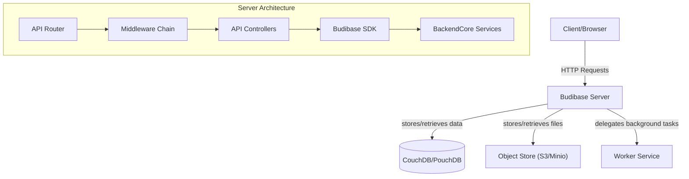
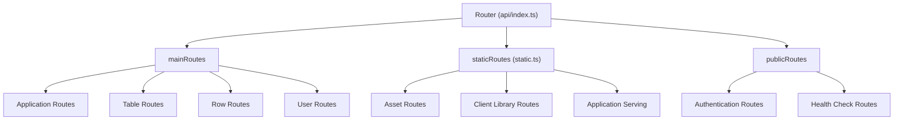
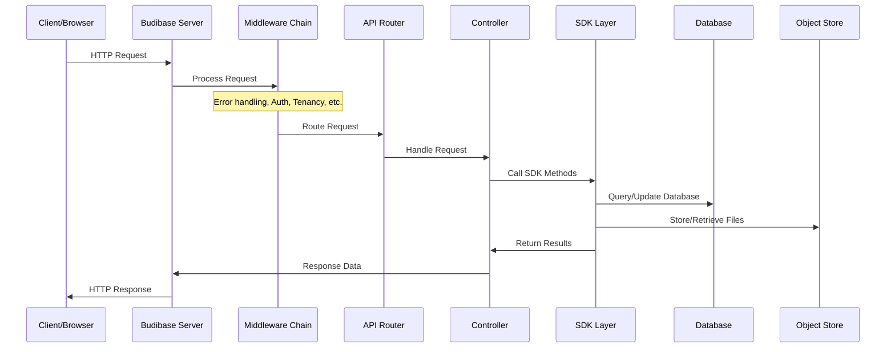
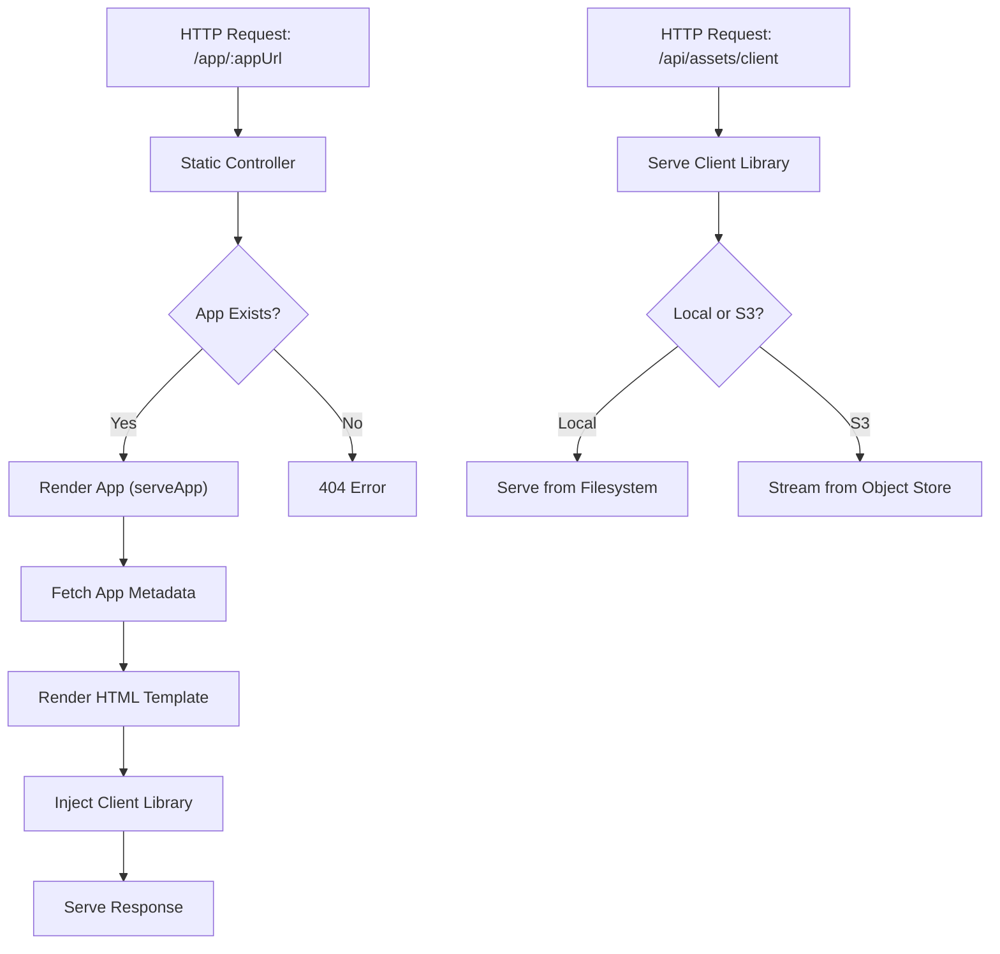
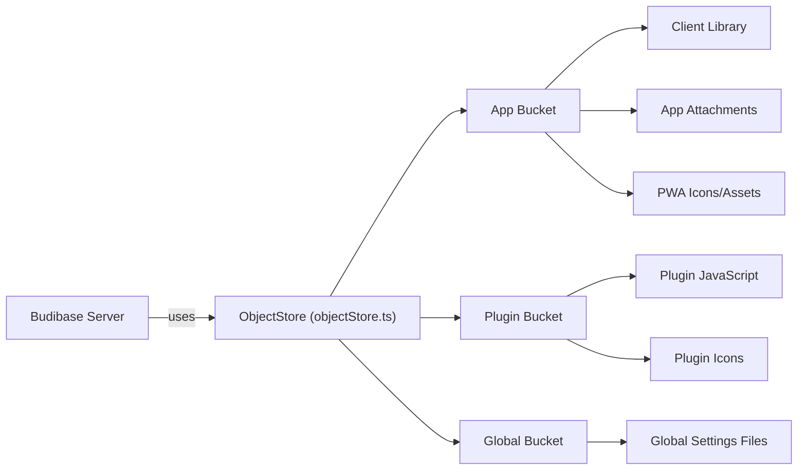

# Server Architecture

Relevant source files

The following files were used as context for generating this wiki page:

- [lerna.json](https://github.com/Budibase/budibase/blob/e981536b/lerna.json)
- [packages/backend-core/__mocks__/@aws-sdk/client-s3.ts](https://github.com/Budibase/budibase/blob/e981536b/packages/backend-core/__mocks__/@aws-sdk/client-s3.ts)
- [packages/backend-core/__mocks__/@aws-sdk/s3-request-presigner.ts](https://github.com/Budibase/budibase/blob/e981536b/packages/backend-core/__mocks__/@aws-sdk/s3-request-presigner.ts)
- [packages/backend-core/package.json](https://github.com/Budibase/budibase/blob/e981536b/packages/backend-core/package.json)
- [packages/backend-core/src/objectStore/buckets/app.ts](https://github.com/Budibase/budibase/blob/e981536b/packages/backend-core/src/objectStore/buckets/app.ts)
- [packages/backend-core/src/objectStore/buckets/global.ts](https://github.com/Budibase/budibase/blob/e981536b/packages/backend-core/src/objectStore/buckets/global.ts)
- [packages/backend-core/src/objectStore/buckets/plugins.ts](https://github.com/Budibase/budibase/blob/e981536b/packages/backend-core/src/objectStore/buckets/plugins.ts)
- [packages/backend-core/src/objectStore/buckets/tests/app.spec.ts](https://github.com/Budibase/budibase/blob/e981536b/packages/backend-core/src/objectStore/buckets/tests/app.spec.ts)
- [packages/backend-core/src/objectStore/buckets/tests/global.spec.ts](https://github.com/Budibase/budibase/blob/e981536b/packages/backend-core/src/objectStore/buckets/tests/global.spec.ts)
- [packages/backend-core/src/objectStore/objectStore.ts](https://github.com/Budibase/budibase/blob/e981536b/packages/backend-core/src/objectStore/objectStore.ts)
- [packages/bbui/package.json](https://github.com/Budibase/budibase/blob/e981536b/packages/bbui/package.json)
- [packages/bbui/src/Form/Core/File.svelte](https://github.com/Budibase/budibase/blob/e981536b/packages/bbui/src/Form/Core/File.svelte)
- [packages/bbui/src/Form/File.svelte](https://github.com/Budibase/budibase/blob/e981536b/packages/bbui/src/Form/File.svelte)
- [packages/builder/package.json](https://github.com/Budibase/budibase/blob/e981536b/packages/builder/package.json)
- [packages/builder/src/pages/builder/app/[application]/settings/pwa.svelte](packages/builder/src/pages/builder/app/[application]/settings/pwa.svelte)
- [packages/cli/package.json](https://github.com/Budibase/budibase/blob/e981536b/packages/cli/package.json)
- [packages/client/package.json](https://github.com/Budibase/budibase/blob/e981536b/packages/client/package.json)
- [packages/frontend-core/package.json](https://github.com/Budibase/budibase/blob/e981536b/packages/frontend-core/package.json)
- [packages/frontend-core/src/api/attachments.ts](https://github.com/Budibase/budibase/blob/e981536b/packages/frontend-core/src/api/attachments.ts)
- [packages/server/package.json](https://github.com/Budibase/budibase/blob/e981536b/packages/server/package.json)
- [packages/server/src/api/controllers/apikeys.ts](https://github.com/Budibase/budibase/blob/e981536b/packages/server/src/api/controllers/apikeys.ts)
- [packages/server/src/api/controllers/application.ts](https://github.com/Budibase/budibase/blob/e981536b/packages/server/src/api/controllers/application.ts)
- [packages/server/src/api/controllers/assets.ts](https://github.com/Budibase/budibase/blob/e981536b/packages/server/src/api/controllers/assets.ts)
- [packages/server/src/api/controllers/static/index.ts](https://github.com/Budibase/budibase/blob/e981536b/packages/server/src/api/controllers/static/index.ts)
- [packages/server/src/api/controllers/static/templates/BudibaseApp.svelte](https://github.com/Budibase/budibase/blob/e981536b/packages/server/src/api/controllers/static/templates/BudibaseApp.svelte)
- [packages/server/src/api/index.ts](https://github.com/Budibase/budibase/blob/e981536b/packages/server/src/api/index.ts)
- [packages/server/src/api/routes/assets.ts](https://github.com/Budibase/budibase/blob/e981536b/packages/server/src/api/routes/assets.ts)
- [packages/server/src/api/routes/static.ts](https://github.com/Budibase/budibase/blob/e981536b/packages/server/src/api/routes/static.ts)
- [packages/server/src/api/routes/tests/application.spec.ts](https://github.com/Budibase/budibase/blob/e981536b/packages/server/src/api/routes/tests/application.spec.ts)
- [packages/server/src/api/routes/tests/assets.spec.ts](https://github.com/Budibase/budibase/blob/e981536b/packages/server/src/api/routes/tests/assets.spec.ts)
- [packages/server/src/api/utils.ts](https://github.com/Budibase/budibase/blob/e981536b/packages/server/src/api/utils.ts)
- [packages/server/src/sdk/app/applications/utils.ts](https://github.com/Budibase/budibase/blob/e981536b/packages/server/src/sdk/app/applications/utils.ts)
- [packages/server/src/tests/utilities/api/application.ts](https://github.com/Budibase/budibase/blob/e981536b/packages/server/src/tests/utilities/api/application.ts)
- [packages/server/src/tests/utilities/api/assets.ts](https://github.com/Budibase/budibase/blob/e981536b/packages/server/src/tests/utilities/api/assets.ts)
- [packages/server/src/utilities/fileSystem/filesystem.ts](https://github.com/Budibase/budibase/blob/e981536b/packages/server/src/utilities/fileSystem/filesystem.ts)
- [packages/string-templates/package.json](https://github.com/Budibase/budibase/blob/e981536b/packages/string-templates/package.json)
- [packages/types/package.json](https://github.com/Budibase/budibase/blob/e981536b/packages/types/package.json)
- [packages/types/src/api/web/apikeys.ts](https://github.com/Budibase/budibase/blob/e981536b/packages/types/src/api/web/apikeys.ts)
- [packages/types/src/documents/app/app.ts](https://github.com/Budibase/budibase/blob/e981536b/packages/types/src/documents/app/app.ts)
- [packages/types/src/ui/BudibaseApp.ts](https://github.com/Budibase/budibase/blob/e981536b/packages/types/src/ui/BudibaseApp.ts)
- [packages/worker/package.json](https://github.com/Budibase/budibase/blob/e981536b/packages/worker/package.json)

This document provides a technical overview of the Budibase server component, explaining its architectural design, request handling flow, and key subsystems. The server component is responsible for processing HTTP requests, serving applications, and providing the API endpoints necessary for the Budibase platform to function. For information about the worker component that handles background tasks and automations, see [Worker Architecture](#2.2).

## Overview

The Budibase server is the central component that handles all HTTP requests, serves applications, and provides API endpoints for building and managing applications. It is built on Node.js using the Koa framework and follows a modular architecture with clear separation of concerns.

Sources: [packages/server/package.json](https://github.com/Budibase/budibase/blob/e981536b/packages/server/package.json), [packages/server/src/api/index.ts](https://github.com/Budibase/budibase/blob/e981536b/packages/server/src/api/index.ts)

## Key Components

### HTTP Server and Router

The server is built on Koa.js and uses a router system to direct requests to appropriate handlers. Routes are organized into several categories:

- **Main routes**: Authenticated API endpoints for app management, data operations, etc.
- **Static routes**: For serving static files, including built applications
- **Public routes**: Endpoints that don't require authentication

Sources: [packages/server/src/api/index.ts:31-93](https://github.com/Budibase/budibase/blob/e981536b/packages/server/src/api/index.ts#L31-L93), [packages/server/src/api/routes/static.ts:9-36](https://github.com/Budibase/budibase/blob/e981536b/packages/server/src/api/routes/static.ts#L9-L36)

### Middleware Chain

Before requests reach controllers, they pass through a middleware chain that handles:

1. **Error handling**: Capturing and formatting errors
2. **Authentication**: Verifying user credentials
3. **Tenancy**: Determining the correct tenant context
4. **Compression**: Compressing responses when appropriate
5. **Current app**: Setting up the application context
6. **Content Security Policy (CSP)**: Setting security headers
7. **Cleanup**: Ensuring resources are properly released

Sources: [packages/server/src/api/index.ts:34-80](https://github.com/Budibase/budibase/blob/e981536b/packages/server/src/api/index.ts#L34-L80)

### Controllers

Controllers handle specific API endpoints and are organized by functionality. Each controller typically exports functions that correspond to specific HTTP endpoints. Key controllers include:

- **Application Controller**: Manages application lifecycle (create, update, publish, delete)
- **Static Controller**: Serves applications, client libraries, and assets
- **Row Controller**: Handles CRUD operations on data rows
- **Table Controller**: Manages table definitions and schemas

Sources: [packages/server/src/api/controllers/application.ts](https://github.com/Budibase/budibase/blob/e981536b/packages/server/src/api/controllers/application.ts), [packages/server/src/api/controllers/static/index.ts](https://github.com/Budibase/budibase/blob/e981536b/packages/server/src/api/controllers/static/index.ts)

### SDK Layer

The SDK layer provides a clean interface for controllers to interact with databases, object storage, and other services. This layer abstracts away the implementation details and provides reusable functionality.

Sources: [packages/server/src/sdk/app/applications/utils.ts](https://github.com/Budibase/budibase/blob/e981536b/packages/server/src/sdk/app/applications/utils.ts)

## Request Flow

The following diagram illustrates how a typical request flows through the Budibase server:

Sources: [packages/server/src/api/index.ts:31-93](https://github.com/Budibase/budibase/blob/e981536b/packages/server/src/api/index.ts#L31-L93)

## Application Serving

One of the key responsibilities of the server is serving applications to end users. This involves several steps:

1. **Client Library**: Serves the JavaScript client library needed by applications
2. **Static Assets**: Serves static assets like CSS, images, etc.
3. **Application Rendering**: Renders the application HTML with appropriate data

The server supports two main modes of serving applications:

- **Builder Preview**: A special mode for previewing applications during development
- **Published Applications**: The production version of applications available to end users

Sources: [packages/server/src/api/controllers/static/index.ts:249-404](https://github.com/Budibase/budibase/blob/e981536b/packages/server/src/api/controllers/static/index.ts#L249-L404), [packages/server/src/api/controllers/static/index.ts:439-468](https://github.com/Budibase/budibase/blob/e981536b/packages/server/src/api/controllers/static/index.ts#L439-L468)

## Object Storage Integration

The server uses object storage (S3, Minio, or compatible systems) to store and retrieve various assets:

The object store abstraction layer handles:

1. **Bucket Management**: Creating and managing storage buckets
2. **File Upload/Download**: Storing and retrieving files
3. **Presigned URLs**: Generating temporary URLs for client-side access
4. **Streaming**: Efficient streaming of files to clients

Sources: [packages/backend-core/src/objectStore/objectStore.ts](https://github.com/Budibase/budibase/blob/e981536b/packages/backend-core/src/objectStore/objectStore.ts), [packages/backend-core/src/objectStore/buckets/app.ts](https://github.com/Budibase/budibase/blob/e981536b/packages/backend-core/src/objectStore/buckets/app.ts), [packages/backend-core/src/objectStore/buckets/plugins.ts](https://github.com/Budibase/budibase/blob/e981536b/packages/backend-core/src/objectStore/buckets/plugins.ts)

## Progressive Web Application (PWA) Support

The server includes support for PWA features, allowing Budibase apps to be installed as native-like applications. This includes:

1. **Manifest Generation**: Creating the Web App Manifest
2. **Icon Management**: Storing and serving PWA icons
3. **Service Worker**: Serving the service worker script

PWA assets are stored in the object store and served with appropriate headers and content types.

Sources: [packages/server/src/api/controllers/static/index.ts:532-597](https://github.com/Budibase/budibase/blob/e981536b/packages/server/src/api/controllers/static/index.ts#L532-L597), [packages/builder/src/pages/builder/app/[application]/settings/pwa.svelte]()

## API Categories

The server exposes several categories of APIs:

1. **App Management**: Creating, updating, publishing, and deleting applications
2. **Data Management**: Managing tables, rows, and views
3. **Authentication**: User login, registration, and session management
4. **File Handling**: Uploading and downloading files and attachments
5. **Plugin Management**: Installing and configuring plugins

Each API category is handled by specialized controllers with appropriate route definitions.

## Conclusion

The Budibase server architecture follows a clean separation of concerns with distinct layers for routing, middleware, controllers, and services. This modular design allows for flexibility and maintainability while providing the features needed for a modern low-code platform.