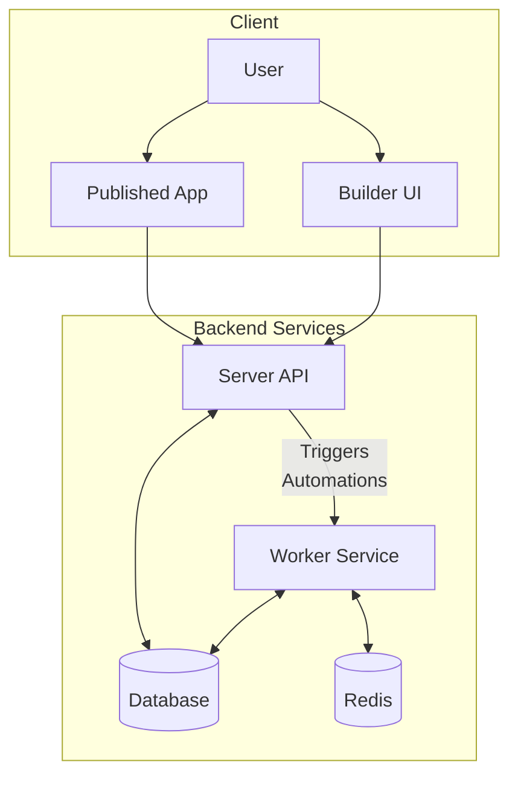
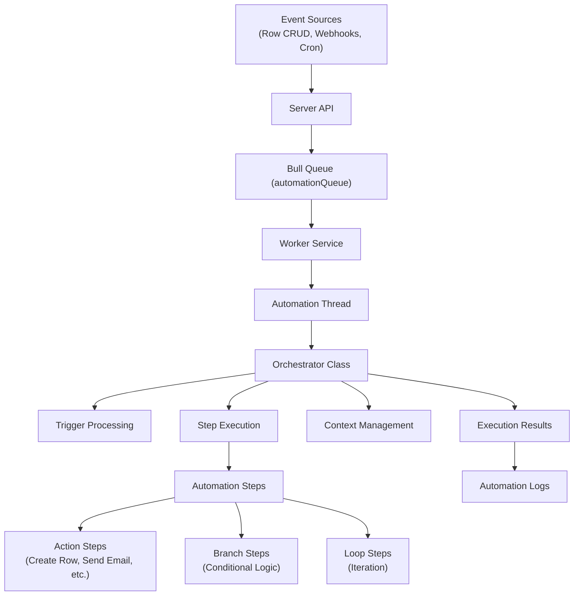
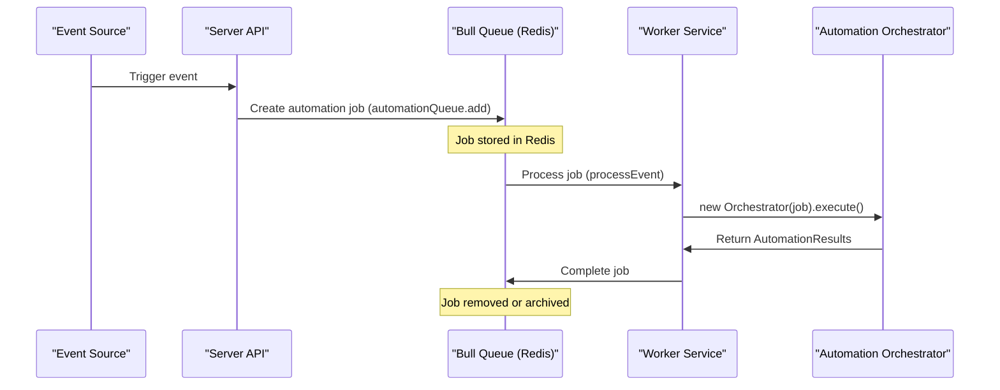
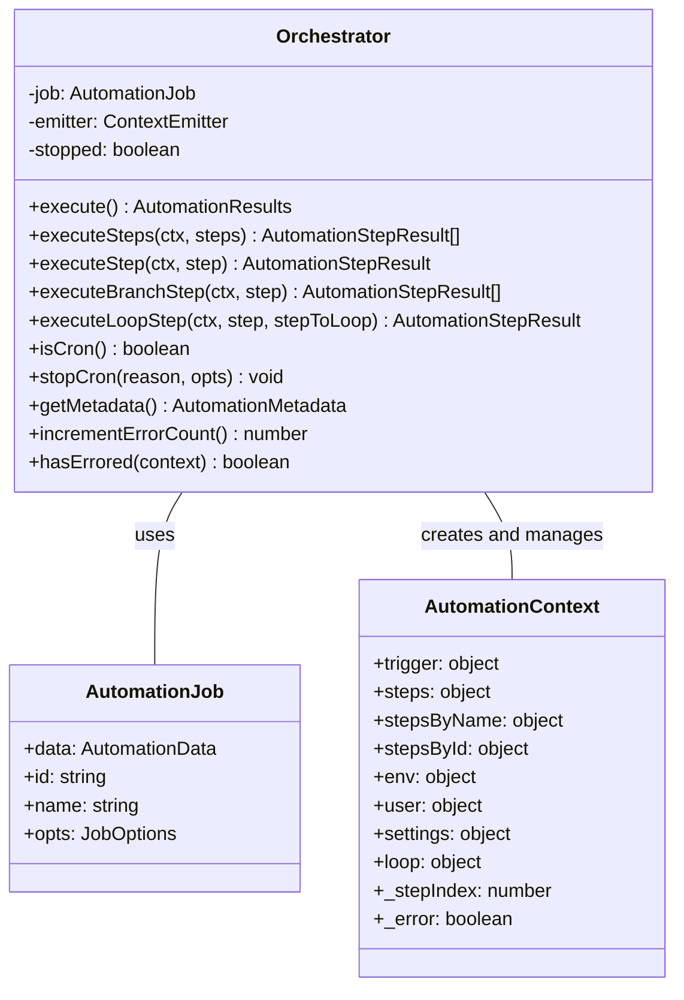
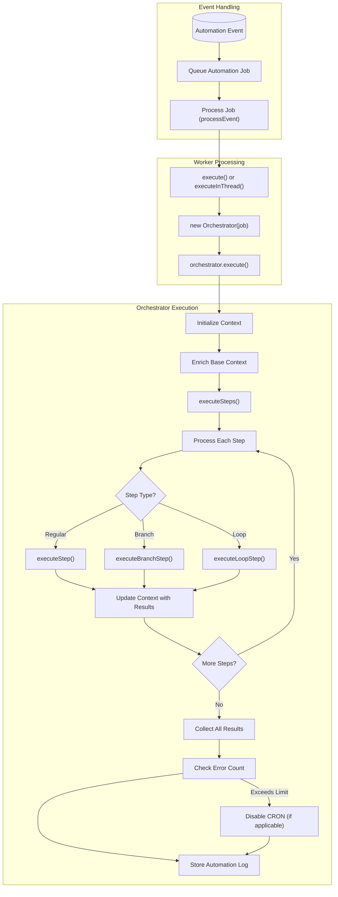
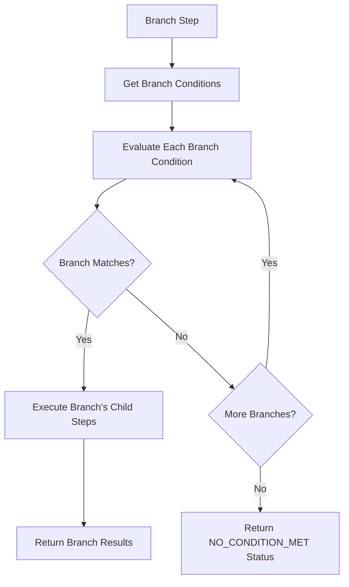
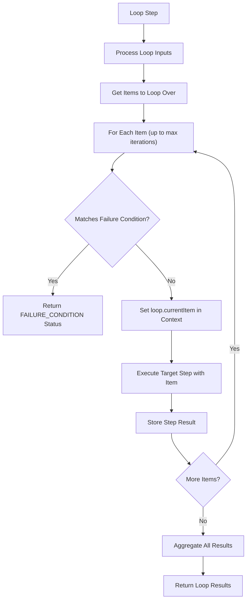
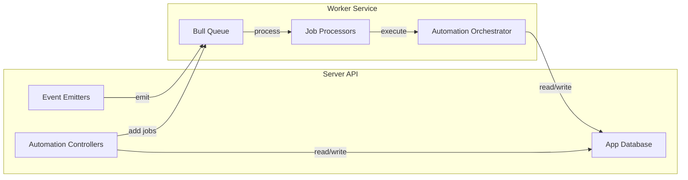

# Worker Architecture

<details>
<summary>Relevant source files</summary>

The following files were used as context for generating this wiki page:

- [lerna.json](https://github.com/Budibase/budibase/blob/e981536b/lerna.json)
- [packages/backend-core/package.json](https://github.com/Budibase/budibase/blob/e981536b/packages/backend-core/package.json)
- [packages/bbui/package.json](https://github.com/Budibase/budibase/blob/e981536b/packages/bbui/package.json)
- [packages/builder/package.json](https://github.com/Budibase/budibase/blob/e981536b/packages/builder/package.json)
- [packages/builder/src/stores/builder/automations.ts](https://github.com/Budibase/budibase/blob/e981536b/packages/builder/src/stores/builder/automations.ts)
- [packages/builder/src/stores/builder/history.ts](https://github.com/Budibase/budibase/blob/e981536b/packages/builder/src/stores/builder/history.ts)
- [packages/cli/package.json](https://github.com/Budibase/budibase/blob/e981536b/packages/cli/package.json)
- [packages/client/package.json](https://github.com/Budibase/budibase/blob/e981536b/packages/client/package.json)
- [packages/frontend-core/package.json](https://github.com/Budibase/budibase/blob/e981536b/packages/frontend-core/package.json)
- [packages/server/package.json](https://github.com/Budibase/budibase/blob/e981536b/packages/server/package.json)
- [packages/server/src/api/controllers/automation.ts](https://github.com/Budibase/budibase/blob/e981536b/packages/server/src/api/controllers/automation.ts)
- [packages/server/src/api/routes/tests/automation.spec.ts](https://github.com/Budibase/budibase/blob/e981536b/packages/server/src/api/routes/tests/automation.spec.ts)
- [packages/server/src/automations/automationUtils.ts](https://github.com/Budibase/budibase/blob/e981536b/packages/server/src/automations/automationUtils.ts)
- [packages/server/src/automations/steps/executeScriptV2.ts](https://github.com/Budibase/budibase/blob/e981536b/packages/server/src/automations/steps/executeScriptV2.ts)
- [packages/server/src/automations/tests/executeScriptV2.spec.ts](https://github.com/Budibase/budibase/blob/e981536b/packages/server/src/automations/tests/executeScriptV2.spec.ts)
- [packages/server/src/automations/tests/utilities/AutomationTestBuilder.ts](https://github.com/Budibase/budibase/blob/e981536b/packages/server/src/automations/tests/utilities/AutomationTestBuilder.ts)
- [packages/server/src/automations/triggers.ts](https://github.com/Budibase/budibase/blob/e981536b/packages/server/src/automations/triggers.ts)
- [packages/server/src/automations/utils.ts](https://github.com/Budibase/budibase/blob/e981536b/packages/server/src/automations/utils.ts)
- [packages/server/src/definitions/automations.ts](https://github.com/Budibase/budibase/blob/e981536b/packages/server/src/definitions/automations.ts)
- [packages/server/src/sdk/app/automations/crud.ts](https://github.com/Budibase/budibase/blob/e981536b/packages/server/src/sdk/app/automations/crud.ts)
- [packages/server/src/tests/utilities/TestConfiguration.ts](https://github.com/Budibase/budibase/blob/e981536b/packages/server/src/tests/utilities/TestConfiguration.ts)
- [packages/server/src/tests/utilities/api/webhook.ts](https://github.com/Budibase/budibase/blob/e981536b/packages/server/src/tests/utilities/api/webhook.ts)
- [packages/server/src/tests/utilities/structures.ts](https://github.com/Budibase/budibase/blob/e981536b/packages/server/src/tests/utilities/structures.ts)
- [packages/server/src/threads/automation.ts](https://github.com/Budibase/budibase/blob/e981536b/packages/server/src/threads/automation.ts)
- [packages/shared-core/src/sdk/documents/automations.ts](https://github.com/Budibase/budibase/blob/e981536b/packages/shared-core/src/sdk/documents/automations.ts)
- [packages/string-templates/package.json](https://github.com/Budibase/budibase/blob/e981536b/packages/string-templates/package.json)
- [packages/types/package.json](https://github.com/Budibase/budibase/blob/e981536b/packages/types/package.json)
- [packages/types/src/documents/app/automation/StepInputsOutputs.ts](https://github.com/Budibase/budibase/blob/e981536b/packages/types/src/documents/app/automation/StepInputsOutputs.ts)
- [packages/types/src/documents/app/automation/automation.ts](https://github.com/Budibase/budibase/blob/e981536b/packages/types/src/documents/app/automation/automation.ts)
- [packages/types/src/documents/app/automation/schema.ts](https://github.com/Budibase/budibase/blob/e981536b/packages/types/src/documents/app/automation/schema.ts)
- [packages/types/src/documents/app/webhook.ts](https://github.com/Budibase/budibase/blob/e981536b/packages/types/src/documents/app/webhook.ts)
- [packages/types/src/sdk/automations/index.ts](https://github.com/Budibase/budibase/blob/e981536b/packages/types/src/sdk/automations/index.ts)
- [packages/types/src/ui/stores/automations.ts](https://github.com/Budibase/budibase/blob/e981536b/packages/types/src/ui/stores/automations.ts)
- [packages/worker/package.json](https://github.com/Budibase/budibase/blob/e981536b/packages/worker/package.json)

</details>


The Worker Architecture in Budibase is responsible for handling background tasks, with a primary focus on executing automations. It processes asynchronous operations independently from the main application server, ensuring the system remains responsive while complex or long-running tasks are executed. This document explores the design and implementation of the Worker component, its relationship with the broader system, and how it processes automation jobs.

For information about automation definitions and triggers, see [Automation System](#4).

## System Overview

The Worker is a separate service in the Budibase architecture that works alongside the Server API to handle background tasks. It uses a job queue system to manage reliable task execution, retries, and scheduled operations.



The Worker architecture consists of several key components that work together to process automation jobs efficiently:



Sources: [packages/worker/package.json](https://github.com/Budibase/budibase/blob/e981536b/packages/worker/package.json). [packages/server/src/threads/automation.ts](https://github.com/Budibase/budibase/blob/e981536b/packages/server/src/threads/automation.ts).

## Job Queue System

Budibase uses Bull, a Redis-based queue library, to manage automation jobs. This provides:

1. Persistent job storage in Redis
2. Reliable job processing with retries
3. Scheduled job execution (for CRON automations)
4. Job prioritization and management

### Queue Processing Flow



Jobs are processed by the `processEvent` function in `automations/utils.ts`, which sets up the necessary context and delegates to the Worker's thread system.

Sources: [packages/server/src/automations/utils.ts:37-92](https://github.com/Budibase/budibase/blob/e981536b/packages/server/src/automations/utils.ts#L37-L92). [packages/server/src/automations/bullboard.ts](https://github.com/Budibase/budibase/blob/e981536b/packages/server/src/automations/bullboard.ts).

## Orchestrator

The core of the Worker architecture is the `Orchestrator` class, which manages the execution of automation steps.



The Orchestrator is instantiated with an automation job and manages the execution flow, results collection, and error handling.

Sources: [packages/server/src/threads/automation.ts:206-591](https://github.com/Budibase/budibase/blob/e981536b/packages/server/src/threads/automation.ts#L206-L591). [packages/types/src/documents/app/automation/automation.ts](https://github.com/Budibase/budibase/blob/e981536b/packages/types/src/documents/app/automation/automation.ts).

## Automation Context

During execution, the Orchestrator maintains a context object that serves as the data environment for step execution:

```typescript
interface AutomationContext {
  trigger: AutomationTriggerResultOutputs;
  steps: Record<string, AutomationStepResultOutputs>;
  stepsByName: Record<string, AutomationStepResultOutputs>;
  stepsById: Record<string, AutomationStepResultOutputs>;
  env?: Record<string, string>;
  user?: UserBindings;
  settings?: {
    url?: string;
    logo?: string;
    company?: string;
  };
  loop?: { currentItem: any };
  _stepIndex: number;
  _error: boolean;
}
```

This context is used for data binding in templates using string interpolation (e.g., `{{ steps.1.value }}`) and is passed to each step during execution. The context is progressively built as each step executes, with outputs from previous steps available to subsequent ones.

Sources: [packages/server/src/definitions/automations.ts:21-39](https://github.com/Budibase/budibase/blob/e981536b/packages/server/src/definitions/automations.ts#L21-L39). [packages/server/src/threads/automation.ts:318-327](https://github.com/Budibase/budibase/blob/e981536b/packages/server/src/threads/automation.ts#L318-L327).

## Execution Flow

The automation execution process follows this detailed sequence:



Sources: [packages/server/src/threads/automation.ts:298-372](https://github.com/Budibase/budibase/blob/e981536b/packages/server/src/threads/automation.ts#L298-L372). [packages/server/src/automations/utils.ts:37-92](https://github.com/Budibase/budibase/blob/e981536b/packages/server/src/automations/utils.ts#L37-L92).

## Step Execution Details

### Regular Steps

For standard action steps, the execution process:

1. Processes input templates with the current context
2. Calls the step's implementation function with inputs and context
3. Adds the step's outputs to the context
4. Returns a success or failure result

```javascript
// Simplified version of executeStep method
private async executeStep(ctx: AutomationContext, step: AutomationStep): Promise<AutomationStepResult> {
  // Process inputs with template bindings
  let inputs = await processObject(step.inputs, ctx);
  
  // Clean input values based on schema
  inputs = automationUtils.cleanInputValues(inputs, step.schema.inputs.properties);
  
  // Execute the actual step function
  const outputs = await fn({
    inputs,
    appId: this.appId,
    emitter: this.emitter,
    context: ctx,
  });
  
  // Return step result
  return stepSuccess(step, outputs, inputs);
}
```

Sources: [packages/server/src/threads/automation.ts:530-590](https://github.com/Budibase/budibase/blob/e981536b/packages/server/src/threads/automation.ts#L530-L590).

### Branch Steps

Branch steps enable conditional logic in automations:



The `executeBranchStep` method in the Orchestrator evaluates conditions against the current context and executes the matching branch's steps.

Sources: [packages/server/src/threads/automation.ts:504-527](https://github.com/Budibase/budibase/blob/e981536b/packages/server/src/threads/automation.ts#L504-L527). [packages/types/src/documents/app/automation/StepInputsOutputs.ts:132-140](https://github.com/Budibase/budibase/blob/e981536b/packages/types/src/documents/app/automation/StepInputsOutputs.ts#L132-L140).

### Loop Steps

Loop steps provide iteration capabilities:



The `executeLoopStep` method handles loop execution, supporting array iteration, string splitting, and other loop patterns.

Sources: [packages/server/src/threads/automation.ts:441-502](https://github.com/Budibase/budibase/blob/e981536b/packages/server/src/threads/automation.ts#L441-L502). [packages/types/src/documents/app/automation/automation.ts:40-67](https://github.com/Budibase/budibase/blob/e981536b/packages/types/src/documents/app/automation/automation.ts#L40-L67).

## Error Handling

The Worker implements several error handling mechanisms:

1. **Step-Level Error Containment**: Errors in individual steps are captured and don't terminate the entire automation
2. **Error State Tracking**: Error state is tracked in the context via the `_error` flag
3. **Automatic CRON Disabling**: CRON automations with repeated errors are automatically disabled after exceeding `MAX_AUTOMATION_RECURRING_ERRORS`
4. **Execution Timeouts**: Timeouts (configurable via `AUTOMATION_THREAD_TIMEOUT`) prevent infinite loops and hanging automations
5. **Job Retry Mechanisms**: Bull queue provides configurable automatic retries for failed jobs

The system also maintains metadata about automation errors to track recurring issues:

```typescript
interface AutomationMetadata extends Document {
  errorCount?: number;
  automationChainCount?: number;
}
```

Sources: [packages/server/src/threads/automation.ts:252-287](https://github.com/Budibase/budibase/blob/e981536b/packages/server/src/threads/automation.ts#L252-L287). [packages/server/src/constants.ts](https://github.com/Budibase/budibase/blob/e981536b/packages/server/src/constants.ts). [packages/types/src/documents/app/automation/automation.ts:253-256](https://github.com/Budibase/budibase/blob/e981536b/packages/types/src/documents/app/automation/automation.ts#L253-L256).

## Integration with Server API

The Worker integrates with the Budibase Server through:

1. **Event System**: The Server uses events to trigger automations based on row operations and other system events
2. **API Controllers**: The automation controller in the Server API manages automation definitions and provides testing endpoints
3. **Bull Queue**: The queue acts as the primary interface between Server and Worker for scheduling automation jobs
4. **Database Access**: Both Server and Worker access the same application database for storing and retrieving automation definitions, logs, and results



Sources: [packages/server/src/automations/triggers.ts:138-163](https://github.com/Budibase/budibase/blob/e981536b/packages/server/src/automations/triggers.ts#L138-L163). [packages/server/src/api/controllers/automation.ts:51-262](https://github.com/Budibase/budibase/blob/e981536b/packages/server/src/api/controllers/automation.ts#L51-L262).

## Conclusion

The Worker Architecture is a critical component of Budibase that enables powerful automation capabilities through asynchronous processing. Its job queue system, Orchestrator engine, and step execution framework provide a reliable and flexible foundation for automating business workflows. 

The separation of the Worker service from the main Server API allows Budibase to efficiently handle resource-intensive tasks in the background while keeping the user interface responsive, and the use of the Bull queue library ensures reliable job processing even in case of service restarts or failures.