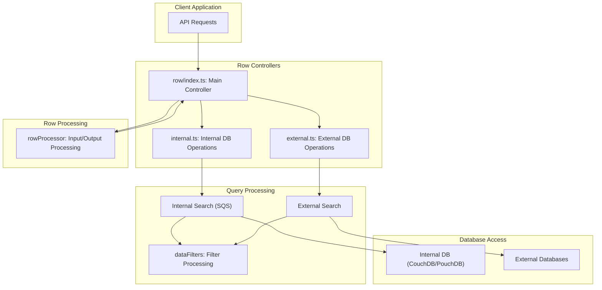
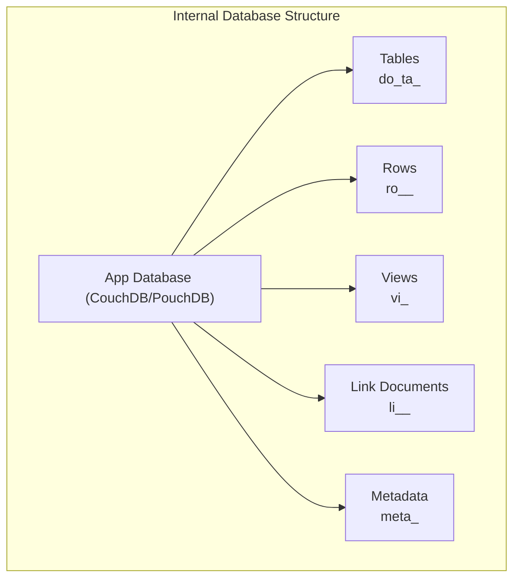
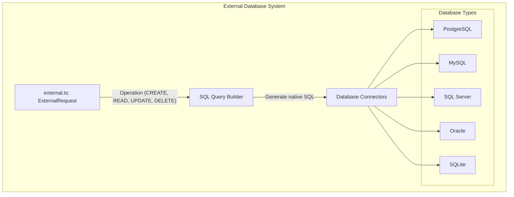
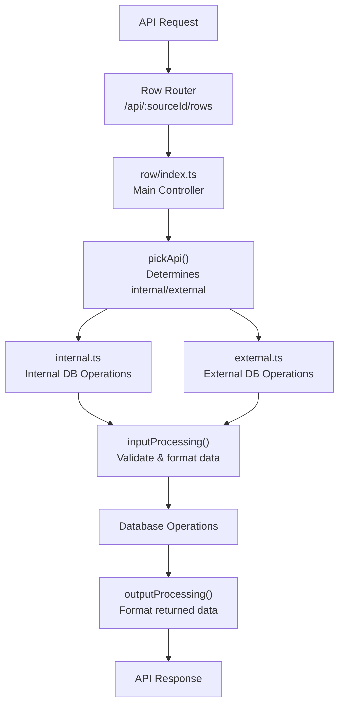
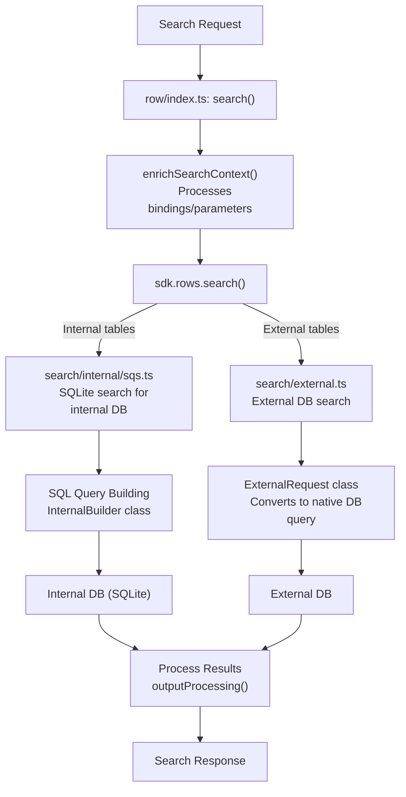
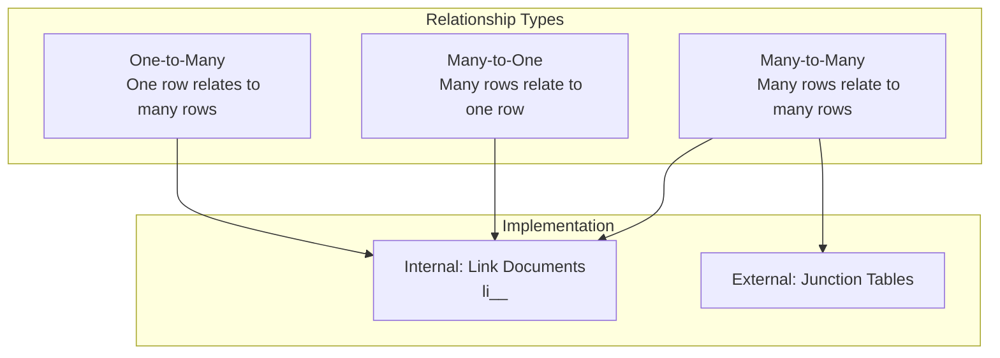
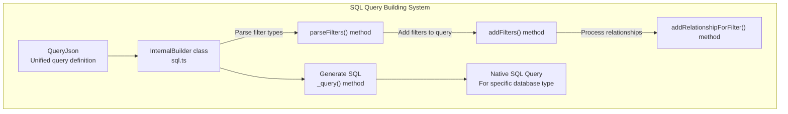

# Database System

<details>
<summary>Relevant source files</summary>

The following files were used as context for generating this wiki page:

- [packages/backend-core/src/context/index.ts](https://github.com/Budibase/budibase/blob/e981536b/packages/backend-core/src/context/index.ts)
- [packages/backend-core/src/db/couch/index.ts](https://github.com/Budibase/budibase/blob/e981536b/packages/backend-core/src/db/couch/index.ts)
- [packages/backend-core/src/db/index.ts](https://github.com/Budibase/budibase/blob/e981536b/packages/backend-core/src/db/index.ts)
- [packages/backend-core/src/index.ts](https://github.com/Budibase/budibase/blob/e981536b/packages/backend-core/src/index.ts)
- [packages/backend-core/src/sql/sql.ts](https://github.com/Budibase/budibase/blob/e981536b/packages/backend-core/src/sql/sql.ts)
- [packages/backend-core/src/sql/tests/utils.spec.ts](https://github.com/Budibase/budibase/blob/e981536b/packages/backend-core/src/sql/tests/utils.spec.ts)
- [packages/backend-core/src/sql/utils.ts](https://github.com/Budibase/budibase/blob/e981536b/packages/backend-core/src/sql/utils.ts)
- [packages/server/src/api/controllers/row/external.ts](https://github.com/Budibase/budibase/blob/e981536b/packages/server/src/api/controllers/row/external.ts)
- [packages/server/src/api/controllers/row/index.ts](https://github.com/Budibase/budibase/blob/e981536b/packages/server/src/api/controllers/row/index.ts)
- [packages/server/src/api/controllers/row/internal.ts](https://github.com/Budibase/budibase/blob/e981536b/packages/server/src/api/controllers/row/internal.ts)
- [packages/server/src/api/controllers/row/utils/basic.ts](https://github.com/Budibase/budibase/blob/e981536b/packages/server/src/api/controllers/row/utils/basic.ts)
- [packages/server/src/api/controllers/row/utils/sqlUtils.ts](https://github.com/Budibase/budibase/blob/e981536b/packages/server/src/api/controllers/row/utils/sqlUtils.ts)
- [packages/server/src/api/controllers/row/utils/tests/sqlUtils.spec.ts](https://github.com/Budibase/budibase/blob/e981536b/packages/server/src/api/controllers/row/utils/tests/sqlUtils.spec.ts)
- [packages/server/src/api/controllers/row/utils/utils.ts](https://github.com/Budibase/budibase/blob/e981536b/packages/server/src/api/controllers/row/utils/utils.ts)
- [packages/server/src/api/controllers/row/views.ts](https://github.com/Budibase/budibase/blob/e981536b/packages/server/src/api/controllers/row/views.ts)
- [packages/server/src/api/routes/row.ts](https://github.com/Budibase/budibase/blob/e981536b/packages/server/src/api/routes/row.ts)
- [packages/server/src/api/routes/tests/row.spec.ts](https://github.com/Budibase/budibase/blob/e981536b/packages/server/src/api/routes/tests/row.spec.ts)
- [packages/server/src/api/routes/tests/search.spec.ts](https://github.com/Budibase/budibase/blob/e981536b/packages/server/src/api/routes/tests/search.spec.ts)
- [packages/server/src/db/utils.ts](https://github.com/Budibase/budibase/blob/e981536b/packages/server/src/db/utils.ts)
- [packages/server/src/sdk/app/rows/external.ts](https://github.com/Budibase/budibase/blob/e981536b/packages/server/src/sdk/app/rows/external.ts)
- [packages/server/src/sdk/app/rows/internal.ts](https://github.com/Budibase/budibase/blob/e981536b/packages/server/src/sdk/app/rows/internal.ts)
- [packages/server/src/sdk/app/rows/rows.ts](https://github.com/Budibase/budibase/blob/e981536b/packages/server/src/sdk/app/rows/rows.ts)
- [packages/server/src/sdk/app/rows/search.ts](https://github.com/Budibase/budibase/blob/e981536b/packages/server/src/sdk/app/rows/search.ts)
- [packages/server/src/sdk/app/rows/search/external.ts](https://github.com/Budibase/budibase/blob/e981536b/packages/server/src/sdk/app/rows/search/external.ts)
- [packages/server/src/sdk/app/rows/search/internal/sqs.ts](https://github.com/Budibase/budibase/blob/e981536b/packages/server/src/sdk/app/rows/search/internal/sqs.ts)
- [packages/server/src/tests/utilities/api/row.ts](https://github.com/Budibase/budibase/blob/e981536b/packages/server/src/tests/utilities/api/row.ts)
- [packages/shared-core/jest.config.ts](https://github.com/Budibase/budibase/blob/e981536b/packages/shared-core/jest.config.ts)
- [packages/shared-core/src/filters.ts](https://github.com/Budibase/budibase/blob/e981536b/packages/shared-core/src/filters.ts)
- [packages/shared-core/src/tests/cron.test.ts](https://github.com/Budibase/budibase/blob/e981536b/packages/shared-core/src/tests/cron.test.ts)
- [packages/shared-core/src/utils.ts](https://github.com/Budibase/budibase/blob/e981536b/packages/shared-core/src/utils.ts)
- [packages/types/src/api/web/searchFilter.ts](https://github.com/Budibase/budibase/blob/e981536b/packages/types/src/api/web/searchFilter.ts)
- [packages/types/src/sdk/row.ts](https://github.com/Budibase/budibase/blob/e981536b/packages/types/src/sdk/row.ts)
- [packages/types/src/sdk/search.ts](https://github.com/Budibase/budibase/blob/e981536b/packages/types/src/sdk/search.ts)

</details>


This document describes the database architecture within Budibase, explaining how data is stored, accessed, and manipulated throughout the application. It covers both internal database storage (built on CouchDB/PouchDB) and external database connections, the row manipulation systems, and query building mechanisms. For information on external data sources and integrations with other database systems, see [External Data Sources](#2.4).

## Overview

Budibase employs a dual database architecture that allows for both internal storage (for application metadata and user data) and connections to external data sources. The database system is responsible for:

- Storing and retrieving application data
- Processing row operations (create, read, update, delete)
- Building and executing queries
- Managing relationships between data
- Handling search and filtering



Sources: [packages/server/src/api/controllers/row/index.ts:1-442](https://github.com/Budibase/budibase/blob/e981536b/packages/server/src/api/controllers/row/index.ts:1-442#L1-L442), [packages/server/src/api/controllers/row/internal.ts:1-243](https://github.com/Budibase/budibase/blob/e981536b/packages/server/src/api/controllers/row/internal.ts:1-243#L1-L243), [packages/server/src/api/controllers/row/external.ts:1-198](https://github.com/Budibase/budibase/blob/e981536b/packages/server/src/api/controllers/row/external.ts:1-198#L1-L198), [packages/server/src/sdk/app/rows/search.ts:1-173](https://github.com/Budibase/budibase/blob/e981536b/packages/server/src/sdk/app/rows/search.ts:1-173#L1-L173)

## Database Architecture

Budibase's database system is split into two primary components:

1. **Internal Database System**: Based on CouchDB/PouchDB, used for storing application metadata, table definitions, and data for internal tables
2. **External Database System**: Connects to external databases like PostgreSQL, MySQL, etc. via datasource connectors

### Internal Database

The internal database is a document-oriented database built on CouchDB for server deployments and PouchDB for client-side storage. It uses a structured document ID system to organize different types of data.



Sources: [packages/backend-core/src/db/utils.ts:1-63](https://github.com/Budibase/budibase/blob/e981536b/packages/backend-core/src/db/utils.ts:1-63#L1-L63), [packages/server/src/db/utils.ts:1-56](https://github.com/Budibase/budibase/blob/e981536b/packages/server/src/db/utils.ts:1-56#L1-L56)

The internal database system leverages document IDs with specific prefixes to categorize different types of data:

| Prefix | Description | Example |
|--------|-------------|---------|
| `ro_` | Identifies row documents | `ro_ta_users_12345` |
| `ta_` | Identifies table definitions | `ta_users` |
| `vi_` | Identifies view definitions | `vi_activeUsers` |
| `li_` | Identifies relationship link documents | `li_ta_users_ta_orders_12345` |
| `au_` | Identifies automation definitions | `au_emailNotification` |

### External Database System

For external databases, Budibase uses a connector system that translates Budibase operations to the appropriate native database queries.



Sources: [packages/server/src/api/controllers/row/external.ts:1-198](https://github.com/Budibase/budibase/blob/e981536b/packages/server/src/api/controllers/row/external.ts:1-198#L1-L198), [packages/backend-core/src/sql/sql.ts:1-100](https://github.com/Budibase/budibase/blob/e981536b/packages/backend-core/src/sql/sql.ts:1-100#L1-L100)

## Row Operations

The row system is the primary interface for interacting with data in Budibase. It handles CRUD operations (Create, Read, Update, Delete) for both internal and external databases.

### Row Controller Architecture



Sources: [packages/server/src/api/controllers/row/index.ts:51-124](https://github.com/Budibase/budibase/blob/e981536b/packages/server/src/api/controllers/row/index.ts:51-124#L51-L124), [packages/server/src/api/routes/row.ts:14-98](https://github.com/Budibase/budibase/blob/e981536b/packages/server/src/api/routes/row.ts:14-98#L14-L98)

### Row CRUD Operations

#### Create

When creating a row, the system:
1. Determines if the table is internal or external
2. Processes input data (validates, formats values)
3. Applies default values where specified
4. Saves the row to the appropriate database
5. Processes the row for output (enriches with relationships)
6. Emits events for automations

```typescript
// Save row controller
export const save = async (ctx: UserCtx<SaveRowRequest, SaveRowResponse>) => {
  const { tableId, viewId } = utils.getSourceId(ctx)
  const sourceId = viewId || tableId

  // Check for user metadata table
  if (utils.isUserMetadataTable(tableId) && !body._rev) {
    ctx.throw(400, "Cannot create new user entry.")
  }

  // If ID exists, it's a patch operation
  if (body && body._id) {
    return patch(ctx as UserCtx<PatchRowRequest, PatchRowResponse>)
  }

  // Save the row (with quota tracking for internal tables)
  const { row, table, squashed } = tableId.includes("datasource_plus")
    ? await sdk.rows.save(sourceId, ctx.request.body, ctx.user?._id)
    : await quotas.addRow(() =>
        sdk.rows.save(sourceId, ctx.request.body, ctx.user?._id)
      )
}
```

Sources: [packages/server/src/api/controllers/row/index.ts:91-124](https://github.com/Budibase/budibase/blob/e981536b/packages/server/src/api/controllers/row/index.ts:91-124#L91-L124)

#### Read

Reading operations fetch rows from the database with support for:
- Single row retrieval by ID
- Bulk retrieval of multiple rows
- Enriched row retrieval (including related data)
- Search with filtering, sorting, and pagination

```typescript
// Fetch row controller
export async function fetch(ctx: UserCtx<void, FetchRowsResponse>) {
  const { tableId } = utils.getSourceId(ctx)
  ctx.body = await sdk.rows.fetch(tableId)
}

// Find single row by ID
export async function find(ctx: UserCtx<void, FindRowResponse>) {
  const { tableId, viewId } = utils.getSourceId(ctx)
  const sourceId = viewId || tableId
  const rowId = ctx.params.rowId
  try {
    ctx.body = await sdk.rows.find(sourceId, rowId)
  } catch (e) {
    ctx.throw(404, "That row couldn't be found")
  }
}
```

Sources: [packages/server/src/api/controllers/row/index.ts:137-152](https://github.com/Budibase/budibase/blob/e981536b/packages/server/src/api/controllers/row/index.ts:137-152#L137-L152)

#### Update

Updating rows follows a similar path to creation but includes:
1. Retrieving the existing row
2. Merging the updates with the existing data
3. Processing the combined data
4. Saving the updated row

```typescript
// Patch row controller (internal implementation)
export async function patch(ctx: UserCtx<PatchRowRequest, PatchRowResponse>) {
  const { tableId } = utils.getSourceId(ctx)
  const source = await utils.getSource(ctx)
  
  // Check if view is a calculation view (can't update through these)
  if (sdk.views.isView(source) && helpers.views.isCalculationView(source)) {
    ctx.throw(400, "Cannot update rows through a calculation view")
  }

  // Get the existing row
  let oldRow = await outputProcessing(source, await findRow(tableId, inputs._id!))
  
  // Combine existing row with updates
  let combinedRow: any = cloneDeep(oldRow)
  for (let key of Object.keys(inputs)) {
    if (!table.schema[key]) continue
    combinedRow[key] = inputs[key]
  }

  // Process and validate the combined row
  let row = await inputProcessing(ctx.user?._id, source, combinedRow)
}
```

Sources: [packages/server/src/api/controllers/row/internal.ts:28-96](https://github.com/Budibase/budibase/blob/e981536b/packages/server/src/api/controllers/row/internal.ts:28-96#L28-L96)

#### Delete

Row deletion handles:
1. Single row deletion
2. Bulk deletion of multiple rows
3. Removal of relationships
4. Cleanup of attachments
5. Quota tracking

```typescript
// Delete row controller
export async function destroy(ctx: UserCtx<DeleteRowRequest>) {
  let response, row

  if (isDeleteRows(ctx.request.body)) {
    response = await deleteRows(ctx)
  } else if (isDeleteRow(ctx.request.body)) {
    const deleteResp = await deleteRow(ctx)
    response = deleteResp.response
    row = deleteResp.row
  } else {
    ctx.status = 400
    response = { message: "Invalid delete rows request" }
  }

  // for automations include the row that was deleted
  ctx.row = row || {}
  ctx.body = response
}
```

Sources: [packages/server/src/api/controllers/row/index.ts:224-241](https://github.com/Budibase/budibase/blob/e981536b/packages/server/src/api/controllers/row/index.ts:224-241#L224-L241)

## Search and Filtering System

The search system allows for complex querying of both internal and external databases using a unified filter syntax.

### Search Architecture



Sources: [packages/server/src/api/controllers/row/index.ts:243-278](https://github.com/Budibase/budibase/blob/e981536b/packages/server/src/api/controllers/row/index.ts:243-278#L243-L278), [packages/server/src/sdk/app/rows/search.ts:38-151](https://github.com/Budibase/budibase/blob/e981536b/packages/server/src/sdk/app/rows/search.ts:38-151#L38-L151), [packages/server/src/sdk/app/rows/search/internal/sqs.ts:55-323](https://github.com/Budibase/budibase/blob/e981536b/packages/server/src/sdk/app/rows/search/internal/sqs.ts:55-323#L55-L323), [packages/server/src/sdk/app/rows/search/external.ts:62-150](https://github.com/Budibase/budibase/blob/e981536b/packages/server/src/sdk/app/rows/search/external.ts:62-150#L62-L150)

### Filter Structure

Budibase uses a powerful filtering system that supports various operators for different data types. Filters are constructed as JSON objects with specific operators.

```typescript
// Example filter structure
interface SearchFilters {
  // Basic operators
  equal?: Record<string, any>
  notEqual?: Record<string, any>
  empty?: Record<string, any>
  notEmpty?: Record<string, any>
  
  // String operators
  string?: Record<string, string>
  fuzzy?: Record<string, string>
  
  // Array operators
  oneOf?: Record<string, any[]>
  contains?: Record<string, any[]>
  notContains?: Record<string, any[]>
  containsAny?: Record<string, any[]>
  
  // Range operator
  range?: Record<string, { high: any, low: any }>
  
  // Logical operators
  $and?: { conditions: SearchFilters[] }
  $or?: { conditions: SearchFilters[] }
}
```

Sources: [packages/types/src/sdk/search.ts:92-116](https://github.com/Budibase/budibase/blob/e981536b/packages/types/src/sdk/search.ts:92-116#L92-L116), [packages/shared-core/src/filters.ts:16-43](https://github.com/Budibase/budibase/blob/e981536b/packages/shared-core/src/filters.ts:16-43#L16-L43)

### Search Query Processing

When a search query is submitted, it goes through several processing steps:

1. **Filter Cleaning**: Remove empty filters, fix array filters
2. **Binding Resolution**: Process string templates and bindings
3. **Filter Transformation**: Convert filters to the appropriate database format
4. **Query Building**: Build the native query for the target database
5. **Execution**: Run the query against the database
6. **Result Processing**: Post-process results to include relationships

```typescript
// Search controller
export async function search(ctx: Ctx<SearchRowRequest, SearchRowResponse>) {
  const { tableId, viewId } = utils.getSourceId(ctx)

  // Ensure context for string template evaluation
  await context.ensureSnippetContext(true)

  const searchRequest = ctx.request.body
  let { query } = searchRequest
  
  // Process the query with user context for bindings
  let enrichedQuery: SearchFilters = await utils.enrichSearchContext(query, {
    user: sdk.users.getUserContextBindings(ctx.user),
  })

  // Execute the search
  const searchParams: RequiredKeys<RowSearchParams> = {
    query: enrichedQuery,
    tableId,
    viewId,
    bookmark: searchRequest.bookmark ?? undefined,
    paginate: searchRequest.paginate,
    limit: searchRequest.limit,
    sort: searchRequest.sort ?? undefined,
    sortOrder: searchRequest.sortOrder,
    sortType: searchRequest.sortType ?? undefined,
    countRows: searchRequest.countRows,
    version: searchRequest.version,
    disableEscaping: searchRequest.disableEscaping,
    fields: undefined,
    indexer: undefined,
    rows: undefined,
  }

  ctx.body = await sdk.rows.search(searchParams)
}
```

Sources: [packages/server/src/api/controllers/row/index.ts:243-278](https://github.com/Budibase/budibase/blob/e981536b/packages/server/src/api/controllers/row/index.ts:243-278#L243-L278), [packages/shared-core/src/filters.ts:565-607](https://github.com/Budibase/budibase/blob/e981536b/packages/shared-core/src/filters.ts:565-607#L565-L607)

## Relationships and Link Documents

Budibase supports relationships between tables through a link document system. This allows for one-to-many, many-to-one, and many-to-many relationships.

### Relationship Types



Sources: [packages/server/src/api/controllers/row/utils/sqlUtils.ts:27-107](https://github.com/Budibase/budibase/blob/e981536b/packages/server/src/api/controllers/row/utils/sqlUtils.ts:27-107#L27-L107)

### Relationship Processing

For internal tables, relationships are handled through link documents that store the relationships between rows. For external databases, relationships are managed through SQL joins and junction tables.

```typescript
// Example of building internal relationships
export function buildInternalRelationships(
  table: Table,
  allTables: Table[]
): RelationshipsJson[] {
  const relationships: RelationshipsJson[] = []
  const links = Object.values(table.schema).filter(
    column => column.type === FieldType.LINK
  )
  const tableId = table._id!
  for (let link of links) {
    if (link.type !== FieldType.LINK) {
      continue
    }
    const linkTableId = link.tableId!
    const junctionTableId = generateJunctionTableID(tableId, linkTableId)
    const isFirstTable = tableId > linkTableId
    
    relationships.push({
      through: junctionTableId,
      column: link.name,
      tableName: linkTableId,
      fromPrimary: "_id",
      to: isFirstTable ? "doc2.rowId" : "doc1.rowId",
      from: isFirstTable ? "doc1.rowId" : "doc2.rowId",
      toPrimary: "_id",
    })
  }
  return relationships
}
```

Sources: [packages/server/src/api/controllers/row/utils/sqlUtils.ts:76-107](https://github.com/Budibase/budibase/blob/e981536b/packages/server/src/api/controllers/row/utils/sqlUtils.ts:76-107#L76-L107)

## Row Processing

Row processing is a critical component that handles:
1. Validating and transforming input data
2. Processing relationships
3. Handling default values
4. Formatting output data for client consumption

### Input Processing

Input processing converts raw input data into the format expected by the database, handling:
- Type conversion
- Default value application
- Formula calculation
- Relationship processing

### Output Processing

Output processing transforms database rows into the format expected by the client, handling:
- Relationship enrichment
- Formula calculation
- Date formatting
- Field visibility based on user permissions

```typescript
// Sample of row processing flow
async function processRow(sourceId: string, rowData: any, userId: string) {
  // Get the table/view
  const source = await sdk.tables.getTable(sourceId)
  
  // Process input (validation, defaults, etc.)
  const processedInput = await inputProcessing(userId, source, rowData)
  
  // Save to database
  const savedRow = await dbSave(source, processedInput)
  
  // Process output (enrich with relationships, etc.)
  const processedOutput = await outputProcessing(source, savedRow, {
    squash: true,
    preserveLinks: true
  })
  
  return processedOutput
}
```

Sources: [packages/server/src/api/controllers/row/utils/utils.ts:128-169](https://github.com/Budibase/budibase/blob/e981536b/packages/server/src/api/controllers/row/utils/utils.ts:128-169#L128-L169)

## SQL Query Building

For both internal (SQLite) and external databases, Budibase builds SQL queries dynamically based on the requested operation.

### SQL Builder Architecture



Sources: [packages/backend-core/src/sql/sql.ts:145-876](https://github.com/Budibase/budibase/blob/e981536b/packages/backend-core/src/sql/sql.ts:145-876#L145-L876)

### Query Components

The SQL builder manages several aspects of query construction:

1. **Select Statement**: Determines which columns to include in the query output
2. **Filters**: Translates filter conditions to WHERE clauses
3. **Relationships**: Handles JOIN statements for related data
4. **Sorting**: Implements ORDER BY clauses
5. **Pagination**: Manages LIMIT and OFFSET for paginated results

```typescript
// Example of filter parsing in SQL builder
private parseFilters(filters: SearchFilters): SearchFilters {
  filters = cloneDeep(filters)
  for (const op of Object.values(BasicOperator)) {
    const filter = filters[op]
    if (!filter) {
      continue
    }
    for (const key of Object.keys(filter)) {
      if (Array.isArray(filter[key])) {
        filter[key] = JSON.stringify(filter[key])
        continue
      }
      const { column } = this.splitter.run(key)
      const schema = this.table.schema[column]
      if (!schema) {
        continue
      }
      filter[key] = this.parse(filter[key], schema)
    }
  }
  
  // Process array operators
  for (const op of Object.values(ArrayOperator)) {
    // Process array filters...
  }
  
  // Process range operators
  for (const op of Object.values(RangeOperator)) {
    // Process range filters...
  }
  
  return filters
}
```

Sources: [packages/backend-core/src/sql/sql.ts:449-507](https://github.com/Budibase/budibase/blob/e981536b/packages/backend-core/src/sql/sql.ts:449-507#L449-L507)

## Summary

The Budibase database system provides a unified interface for working with both internal document-based storage and external SQL databases. Key components include:

1. **Row Controllers**: Handle CRUD operations by routing requests to the appropriate database handler
2. **Search System**: Provides a powerful filtering mechanism that works across database types
3. **Relationship Management**: Supports relationships between tables through link documents and SQL joins
4. **Row Processing**: Handles input validation, data transformation, and output enrichment
5. **SQL Builder**: Dynamically constructs SQL queries for internal and external databases

This architecture allows Budibase to support a wide range of data storage options while providing a consistent API for applications to interact with data.