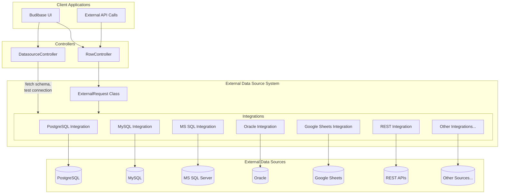
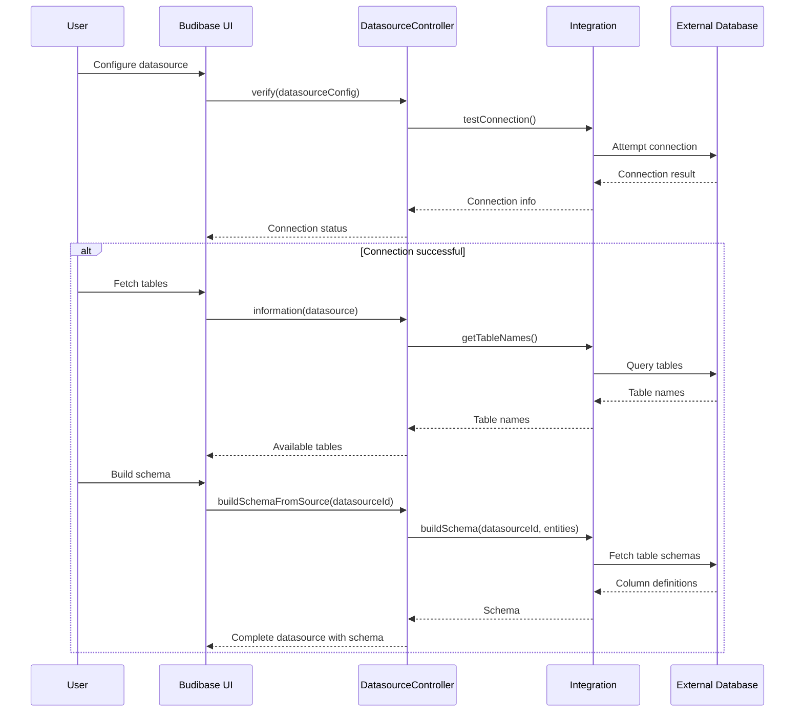
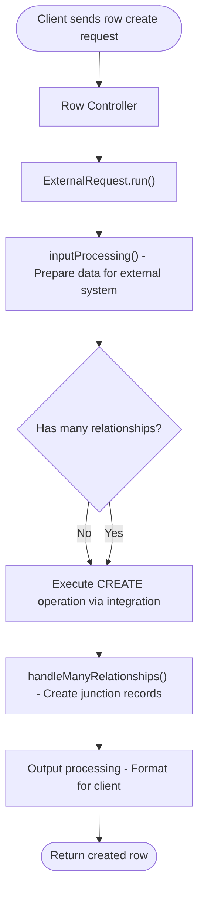
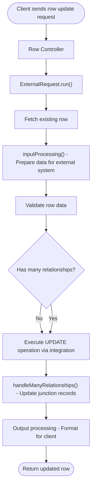
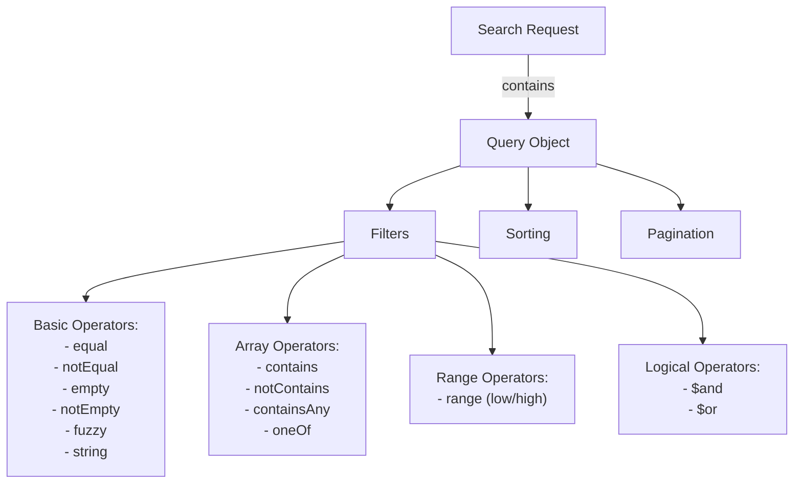
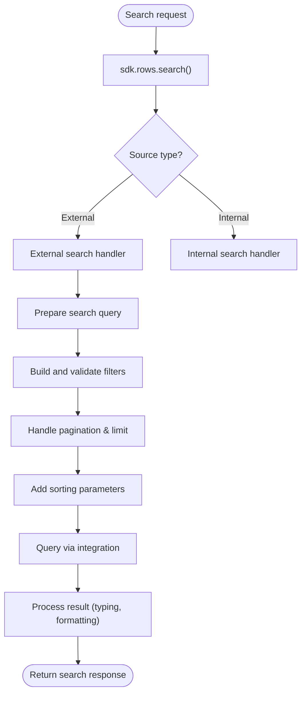
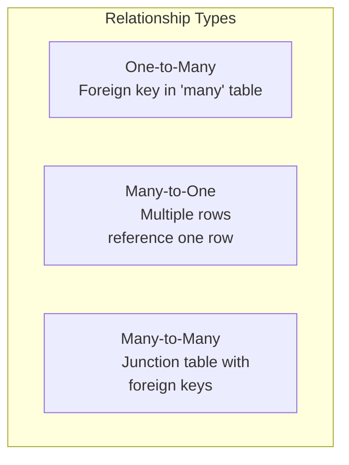
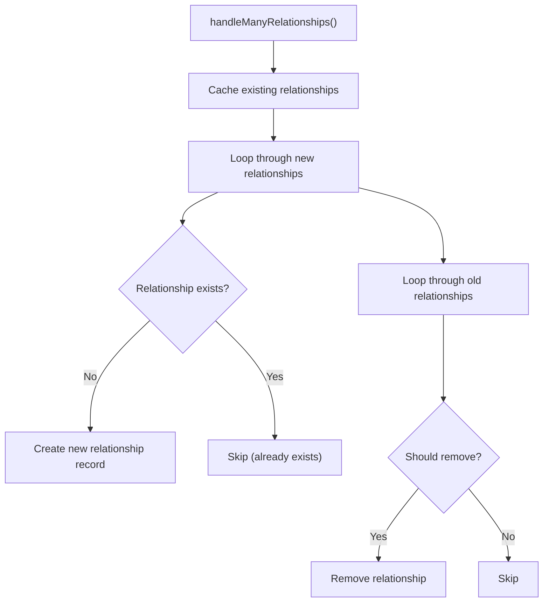
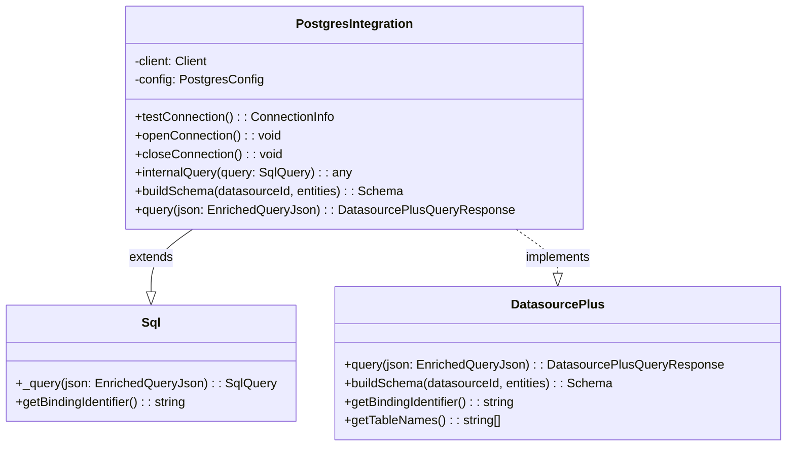
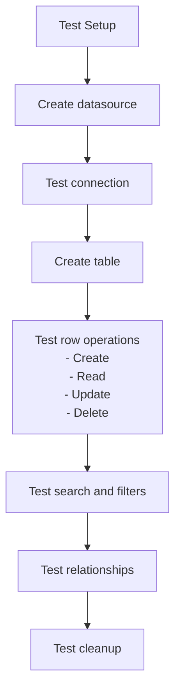

# External Data Sources

<details>
<summary>Relevant source files</summary>

The following files were used as context for generating this wiki page:

- [packages/backend-core/src/sql/sql.ts](https://github.com/Budibase/budibase/blob/e981536b/packages/backend-core/src/sql/sql.ts)
- [packages/backend-core/src/sql/tests/utils.spec.ts](https://github.com/Budibase/budibase/blob/e981536b/packages/backend-core/src/sql/tests/utils.spec.ts)
- [packages/backend-core/src/sql/utils.ts](https://github.com/Budibase/budibase/blob/e981536b/packages/backend-core/src/sql/utils.ts)
- [packages/builder/src/components/backend/DatasourceNavigator/icons/Custom.svelte](https://github.com/Budibase/budibase/blob/e981536b/packages/builder/src/components/backend/DatasourceNavigator/icons/Custom.svelte)
- [packages/builder/src/components/backend/DatasourceNavigator/icons/index.js](https://github.com/Budibase/budibase/blob/e981536b/packages/builder/src/components/backend/DatasourceNavigator/icons/index.js)
- [packages/server/scripts/integrations/postgres/init.sql](https://github.com/Budibase/budibase/blob/e981536b/packages/server/scripts/integrations/postgres/init.sql)
- [packages/server/src/api/controllers/datasource.ts](https://github.com/Budibase/budibase/blob/e981536b/packages/server/src/api/controllers/datasource.ts)
- [packages/server/src/api/controllers/row/ExternalRequest.ts](https://github.com/Budibase/budibase/blob/e981536b/packages/server/src/api/controllers/row/ExternalRequest.ts)
- [packages/server/src/api/controllers/row/external.ts](https://github.com/Budibase/budibase/blob/e981536b/packages/server/src/api/controllers/row/external.ts)
- [packages/server/src/api/controllers/row/index.ts](https://github.com/Budibase/budibase/blob/e981536b/packages/server/src/api/controllers/row/index.ts)
- [packages/server/src/api/controllers/row/internal.ts](https://github.com/Budibase/budibase/blob/e981536b/packages/server/src/api/controllers/row/internal.ts)
- [packages/server/src/api/controllers/row/utils/basic.ts](https://github.com/Budibase/budibase/blob/e981536b/packages/server/src/api/controllers/row/utils/basic.ts)
- [packages/server/src/api/controllers/row/utils/sqlUtils.ts](https://github.com/Budibase/budibase/blob/e981536b/packages/server/src/api/controllers/row/utils/sqlUtils.ts)
- [packages/server/src/api/controllers/row/utils/tests/sqlUtils.spec.ts](https://github.com/Budibase/budibase/blob/e981536b/packages/server/src/api/controllers/row/utils/tests/sqlUtils.spec.ts)
- [packages/server/src/api/controllers/row/utils/utils.ts](https://github.com/Budibase/budibase/blob/e981536b/packages/server/src/api/controllers/row/utils/utils.ts)
- [packages/server/src/api/controllers/row/views.ts](https://github.com/Budibase/budibase/blob/e981536b/packages/server/src/api/controllers/row/views.ts)
- [packages/server/src/api/controllers/table/ExternalRequest.ts](https://github.com/Budibase/budibase/blob/e981536b/packages/server/src/api/controllers/table/ExternalRequest.ts)
- [packages/server/src/api/routes/datasource.ts](https://github.com/Budibase/budibase/blob/e981536b/packages/server/src/api/routes/datasource.ts)
- [packages/server/src/api/routes/row.ts](https://github.com/Budibase/budibase/blob/e981536b/packages/server/src/api/routes/row.ts)
- [packages/server/src/api/routes/tests/row.spec.ts](https://github.com/Budibase/budibase/blob/e981536b/packages/server/src/api/routes/tests/row.spec.ts)
- [packages/server/src/api/routes/tests/search.spec.ts](https://github.com/Budibase/budibase/blob/e981536b/packages/server/src/api/routes/tests/search.spec.ts)
- [packages/server/src/db/utils.ts](https://github.com/Budibase/budibase/blob/e981536b/packages/server/src/db/utils.ts)
- [packages/server/src/definitions/datasource.ts](https://github.com/Budibase/budibase/blob/e981536b/packages/server/src/definitions/datasource.ts)
- [packages/server/src/integrations/base/query.ts](https://github.com/Budibase/budibase/blob/e981536b/packages/server/src/integrations/base/query.ts)
- [packages/server/src/integrations/googlesheets.ts](https://github.com/Budibase/budibase/blob/e981536b/packages/server/src/integrations/googlesheets.ts)
- [packages/server/src/integrations/index.ts](https://github.com/Budibase/budibase/blob/e981536b/packages/server/src/integrations/index.ts)
- [packages/server/src/integrations/microsoftSqlServer.ts](https://github.com/Budibase/budibase/blob/e981536b/packages/server/src/integrations/microsoftSqlServer.ts)
- [packages/server/src/integrations/mysql.ts](https://github.com/Budibase/budibase/blob/e981536b/packages/server/src/integrations/mysql.ts)
- [packages/server/src/integrations/oracle.ts](https://github.com/Budibase/budibase/blob/e981536b/packages/server/src/integrations/oracle.ts)
- [packages/server/src/integrations/postgres.ts](https://github.com/Budibase/budibase/blob/e981536b/packages/server/src/integrations/postgres.ts)
- [packages/server/src/integrations/redis.ts](https://github.com/Budibase/budibase/blob/e981536b/packages/server/src/integrations/redis.ts)
- [packages/server/src/integrations/snowflake.ts](https://github.com/Budibase/budibase/blob/e981536b/packages/server/src/integrations/snowflake.ts)
- [packages/server/src/integrations/tests/googlesheets.spec.ts](https://github.com/Budibase/budibase/blob/e981536b/packages/server/src/integrations/tests/googlesheets.spec.ts)
- [packages/server/src/integrations/tests/sqlAlias.spec.ts](https://github.com/Budibase/budibase/blob/e981536b/packages/server/src/integrations/tests/sqlAlias.spec.ts)
- [packages/server/src/integrations/tests/utils/googlesheets.ts](https://github.com/Budibase/budibase/blob/e981536b/packages/server/src/integrations/tests/utils/googlesheets.ts)
- [packages/server/src/sdk/app/datasources/datasources.ts](https://github.com/Budibase/budibase/blob/e981536b/packages/server/src/sdk/app/datasources/datasources.ts)
- [packages/server/src/sdk/app/datasources/index.ts](https://github.com/Budibase/budibase/blob/e981536b/packages/server/src/sdk/app/datasources/index.ts)
- [packages/server/src/sdk/app/datasources/plus.ts](https://github.com/Budibase/budibase/blob/e981536b/packages/server/src/sdk/app/datasources/plus.ts)
- [packages/server/src/sdk/app/rows/external.ts](https://github.com/Budibase/budibase/blob/e981536b/packages/server/src/sdk/app/rows/external.ts)
- [packages/server/src/sdk/app/rows/internal.ts](https://github.com/Budibase/budibase/blob/e981536b/packages/server/src/sdk/app/rows/internal.ts)
- [packages/server/src/sdk/app/rows/rows.ts](https://github.com/Budibase/budibase/blob/e981536b/packages/server/src/sdk/app/rows/rows.ts)
- [packages/server/src/sdk/app/rows/search.ts](https://github.com/Budibase/budibase/blob/e981536b/packages/server/src/sdk/app/rows/search.ts)
- [packages/server/src/sdk/app/rows/search/external.ts](https://github.com/Budibase/budibase/blob/e981536b/packages/server/src/sdk/app/rows/search/external.ts)
- [packages/server/src/sdk/app/rows/search/internal/sqs.ts](https://github.com/Budibase/budibase/blob/e981536b/packages/server/src/sdk/app/rows/search/internal/sqs.ts)
- [packages/server/src/sdk/app/rows/sqlAlias.ts](https://github.com/Budibase/budibase/blob/e981536b/packages/server/src/sdk/app/rows/sqlAlias.ts)
- [packages/server/src/sdk/app/rows/tests/utils.spec.ts](https://github.com/Budibase/budibase/blob/e981536b/packages/server/src/sdk/app/rows/tests/utils.spec.ts)
- [packages/server/src/sdk/app/rows/utils.ts](https://github.com/Budibase/budibase/blob/e981536b/packages/server/src/sdk/app/rows/utils.ts)
- [packages/server/src/tests/utilities/api/row.ts](https://github.com/Budibase/budibase/blob/e981536b/packages/server/src/tests/utilities/api/row.ts)
- [packages/shared-core/jest.config.ts](https://github.com/Budibase/budibase/blob/e981536b/packages/shared-core/jest.config.ts)
- [packages/shared-core/src/filters.ts](https://github.com/Budibase/budibase/blob/e981536b/packages/shared-core/src/filters.ts)
- [packages/shared-core/src/tests/cron.test.ts](https://github.com/Budibase/budibase/blob/e981536b/packages/shared-core/src/tests/cron.test.ts)
- [packages/shared-core/src/utils.ts](https://github.com/Budibase/budibase/blob/e981536b/packages/shared-core/src/utils.ts)
- [packages/types/src/api/web/app/datasource.ts](https://github.com/Budibase/budibase/blob/e981536b/packages/types/src/api/web/app/datasource.ts)
- [packages/types/src/api/web/searchFilter.ts](https://github.com/Budibase/budibase/blob/e981536b/packages/types/src/api/web/searchFilter.ts)
- [packages/types/src/sdk/datasources.ts](https://github.com/Budibase/budibase/blob/e981536b/packages/types/src/sdk/datasources.ts)
- [packages/types/src/sdk/row.ts](https://github.com/Budibase/budibase/blob/e981536b/packages/types/src/sdk/row.ts)
- [packages/types/src/sdk/search.ts](https://github.com/Budibase/budibase/blob/e981536b/packages/types/src/sdk/search.ts)

</details>


This page explains how Budibase connects to and integrates with external databases and data sources. It covers the architecture of the external data source system, supported datasources, connection configuration, row operations, searching/filtering mechanisms, and relationship handling. For information about the internal database system, see [Database System](#2.3).

## Architecture Overview

The external data source system in Budibase allows applications to connect to and interact with a variety of external databases and services. The system translates between Budibase's internal data model and external data sources, enabling consistent CRUD operations and querying capabilities regardless of the underlying database technology.



Sources: [packages/server/src/api/controllers/row/ExternalRequest.ts](https://github.com/Budibase/budibase/blob/e981536b/packages/server/src/api/controllers/row/ExternalRequest.ts), [packages/server/src/api/controllers/datasource.ts](https://github.com/Budibase/budibase/blob/e981536b/packages/server/src/api/controllers/datasource.ts), [packages/server/src/integrations/index.ts](https://github.com/Budibase/budibase/blob/e981536b/packages/server/src/integrations/index.ts)

## Core Components

The external data sources system consists of several key components working together:

### ExternalRequest Class

The `ExternalRequest` class is the central component for handling operations on external data sources. It processes rows for both input and output, handles relationships between tables, and executes operations through the appropriate integration.

```mermaid
classDiagram
    class ExternalRequest {
        +operation: Operation
        +source: Table | ViewV2
        +datasource: Datasource
        +static for(operation, source, opts): ExternalRequest
        +run(config): ExternalRequestReturnType
        +getTable(tableId): Table
        +getRow(table, rowId): Row
        +inputProcessing(row, table): {row, manyRelationships}
        +handleManyRelationships(tableId, row, relationships): void
        +removeRelationshipsToRow(table, rowId): void
    }
    
    class Integration {
        +testConnection(): ConnectionInfo
        +query(json): DatasourcePlusQueryResponse
        +buildSchema(datasourceId, entities): Schema
        +getTableNames(): string[]
    }
    
    ExternalRequest --> Integration: uses
```

Sources: [packages/server/src/api/controllers/row/ExternalRequest.ts](https://github.com/Budibase/budibase/blob/e981536b/packages/server/src/api/controllers/row/ExternalRequest.ts)

### Integration Connectors

Each supported external data source has a dedicated connector implementing the `DatasourcePlus` interface. These connectors handle connection management, schema discovery, query building, and data type conversion specific to their respective database systems.

Sources: [packages/server/src/integrations/postgres.ts](https://github.com/Budibase/budibase/blob/e981536b/packages/server/src/integrations/postgres.ts), [packages/server/src/integrations/mysql.ts](https://github.com/Budibase/budibase/blob/e981536b/packages/server/src/integrations/mysql.ts), [packages/server/src/integrations/microsoftSqlServer.ts](https://github.com/Budibase/budibase/blob/e981536b/packages/server/src/integrations/microsoftSqlServer.ts), [packages/server/src/integrations/oracle.ts](https://github.com/Budibase/budibase/blob/e981536b/packages/server/src/integrations/oracle.ts), [packages/server/src/integrations/googlesheets.ts](https://github.com/Budibase/budibase/blob/e981536b/packages/server/src/integrations/googlesheets.ts)

### Datasource and Row Controllers

The API layer consists of controllers that handle incoming requests:
- `DatasourceController`: Manages datasource configurations, connection testing, and schema building
- `RowController`: Handles CRUD operations for rows, delegating to either internal or external handlers based on the target datasource

Sources: [packages/server/src/api/controllers/datasource.ts](https://github.com/Budibase/budibase/blob/e981536b/packages/server/src/api/controllers/datasource.ts), [packages/server/src/api/controllers/row/index.ts](https://github.com/Budibase/budibase/blob/e981536b/packages/server/src/api/controllers/row/index.ts)

## Supported Datasources

Budibase supports a wide range of external datasources, each with its own integration module:

| Category | Datasources |
|----------|-------------|
| SQL Databases | PostgreSQL, MySQL, Microsoft SQL Server, Oracle, Snowflake |
| NoSQL Databases | MongoDB, DynamoDB, CouchDB, ArangoDB, Redis |
| Search Engines | Elasticsearch |
| File Storage | S3 |
| Services | Airtable, Google Sheets, Firebase, REST APIs |

Each datasource defines its own schema through an `Integration` object that specifies the configuration fields, supported query types, and features.

Sources: [packages/server/src/integrations/index.ts](https://github.com/Budibase/budibase/blob/e981536b/packages/server/src/integrations/index.ts)

## Connecting to External Data Sources

The process of connecting to an external data source involves several steps:



Sources: [packages/server/src/api/controllers/datasource.ts](https://github.com/Budibase/budibase/blob/e981536b/packages/server/src/api/controllers/datasource.ts)

### Configuration

Each datasource type has specific configuration requirements:

- **SQL databases**: Host, port, database name, username, password, SSL options
- **NoSQL databases**: Connection strings, authentication details
- **Services (Google Sheets, Airtable)**: API keys, authentication tokens
- **REST APIs**: Base URLs, authentication methods, headers

Sensitive information like passwords and API keys is securely stored and not returned in API responses.

Sources: [packages/server/src/integrations/postgres.ts:61-105](https://github.com/Budibase/budibase/blob/e981536b/packages/server/src/integrations/postgres.ts:61-105#L61-L105), [packages/server/src/integrations/mysql.ts:40-101](https://github.com/Budibase/budibase/blob/e981536b/packages/server/src/integrations/mysql.ts:40-101#L40-L101), [packages/server/src/integrations/microsoftSqlServer.ts:78-193](https://github.com/Budibase/budibase/blob/e981536b/packages/server/src/integrations/microsoftSqlServer.ts:78-193#L78-L193)

### Schema Building

Once a datasource is configured, Budibase builds a schema by:

1. Fetching table names from the external source
2. Retrieving column definitions for each table
3. Mapping external column types to Budibase field types
4. Identifying primary keys and relationships
5. Creating table definitions in Budibase

This schema is used to generate tables in Budibase that mirror the structure of the external data.

Sources: [packages/server/src/integrations/postgres.ts:304-381](https://github.com/Budibase/budibase/blob/e981536b/packages/server/src/integrations/postgres.ts:304-381#L304-L381), [packages/server/src/api/controllers/datasource.ts:77-92](https://github.com/Budibase/budibase/blob/e981536b/packages/server/src/api/controllers/datasource.ts:77-92#L77-L92)

## Row Operations

The external data source system supports standard CRUD (Create, Read, Update, Delete) operations on rows:

### Create



Sources: [packages/server/src/api/controllers/row/ExternalRequest.ts:161-443](https://github.com/Budibase/budibase/blob/e981536b/packages/server/src/api/controllers/row/ExternalRequest.ts:161-443#L161-L443)

### Read

Reading rows involves building and executing queries against the external data source, then processing the results for Budibase consumption.

Sources: [packages/server/src/api/controllers/row/external.ts:149-167](https://github.com/Budibase/budibase/blob/e981536b/packages/server/src/api/controllers/row/external.ts:149-167#L149-L167), [packages/server/src/sdk/app/rows/search/external.ts:32-171](https://github.com/Budibase/budibase/blob/e981536b/packages/server/src/sdk/app/rows/search/external.ts:32-171#L32-L171)

### Update



Sources: [packages/server/src/api/controllers/row/external.ts:45-113](https://github.com/Budibase/budibase/blob/e981536b/packages/server/src/api/controllers/row/external.ts:45-113#L45-L113)

### Delete

Deleting rows involves removing the main record and any associated relationship records in junction tables.

Sources: [packages/server/src/api/controllers/row/external.ts:115-128](https://github.com/Budibase/budibase/blob/e981536b/packages/server/src/api/controllers/row/external.ts:115-128#L115-L128)

## Searching and Filtering

Budibase provides a powerful search and filter system for external data sources:

### Query Structure

Searches are defined using a consistent query structure regardless of the underlying database:



Sources: [packages/shared-core/src/filters.ts:8-128](https://github.com/Budibase/budibase/blob/e981536b/packages/shared-core/src/filters.ts:8-128#L8-L128), [packages/types/src/sdk/search.ts:8-44](https://github.com/Budibase/budibase/blob/e981536b/packages/types/src/sdk/search.ts:8-44#L8-L44)

### Search Process



Sources: [packages/server/src/sdk/app/rows/search.ts:38-151](https://github.com/Budibase/budibase/blob/e981536b/packages/server/src/sdk/app/rows/search.ts:38-151#L38-L151), [packages/server/src/sdk/app/rows/search/external.ts:62-112](https://github.com/Budibase/budibase/blob/e981536b/packages/server/src/sdk/app/rows/search/external.ts:62-112#L62-L112)

## Relationship Handling

Budibase manages relationships between tables in external data sources:

### Relationship Types



Sources: [packages/server/src/api/controllers/row/ExternalRequest.ts:143-149](https://github.com/Budibase/budibase/blob/e981536b/packages/server/src/api/controllers/row/ExternalRequest.ts:143-149#L143-L149), [packages/server/src/api/controllers/row/ExternalRequest.ts:338-395](https://github.com/Budibase/budibase/blob/e981536b/packages/server/src/api/controllers/row/ExternalRequest.ts:338-395#L338-L395)

### Many Relationship Handling

The `handleManyRelationships` method in `ExternalRequest` handles the complex task of maintaining relationships:



Sources: [packages/server/src/api/controllers/row/ExternalRequest.ts:510-605](https://github.com/Budibase/budibase/blob/e981536b/packages/server/src/api/controllers/row/ExternalRequest.ts:510-605#L510-L605)

## SQL Integration Example

Let's look at how the integration works for a specific database type like PostgreSQL:



Sources: [packages/server/src/integrations/postgres.ts:149-380](https://github.com/Budibase/budibase/blob/e981536b/packages/server/src/integrations/postgres.ts:149-380#L149-L380)

## Error Handling

External data sources may encounter various errors that the system handles:

1. **Connection errors**: Network issues, authentication failures
2. **Schema incompatibilities**: Data type mismatches, unsupported features
3. **Query limitations**: Database-specific constraints on queries
4. **Performance considerations**: External sources may have slower response times

Budibase provides error mapping and readable error messages to help diagnose and troubleshoot issues.

Sources: [packages/server/src/integrations/base/errorMapping.ts](https://github.com/Budibase/budibase/blob/e981536b/packages/server/src/integrations/base/errorMapping.ts)

## Key External Data Sources

### SQL Databases

SQL database integrations (PostgreSQL, MySQL, MS SQL Server, Oracle) follow a similar pattern:
- Connection management via specific database client libraries
- Schema discovery through database metadata queries
- Query building using SQL syntax
- Type conversion between database and Budibase types

Sources: [packages/server/src/integrations/postgres.ts](https://github.com/Budibase/budibase/blob/e981536b/packages/server/src/integrations/postgres.ts), [packages/server/src/integrations/mysql.ts](https://github.com/Budibase/budibase/blob/e981536b/packages/server/src/integrations/mysql.ts), [packages/server/src/integrations/microsoftSqlServer.ts](https://github.com/Budibase/budibase/blob/e981536b/packages/server/src/integrations/microsoftSqlServer.ts), [packages/server/src/integrations/oracle.ts](https://github.com/Budibase/budibase/blob/e981536b/packages/server/src/integrations/oracle.ts)

### Google Sheets

The Google Sheets integration provides a unique example of a non-SQL datasource:
- Authentication using OAuth
- Sheets as tables, with rows as records
- Schema discovery by reading header rows
- Custom query handling for the Google Sheets API

Sources: [packages/server/src/integrations/googlesheets.ts:161-384](https://github.com/Budibase/budibase/blob/e981536b/packages/server/src/integrations/googlesheets.ts:161-384#L161-L384)

### REST APIs

The REST integration allows connecting to any REST API:
- Dynamic authentication (Basic, Bearer, OAuth)
- Custom entity definition
- Query transformation to API requests
- Response parsing and mapping

## Integration Testing

Budibase includes integration tests for external datasources to verify functionality:



Sources: [packages/server/src/integrations/tests/googlesheets.spec.ts](https://github.com/Budibase/budibase/blob/e981536b/packages/server/src/integrations/tests/googlesheets.spec.ts)

## Summary

The external data sources system is a critical component of Budibase, enabling connections to various databases and services. It provides a consistent API for CRUD operations, searching, and relationship management across different data sources, abstracting away the complexities of the underlying systems while preserving their capabilities.