# Data Management

<details>
<summary>Relevant source files</summary>

The following files were used as context for generating this wiki page:

- [packages/backend-core/src/events/processors/posthog/PosthogProcessor.ts](https://github.com/Budibase/budibase/blob/e981536b/packages/backend-core/src/events/processors/posthog/PosthogProcessor.ts)
- [packages/backend-core/src/events/publishers/automation.ts](https://github.com/Budibase/budibase/blob/e981536b/packages/backend-core/src/events/publishers/automation.ts)
- [packages/backend-core/src/events/publishers/rowAction.ts](https://github.com/Budibase/budibase/blob/e981536b/packages/backend-core/src/events/publishers/rowAction.ts)
- [packages/backend-core/src/events/publishers/screen.ts](https://github.com/Budibase/budibase/blob/e981536b/packages/backend-core/src/events/publishers/screen.ts)
- [packages/backend-core/src/events/publishers/table.ts](https://github.com/Budibase/budibase/blob/e981536b/packages/backend-core/src/events/publishers/table.ts)
- [packages/backend-core/src/events/publishers/view.ts](https://github.com/Budibase/budibase/blob/e981536b/packages/backend-core/src/events/publishers/view.ts)
- [packages/backend-core/src/sql/sql.ts](https://github.com/Budibase/budibase/blob/e981536b/packages/backend-core/src/sql/sql.ts)
- [packages/backend-core/src/sql/tests/utils.spec.ts](https://github.com/Budibase/budibase/blob/e981536b/packages/backend-core/src/sql/tests/utils.spec.ts)
- [packages/backend-core/src/sql/utils.ts](https://github.com/Budibase/budibase/blob/e981536b/packages/backend-core/src/sql/utils.ts)
- [packages/server/src/api/controllers/row/external.ts](https://github.com/Budibase/budibase/blob/e981536b/packages/server/src/api/controllers/row/external.ts)
- [packages/server/src/api/controllers/row/index.ts](https://github.com/Budibase/budibase/blob/e981536b/packages/server/src/api/controllers/row/index.ts)
- [packages/server/src/api/controllers/row/internal.ts](https://github.com/Budibase/budibase/blob/e981536b/packages/server/src/api/controllers/row/internal.ts)
- [packages/server/src/api/controllers/row/utils/basic.ts](https://github.com/Budibase/budibase/blob/e981536b/packages/server/src/api/controllers/row/utils/basic.ts)
- [packages/server/src/api/controllers/row/utils/sqlUtils.ts](https://github.com/Budibase/budibase/blob/e981536b/packages/server/src/api/controllers/row/utils/sqlUtils.ts)
- [packages/server/src/api/controllers/row/utils/tests/sqlUtils.spec.ts](https://github.com/Budibase/budibase/blob/e981536b/packages/server/src/api/controllers/row/utils/tests/sqlUtils.spec.ts)
- [packages/server/src/api/controllers/row/utils/utils.ts](https://github.com/Budibase/budibase/blob/e981536b/packages/server/src/api/controllers/row/utils/utils.ts)
- [packages/server/src/api/controllers/row/views.ts](https://github.com/Budibase/budibase/blob/e981536b/packages/server/src/api/controllers/row/views.ts)
- [packages/server/src/api/controllers/view/index.ts](https://github.com/Budibase/budibase/blob/e981536b/packages/server/src/api/controllers/view/index.ts)
- [packages/server/src/api/controllers/view/views.ts](https://github.com/Budibase/budibase/blob/e981536b/packages/server/src/api/controllers/view/views.ts)
- [packages/server/src/api/controllers/view/viewsV2.ts](https://github.com/Budibase/budibase/blob/e981536b/packages/server/src/api/controllers/view/viewsV2.ts)
- [packages/server/src/api/routes/row.ts](https://github.com/Budibase/budibase/blob/e981536b/packages/server/src/api/routes/row.ts)
- [packages/server/src/api/routes/tests/row.spec.ts](https://github.com/Budibase/budibase/blob/e981536b/packages/server/src/api/routes/tests/row.spec.ts)
- [packages/server/src/api/routes/tests/search.spec.ts](https://github.com/Budibase/budibase/blob/e981536b/packages/server/src/api/routes/tests/search.spec.ts)
- [packages/server/src/api/routes/tests/view.spec.ts](https://github.com/Budibase/budibase/blob/e981536b/packages/server/src/api/routes/tests/view.spec.ts)
- [packages/server/src/api/routes/tests/viewV2.spec.ts](https://github.com/Budibase/budibase/blob/e981536b/packages/server/src/api/routes/tests/viewV2.spec.ts)
- [packages/server/src/api/routes/view.ts](https://github.com/Budibase/budibase/blob/e981536b/packages/server/src/api/routes/view.ts)
- [packages/server/src/db/utils.ts](https://github.com/Budibase/budibase/blob/e981536b/packages/server/src/db/utils.ts)
- [packages/server/src/sdk/app/rows/external.ts](https://github.com/Budibase/budibase/blob/e981536b/packages/server/src/sdk/app/rows/external.ts)
- [packages/server/src/sdk/app/rows/internal.ts](https://github.com/Budibase/budibase/blob/e981536b/packages/server/src/sdk/app/rows/internal.ts)
- [packages/server/src/sdk/app/rows/rows.ts](https://github.com/Budibase/budibase/blob/e981536b/packages/server/src/sdk/app/rows/rows.ts)
- [packages/server/src/sdk/app/rows/search.ts](https://github.com/Budibase/budibase/blob/e981536b/packages/server/src/sdk/app/rows/search.ts)
- [packages/server/src/sdk/app/rows/search/external.ts](https://github.com/Budibase/budibase/blob/e981536b/packages/server/src/sdk/app/rows/search/external.ts)
- [packages/server/src/sdk/app/rows/search/internal/sqs.ts](https://github.com/Budibase/budibase/blob/e981536b/packages/server/src/sdk/app/rows/search/internal/sqs.ts)
- [packages/server/src/sdk/app/tables/getters.ts](https://github.com/Budibase/budibase/blob/e981536b/packages/server/src/sdk/app/tables/getters.ts)
- [packages/server/src/sdk/app/views/external.ts](https://github.com/Budibase/budibase/blob/e981536b/packages/server/src/sdk/app/views/external.ts)
- [packages/server/src/sdk/app/views/index.ts](https://github.com/Budibase/budibase/blob/e981536b/packages/server/src/sdk/app/views/index.ts)
- [packages/server/src/sdk/app/views/internal.ts](https://github.com/Budibase/budibase/blob/e981536b/packages/server/src/sdk/app/views/internal.ts)
- [packages/server/src/sdk/app/views/utils.ts](https://github.com/Budibase/budibase/blob/e981536b/packages/server/src/sdk/app/views/utils.ts)
- [packages/server/src/tests/utilities/api/legacyView.ts](https://github.com/Budibase/budibase/blob/e981536b/packages/server/src/tests/utilities/api/legacyView.ts)
- [packages/server/src/tests/utilities/api/row.ts](https://github.com/Budibase/budibase/blob/e981536b/packages/server/src/tests/utilities/api/row.ts)
- [packages/server/src/tests/utilities/api/viewV2.ts](https://github.com/Budibase/budibase/blob/e981536b/packages/server/src/tests/utilities/api/viewV2.ts)
- [packages/shared-core/jest.config.ts](https://github.com/Budibase/budibase/blob/e981536b/packages/shared-core/jest.config.ts)
- [packages/shared-core/src/filters.ts](https://github.com/Budibase/budibase/blob/e981536b/packages/shared-core/src/filters.ts)
- [packages/shared-core/src/tests/cron.test.ts](https://github.com/Budibase/budibase/blob/e981536b/packages/shared-core/src/tests/cron.test.ts)
- [packages/shared-core/src/utils.ts](https://github.com/Budibase/budibase/blob/e981536b/packages/shared-core/src/utils.ts)
- [packages/types/src/api/web/app/view.ts](https://github.com/Budibase/budibase/blob/e981536b/packages/types/src/api/web/app/view.ts)
- [packages/types/src/api/web/searchFilter.ts](https://github.com/Budibase/budibase/blob/e981536b/packages/types/src/api/web/searchFilter.ts)
- [packages/types/src/documents/app/view.ts](https://github.com/Budibase/budibase/blob/e981536b/packages/types/src/documents/app/view.ts)
- [packages/types/src/sdk/events/automation.ts](https://github.com/Budibase/budibase/blob/e981536b/packages/types/src/sdk/events/automation.ts)
- [packages/types/src/sdk/events/screen.ts](https://github.com/Budibase/budibase/blob/e981536b/packages/types/src/sdk/events/screen.ts)
- [packages/types/src/sdk/events/table.ts](https://github.com/Budibase/budibase/blob/e981536b/packages/types/src/sdk/events/table.ts)
- [packages/types/src/sdk/events/view.ts](https://github.com/Budibase/budibase/blob/e981536b/packages/types/src/sdk/events/view.ts)
- [packages/types/src/sdk/row.ts](https://github.com/Budibase/budibase/blob/e981536b/packages/types/src/sdk/row.ts)
- [packages/types/src/sdk/search.ts](https://github.com/Budibase/budibase/blob/e981536b/packages/types/src/sdk/search.ts)

</details>


The Data Management system in Budibase provides the fundamental capabilities for storing, retrieving, and manipulating data across the platform. This document covers how data is structured, accessed, and managed through tables, rows, views, and search functionality. It also explains the distinction between internal and external data sources, and how Budibase provides a unified interface for working with both.

For information about automated workflows that can be triggered by data changes, see [Automation System](#4).

## Data Architecture Overview

Budibase implements a hybrid data management approach that unifies access to both internal and external data sources. The system is designed around several key components working together to provide a consistent interface for data operations.

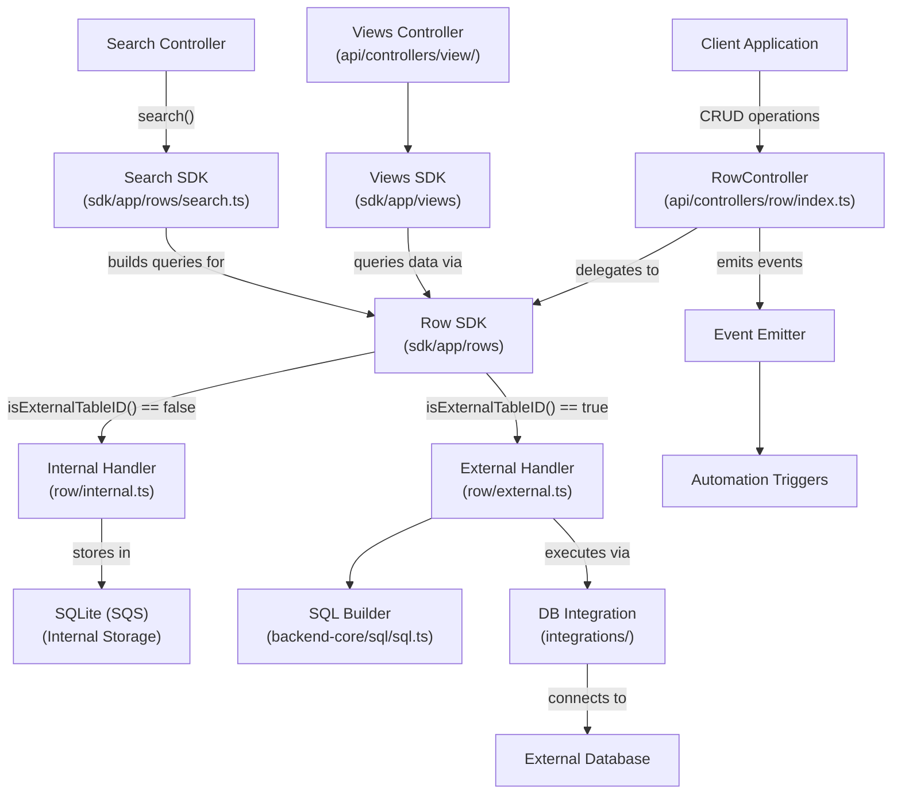

Sources: [packages/server/src/api/controllers/row/index.ts](https://github.com/Budibase/budibase/blob/e981536b/packages/server/src/api/controllers/row/index.ts), [packages/server/src/sdk/app/rows/search.ts](https://github.com/Budibase/budibase/blob/e981536b/packages/server/src/sdk/app/rows/search.ts), [packages/server/src/api/controllers/row/internal.ts](https://github.com/Budibase/budibase/blob/e981536b/packages/server/src/api/controllers/row/internal.ts), [packages/server/src/api/controllers/row/external.ts](https://github.com/Budibase/budibase/blob/e981536b/packages/server/src/api/controllers/row/external.ts), [packages/backend-core/src/sql/sql.ts](https://github.com/Budibase/budibase/blob/e981536b/packages/backend-core/src/sql/sql.ts)

## Data Models

### Tables and Schemas

Tables are the primary data structures in Budibase. Each table consists of a schema that defines the fields, their types, and constraints.

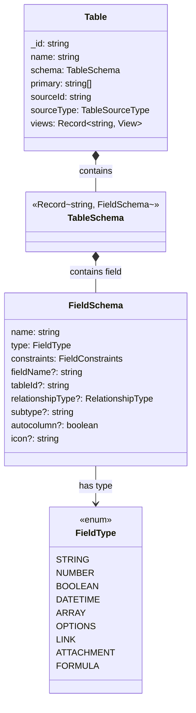

Tables can be either internal (stored in Budibase's SQLite database, known as "SQS") or external (connected to external data sources like MySQL, PostgreSQL, etc.). The distinction is made using the `sourceId` and `sourceType` properties.

Sources: [packages/types/src/documents/app/table.ts](https://github.com/Budibase/budibase/blob/e981536b/packages/types/src/documents/app/table.ts), [packages/server/src/sdk/app/tables/getters.ts](https://github.com/Budibase/budibase/blob/e981536b/packages/server/src/sdk/app/tables/getters.ts)

### Rows

Rows represent individual records in a table. Each row contains values for the fields defined in the table schema:

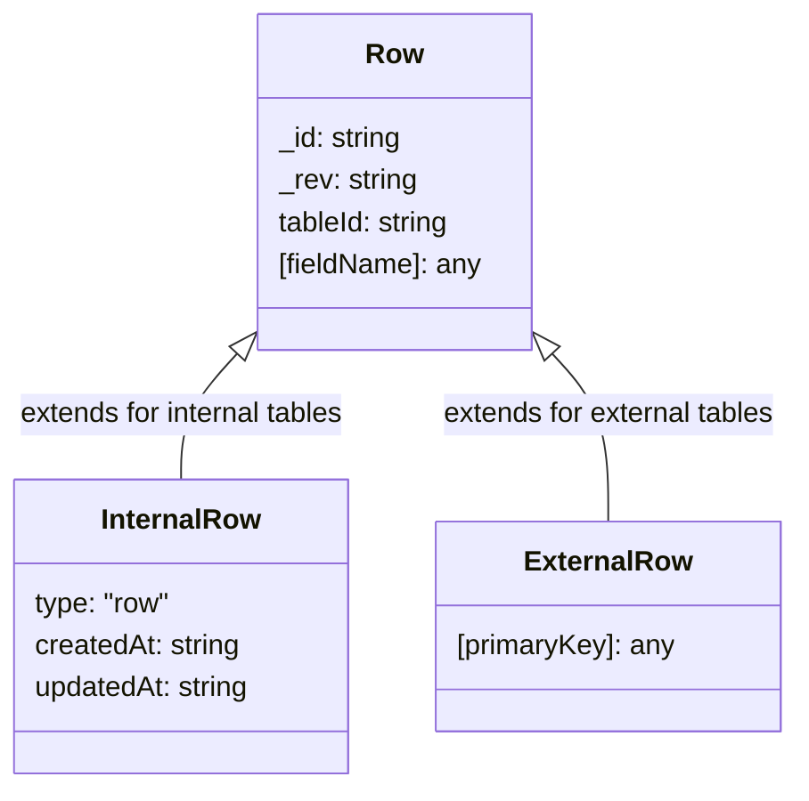

Internal rows have additional metadata like `type`, `createdAt`, and `updatedAt`. External rows might have different primary key fields based on the external data source structure.

Sources: [packages/server/src/api/routes/tests/row.spec.ts](https://github.com/Budibase/budibase/blob/e981536b/packages/server/src/api/routes/tests/row.spec.ts)

### Views

Views provide a way to define specialized access to table data. They can filter, sort, and customize how data is presented to users.

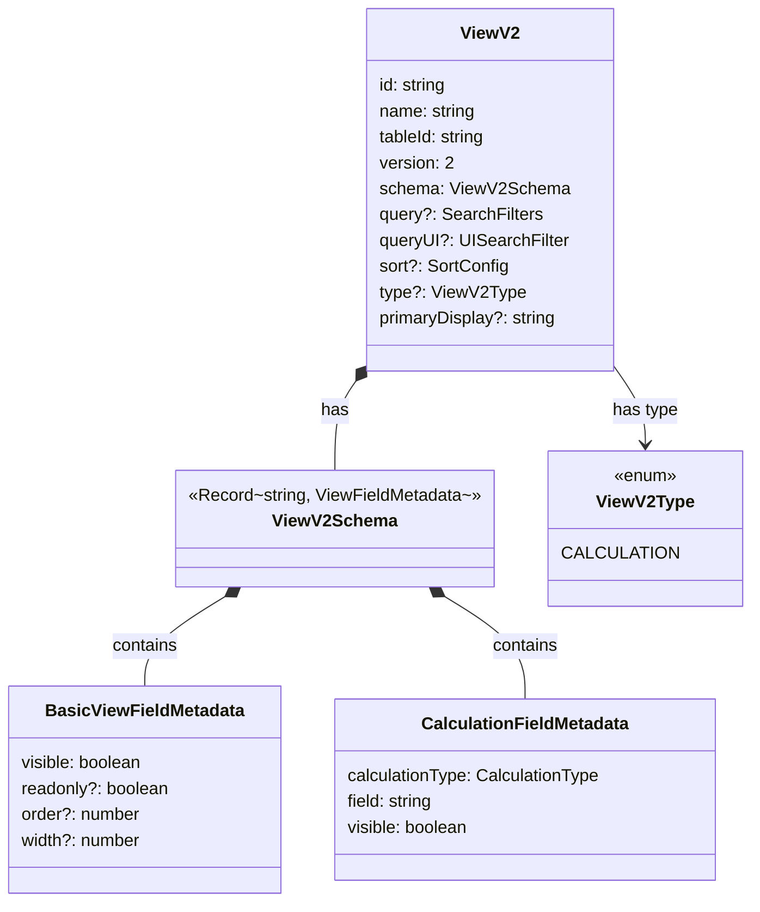

Budibase offers two primary view types:
1. **Standard Views**: Filter and customize the display of table data
2. **Calculation Views**: Perform aggregations (sum, count, average, etc.) on table data

Views provide a powerful way to create different perspectives on the same underlying data.

Sources: [packages/server/src/api/controllers/view/viewsV2.ts](https://github.com/Budibase/budibase/blob/e981536b/packages/server/src/api/controllers/view/viewsV2.ts), [packages/types/src/documents/app/view.ts](https://github.com/Budibase/budibase/blob/e981536b/packages/types/src/documents/app/view.ts), [packages/server/src/sdk/app/views/index.ts](https://github.com/Budibase/budibase/blob/e981536b/packages/server/src/sdk/app/views/index.ts)

## Data Operations

### Row Operations Flow

The data management system provides a unified interface for CRUD (Create, Read, Update, Delete) operations on both internal and external data sources.

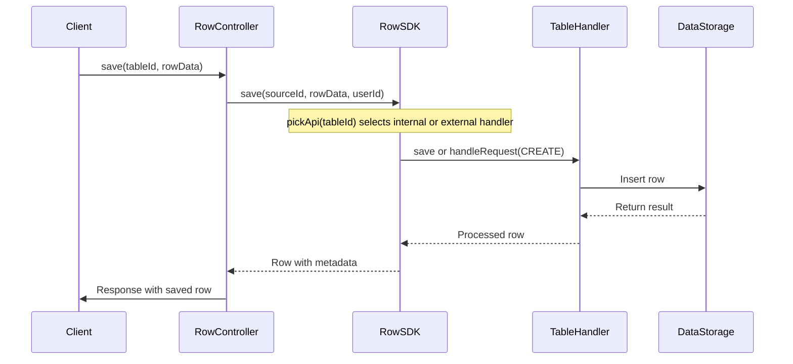

The flow is similar for other operations like `patch` (update), `fetch`/`find` (read), and `destroy` (delete). The system uses the `pickApi` function to determine whether to use internal or external handlers based on the table ID.

Sources: [packages/server/src/api/controllers/row/index.ts](https://github.com/Budibase/budibase/blob/e981536b/packages/server/src/api/controllers/row/index.ts), [packages/server/src/api/controllers/row/internal.ts](https://github.com/Budibase/budibase/blob/e981536b/packages/server/src/api/controllers/row/internal.ts), [packages/server/src/api/controllers/row/external.ts](https://github.com/Budibase/budibase/blob/e981536b/packages/server/src/api/controllers/row/external.ts)

### Input and Output Processing

Data undergoes processing during both input and output operations:

- **Input Processing**: Normalizes and validates data before storage
  - Coerces values to proper types
  - Applies default values
  - Evaluates bindings and formulas
  - Validates against schema constraints

- **Output Processing**: Enriches data for client consumption
  - Resolves relationships and populates linked data
  - Formats dates and special types
  - Computes formula fields
  - Applies view-specific transformations

These processes ensure data integrity and provide a rich experience for end-users.

Sources: [packages/server/src/api/controllers/row/utils/utils.ts](https://github.com/Budibase/budibase/blob/e981536b/packages/server/src/api/controllers/row/utils/utils.ts), [packages/server/src/utilities/rowProcessor.ts](https://github.com/Budibase/budibase/blob/e981536b/packages/server/src/utilities/rowProcessor.ts)

## Search and Filtering

### Search Architecture

Budibase provides a powerful search system that works across both internal and external data sources:

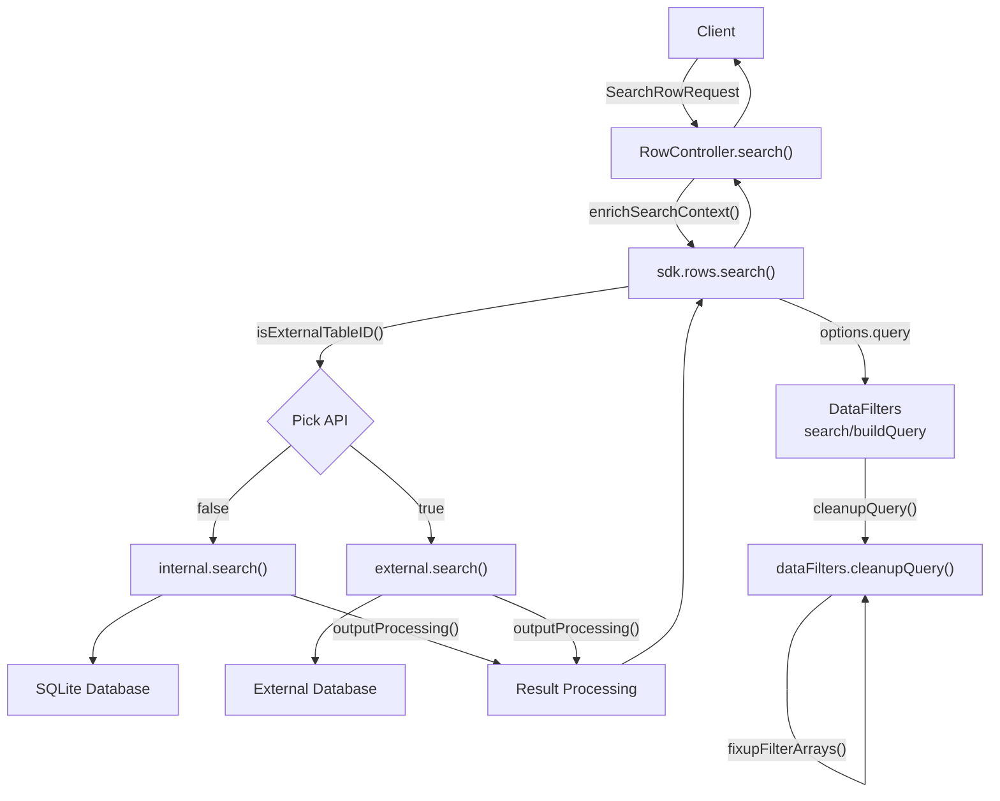

The search system converts high-level search requests into appropriate queries for the underlying data source, executes them, and processes the results before returning them to the client.

Sources: [packages/server/src/api/controllers/row/index.ts](https://github.com/Budibase/budibase/blob/e981536b/packages/server/src/api/controllers/row/index.ts), [packages/server/src/sdk/app/rows/search.ts](https://github.com/Budibase/budibase/blob/e981536b/packages/server/src/sdk/app/rows/search.ts), [packages/shared-core/src/filters.ts](https://github.com/Budibase/budibase/blob/e981536b/packages/shared-core/src/filters.ts)

### Search Filters

Budibase supports a rich set of filter operations through the `SearchFilters` interface:

| Operator Type | Operators | Description |
|---------------|-----------|-------------|
| Basic Operators | equal, notEqual, empty, notEmpty, fuzzy, string | Simple comparison operations |
| Array Operators | contains, notContains, containsAny, oneOf | Operations on array values or multiple values |
| Range Operators | range | Range comparisons for numbers and dates |
| Logical Operators | $and, $or | Combine multiple conditions |

Filters can be nested to create complex queries. The system also supports pagination, sorting, and limiting of results.

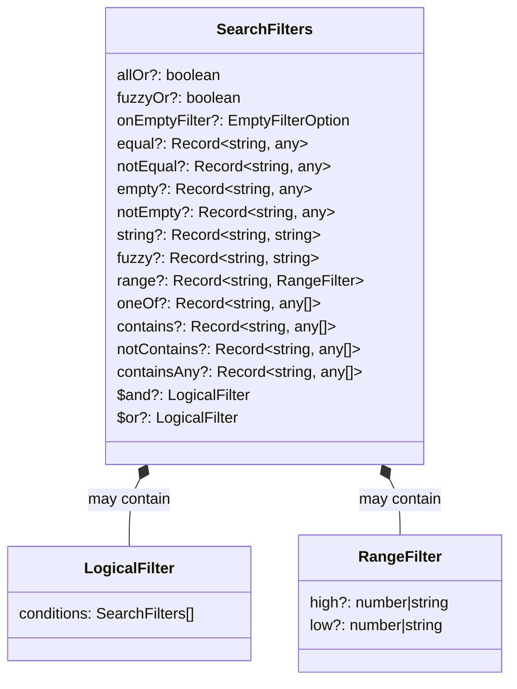

Sources: [packages/types/src/sdk/search.ts](https://github.com/Budibase/budibase/blob/e981536b/packages/types/src/sdk/search.ts), [packages/shared-core/src/filters.ts](https://github.com/Budibase/budibase/blob/e981536b/packages/shared-core/src/filters.ts), [packages/server/src/api/routes/tests/search.spec.ts](https://github.com/Budibase/budibase/blob/e981536b/packages/server/src/api/routes/tests/search.spec.ts)

## Views System

### View Creation and Management

Views in Budibase provide a way to define specialized access to table data. They are created and managed through a dedicated API:

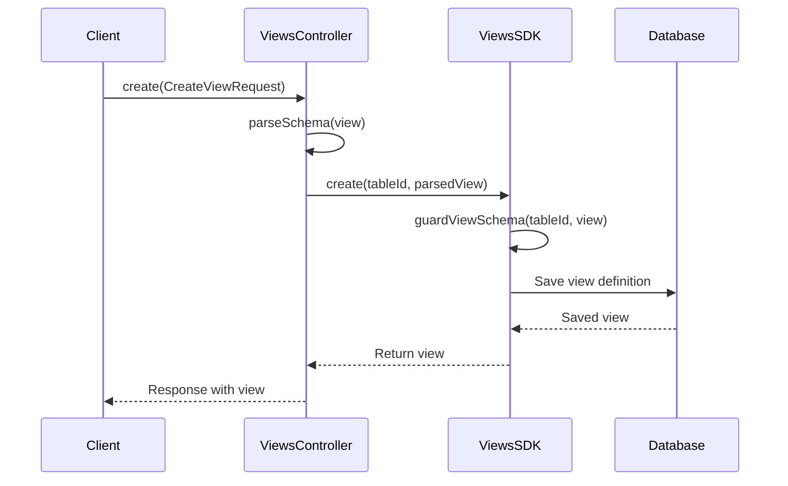

Views can customize:
- Which fields are visible
- Which fields are read-only
- Field ordering and widths
- Data filtering and sorting
- Calculation and aggregation of data

Sources: [packages/server/src/api/controllers/view/viewsV2.ts](https://github.com/Budibase/budibase/blob/e981536b/packages/server/src/api/controllers/view/viewsV2.ts), [packages/server/src/sdk/app/views/index.ts](https://github.com/Budibase/budibase/blob/e981536b/packages/server/src/sdk/app/views/index.ts)

### Using Views for Data Access

Views can be used to access data through the row API:

```mermaid
sequenceDiagram
    participant Client as Client
    participant Controller as RowController
    participant ViewAPI as ViewsController
    participant RowAPI as RowSDK
    
    Client->>Controller: searchView(viewId, query)
    Controller->>ViewAPI: get(viewId)
    ViewAPI-->>Controller: view definition
    
    Controller->>RowAPI: search({
        tableId: view.tableId,
        viewId: view.id,
        query: combinedQuery,
        ...viewOptions
    })
    
    RowAPI-->>Controller: search results
    Controller-->>Client: Response with rows
```

When searching through a view, the view's filters are combined with any additional filters provided in the request, ensuring that view constraints are always respected.

Sources: [packages/server/src/api/controllers/row/views.ts](https://github.com/Budibase/budibase/blob/e981536b/packages/server/src/api/controllers/row/views.ts), [packages/server/src/api/routes/row.ts](https://github.com/Budibase/budibase/blob/e981536b/packages/server/src/api/routes/row.ts)

## Internal vs External Data

### Internal Data Storage

Budibase uses SQLite (referred to as "SQS" - SQLite Storage) for internal data storage:

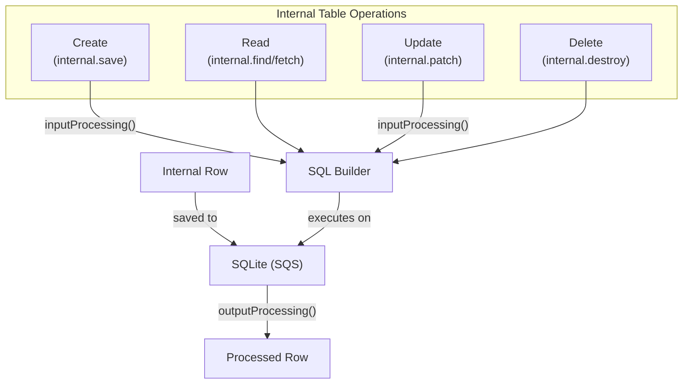

The internal system also handles relationships between tables, file attachments, and automatic fields like creation timestamps.

Sources: [packages/server/src/api/controllers/row/internal.ts](https://github.com/Budibase/budibase/blob/e981536b/packages/server/src/api/controllers/row/internal.ts), [packages/server/src/sdk/app/rows/search/internal/sqs.ts](https://github.com/Budibase/budibase/blob/e981536b/packages/server/src/sdk/app/rows/search/internal/sqs.ts)

### External Data Sources

For external data sources, Budibase provides connectors to various database systems:

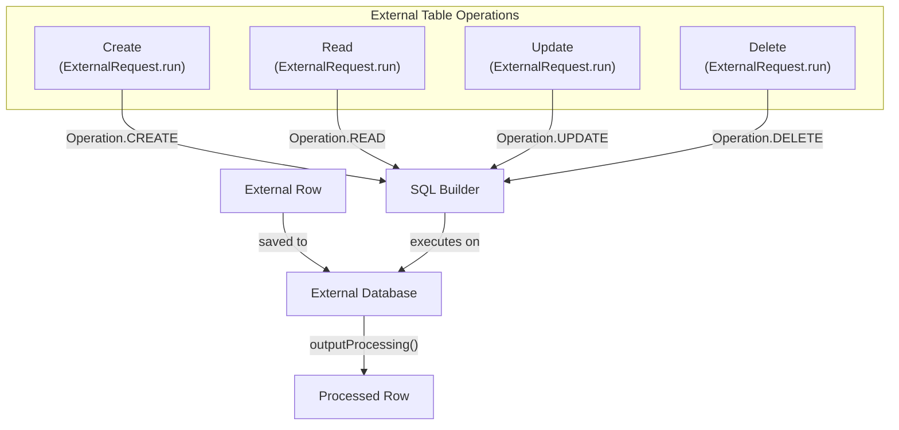

External data operations are handled through the `ExternalRequest` class, which builds appropriate queries based on the operation type and executes them against the external data source.

Sources: [packages/server/src/api/controllers/row/external.ts](https://github.com/Budibase/budibase/blob/e981536b/packages/server/src/api/controllers/row/external.ts), [packages/server/src/sdk/app/rows/search/external.ts](https://github.com/Budibase/budibase/blob/e981536b/packages/server/src/sdk/app/rows/search/external.ts)

## Relationships and Data Linking

Budibase supports relationships between tables, allowing for the creation of complex data models:

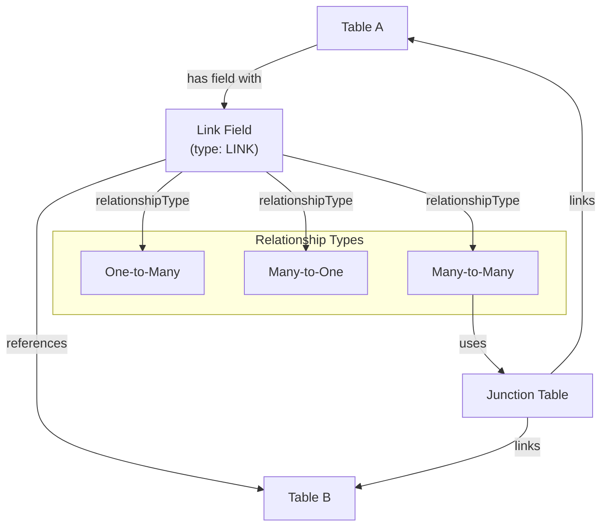

When querying data with relationships, Budibase automatically joins the related tables and populates the linked data, providing a seamless experience for application developers.

Sources: [packages/server/src/api/controllers/row/utils/sqlUtils.ts](https://github.com/Budibase/budibase/blob/e981536b/packages/server/src/api/controllers/row/utils/sqlUtils.ts), [packages/backend-core/src/sql/sql.ts](https://github.com/Budibase/budibase/blob/e981536b/packages/backend-core/src/sql/sql.ts)

## Summary

Budibase's data management system provides a unified interface for working with both internal and external data sources, supporting a wide range of operations and capabilities:

1. **Tables and Schemas**: Define the structure of your data
2. **Rows**: Store and manipulate individual records
3. **Views**: Create specialized perspectives on your data
4. **Search and Filtering**: Find specific data with powerful query capabilities
5. **Internal and External Data**: Work seamlessly with various data sources

The system's architecture ensures consistency across different data sources while providing the flexibility to work with a variety of data models and storage systems.