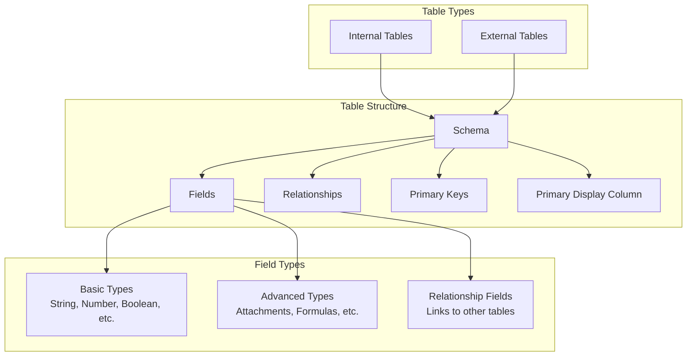
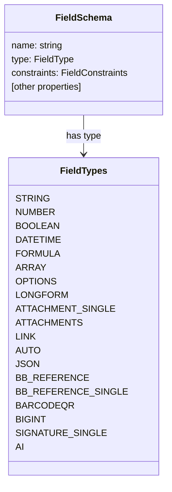
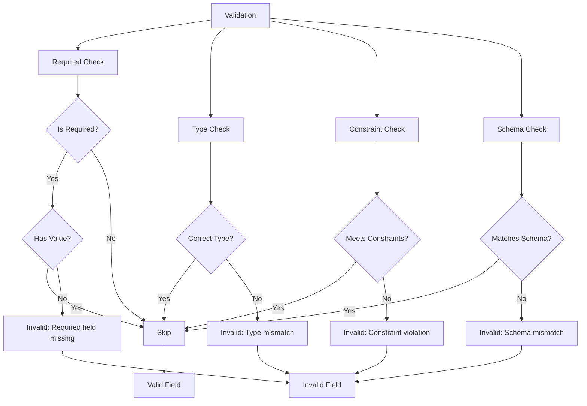
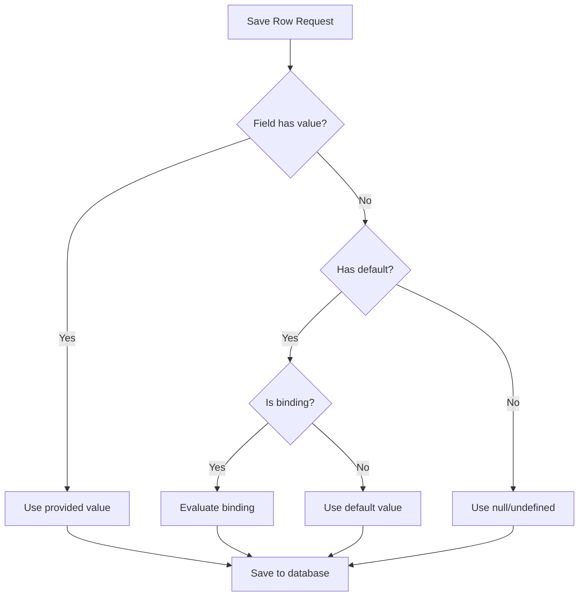
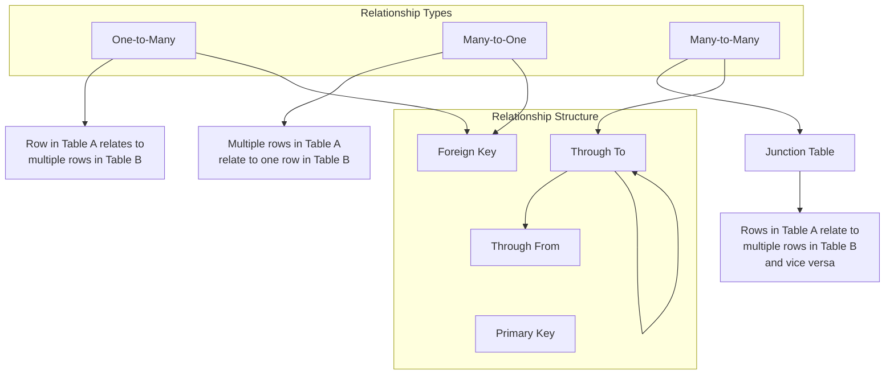
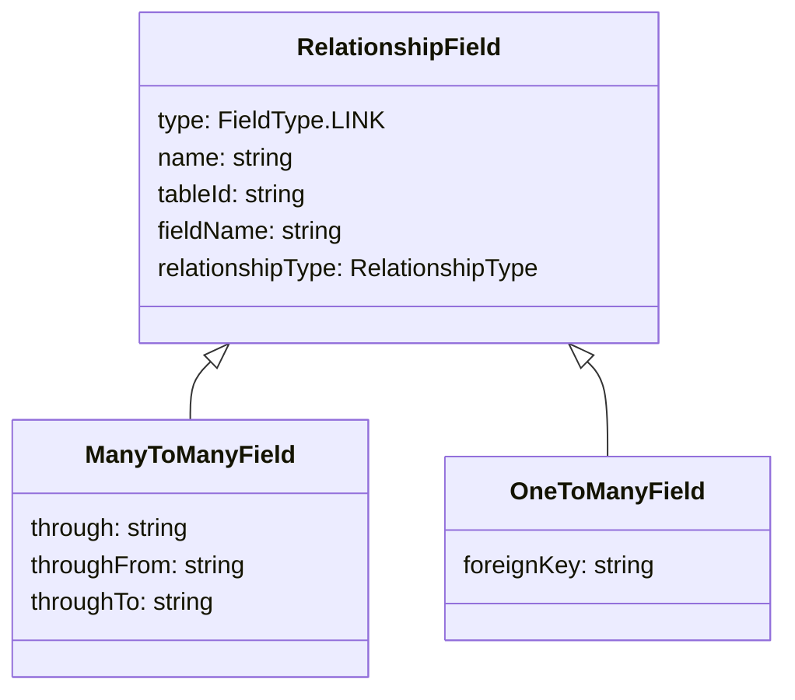
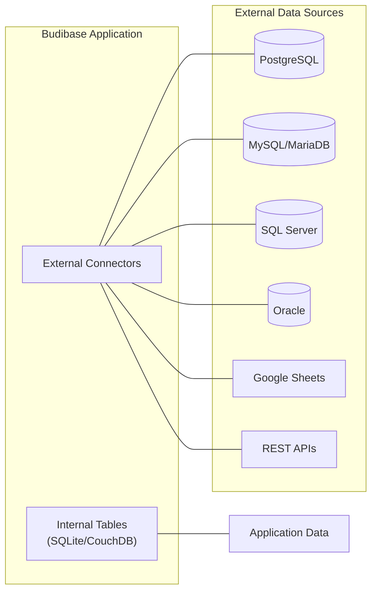
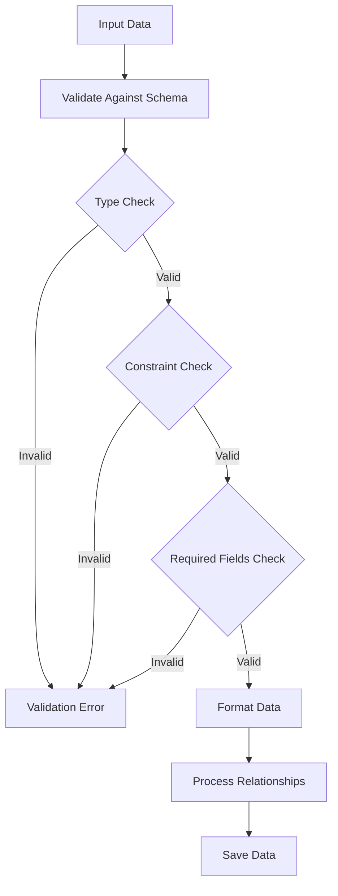
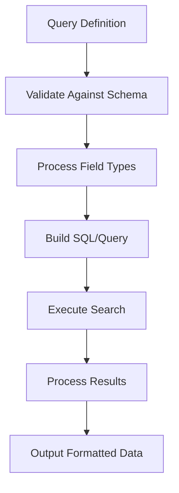

# Tables and Schemas

<details>
<summary>Relevant source files</summary>

The following files were used as context for generating this wiki page:

- [packages/backend-core/src/sql/sql.ts](https://github.com/Budibase/budibase/blob/e981536b/packages/backend-core/src/sql/sql.ts)
- [packages/backend-core/src/sql/tests/utils.spec.ts](https://github.com/Budibase/budibase/blob/e981536b/packages/backend-core/src/sql/tests/utils.spec.ts)
- [packages/backend-core/src/sql/utils.ts](https://github.com/Budibase/budibase/blob/e981536b/packages/backend-core/src/sql/utils.ts)
- [packages/backend-core/tests/core/utilities/mocks/licenses.ts](https://github.com/Budibase/budibase/blob/e981536b/packages/backend-core/tests/core/utilities/mocks/licenses.ts)
- [packages/builder/src/components/backend/DataTable/modals/CreateEditColumn.svelte](https://github.com/Budibase/budibase/blob/e981536b/packages/builder/src/components/backend/DataTable/modals/CreateEditColumn.svelte)
- [packages/builder/src/components/backend/Datasources/CreateEditRelationship.svelte](https://github.com/Budibase/budibase/blob/e981536b/packages/builder/src/components/backend/Datasources/CreateEditRelationship.svelte)
- [packages/builder/src/components/backend/Datasources/relationshipErrors.js](https://github.com/Budibase/budibase/blob/e981536b/packages/builder/src/components/backend/Datasources/relationshipErrors.js)
- [packages/builder/src/components/backend/TableNavigator/utils.js](https://github.com/Budibase/budibase/blob/e981536b/packages/builder/src/components/backend/TableNavigator/utils.js)
- [packages/builder/src/components/common/RelationshipSelector.svelte](https://github.com/Budibase/budibase/blob/e981536b/packages/builder/src/components/common/RelationshipSelector.svelte)
- [packages/builder/src/helpers/schemaGenerator.js](https://github.com/Budibase/budibase/blob/e981536b/packages/builder/src/helpers/schemaGenerator.js)
- [packages/server/scripts/integrations/postgres/emp-territory.sql](https://github.com/Budibase/budibase/blob/e981536b/packages/server/scripts/integrations/postgres/emp-territory.sql)
- [packages/server/src/api/controllers/row/external.ts](https://github.com/Budibase/budibase/blob/e981536b/packages/server/src/api/controllers/row/external.ts)
- [packages/server/src/api/controllers/row/index.ts](https://github.com/Budibase/budibase/blob/e981536b/packages/server/src/api/controllers/row/index.ts)
- [packages/server/src/api/controllers/row/internal.ts](https://github.com/Budibase/budibase/blob/e981536b/packages/server/src/api/controllers/row/internal.ts)
- [packages/server/src/api/controllers/row/utils/basic.ts](https://github.com/Budibase/budibase/blob/e981536b/packages/server/src/api/controllers/row/utils/basic.ts)
- [packages/server/src/api/controllers/row/utils/sqlUtils.ts](https://github.com/Budibase/budibase/blob/e981536b/packages/server/src/api/controllers/row/utils/sqlUtils.ts)
- [packages/server/src/api/controllers/row/utils/tests/sqlUtils.spec.ts](https://github.com/Budibase/budibase/blob/e981536b/packages/server/src/api/controllers/row/utils/tests/sqlUtils.spec.ts)
- [packages/server/src/api/controllers/row/utils/utils.ts](https://github.com/Budibase/budibase/blob/e981536b/packages/server/src/api/controllers/row/utils/utils.ts)
- [packages/server/src/api/controllers/row/views.ts](https://github.com/Budibase/budibase/blob/e981536b/packages/server/src/api/controllers/row/views.ts)
- [packages/server/src/api/controllers/view/exporters.ts](https://github.com/Budibase/budibase/blob/e981536b/packages/server/src/api/controllers/view/exporters.ts)
- [packages/server/src/api/routes/row.ts](https://github.com/Budibase/budibase/blob/e981536b/packages/server/src/api/routes/row.ts)
- [packages/server/src/api/routes/tests/row.spec.ts](https://github.com/Budibase/budibase/blob/e981536b/packages/server/src/api/routes/tests/row.spec.ts)
- [packages/server/src/api/routes/tests/search.spec.ts](https://github.com/Budibase/budibase/blob/e981536b/packages/server/src/api/routes/tests/search.spec.ts)
- [packages/server/src/db/utils.ts](https://github.com/Budibase/budibase/blob/e981536b/packages/server/src/db/utils.ts)
- [packages/server/src/sdk/app/rows/external.ts](https://github.com/Budibase/budibase/blob/e981536b/packages/server/src/sdk/app/rows/external.ts)
- [packages/server/src/sdk/app/rows/internal.ts](https://github.com/Budibase/budibase/blob/e981536b/packages/server/src/sdk/app/rows/internal.ts)
- [packages/server/src/sdk/app/rows/rows.ts](https://github.com/Budibase/budibase/blob/e981536b/packages/server/src/sdk/app/rows/rows.ts)
- [packages/server/src/sdk/app/rows/search.ts](https://github.com/Budibase/budibase/blob/e981536b/packages/server/src/sdk/app/rows/search.ts)
- [packages/server/src/sdk/app/rows/search/external.ts](https://github.com/Budibase/budibase/blob/e981536b/packages/server/src/sdk/app/rows/search/external.ts)
- [packages/server/src/sdk/app/rows/search/internal/sqs.ts](https://github.com/Budibase/budibase/blob/e981536b/packages/server/src/sdk/app/rows/search/internal/sqs.ts)
- [packages/server/src/tests/utilities/api/row.ts](https://github.com/Budibase/budibase/blob/e981536b/packages/server/src/tests/utilities/api/row.ts)
- [packages/server/src/utilities/csv.ts](https://github.com/Budibase/budibase/blob/e981536b/packages/server/src/utilities/csv.ts)
- [packages/server/src/utilities/schema.ts](https://github.com/Budibase/budibase/blob/e981536b/packages/server/src/utilities/schema.ts)
- [packages/server/src/utilities/tests/csv.spec.ts](https://github.com/Budibase/budibase/blob/e981536b/packages/server/src/utilities/tests/csv.spec.ts)
- [packages/shared-core/jest.config.ts](https://github.com/Budibase/budibase/blob/e981536b/packages/shared-core/jest.config.ts)
- [packages/shared-core/src/filters.ts](https://github.com/Budibase/budibase/blob/e981536b/packages/shared-core/src/filters.ts)
- [packages/shared-core/src/tests/cron.test.ts](https://github.com/Budibase/budibase/blob/e981536b/packages/shared-core/src/tests/cron.test.ts)
- [packages/shared-core/src/utils.ts](https://github.com/Budibase/budibase/blob/e981536b/packages/shared-core/src/utils.ts)
- [packages/types/src/api/web/searchFilter.ts](https://github.com/Budibase/budibase/blob/e981536b/packages/types/src/api/web/searchFilter.ts)
- [packages/types/src/sdk/licensing/feature.ts](https://github.com/Budibase/budibase/blob/e981536b/packages/types/src/sdk/licensing/feature.ts)
- [packages/types/src/sdk/row.ts](https://github.com/Budibase/budibase/blob/e981536b/packages/types/src/sdk/row.ts)
- [packages/types/src/sdk/search.ts](https://github.com/Budibase/budibase/blob/e981536b/packages/types/src/sdk/search.ts)

</details>


This document explains how Budibase manages data tables and their schemas. It covers table structure, field types, relationships between tables, and schema validation mechanisms. For information about row operations and CRUD functionality, see [Rows and CRUD Operations](#3.2).

## Overview

Tables in Budibase are the fundamental data structures that store information. Each table has a schema that defines its structure, including the fields (columns), their types, constraints, and relationships with other tables. Budibase supports both internal tables (stored in Budibase's own database) and external tables (connected to external data sources like SQL databases).



Sources: [packages/server/src/api/routes/tests/row.spec.ts:107-137](https://github.com/Budibase/budibase/blob/e981536b/packages/server/src/api/routes/tests/row.spec.ts#L107-L137)</div>

## Table Structure

A table in Budibase is defined by the following key components:

1. **Table ID**: A unique identifier for the table
2. **Name**: A human-readable name for the table
3. **Schema**: The structure definition, including fields and their properties
4. **Primary Key(s)**: One or more fields that uniquely identify each row
5. **Primary Display Column**: The field used to represent a row in UI components
6. **Source Type**: Whether the table is internal or external

```typescript
interface Table {
  _id?: string;
  name: string;
  schema: TableSchema;
  sourceId?: string;
  sourceType: TableSourceType; // INTERNAL or EXTERNAL
  primary?: string[];
  primaryDisplay?: string;
  // ... other properties
}
```

### Table Schema

A table schema is a collection of field definitions that specify the structure of the table. Each field has a name, type, and optional constraints.

```typescript
interface TableSchema {
  [key: string]: FieldSchema;
}

interface FieldSchema {
  name: string;
  type: FieldType;
  constraints?: FieldConstraints;
  // ... other properties based on field type
}
```

Sources: [packages/server/src/api/routes/tests/row.spec.ts:108-138](https://github.com/Budibase/budibase/blob/e981536b/packages/server/src/api/routes/tests/row.spec.ts#L108-L138)</div>

## Field Types

Budibase supports a wide range of field types to accommodate various data needs. The field type determines how data is stored, displayed, and validated.



Sources: [packages/builder/src/components/backend/DataTable/modals/CreateEditColumn.svelte:117-138](https://github.com/Budibase/budibase/blob/e981536b/packages/builder/src/components/backend/DataTable/modals/CreateEditColumn.svelte#L117-L138), [packages/server/src/utilities/schema.ts:43-86](https://github.com/Budibase/budibase/blob/e981536b/packages/server/src/utilities/schema.ts#L43-L86)

### Basic Field Types

- **String**: Text data
- **Number**: Numeric values
- **Boolean**: True/false values
- **Datetime**: Date and time values (with options for date-only or time-only)
- **Options**: Single selection from predefined options
- **Array**: Multiple selections from predefined options
- **Longform**: Rich text with support for markdown
- **BigInt**: Large integer values

### Advanced Field Types

- **Formula**: Calculated fields based on other fields
- **Attachment/Attachments**: File attachments
- **JSON**: Structured JSON data
- **Barcode/QR**: Barcode or QR code data
- **Signature**: Digital signature
- **AI**: AI-generated content

### Relationship Field Types

- **Link**: References to rows in other tables
- **BB Reference**: References to Budibase entities like users

Sources: [packages/builder/src/components/backend/DataTable/modals/CreateEditColumn.svelte:263-276](https://github.com/Budibase/budibase/blob/e981536b/packages/builder/src/components/backend/DataTable/modals/CreateEditColumn.svelte#L263-L276)

## Field Constraints and Validation

Fields can have constraints that define validation rules, such as required fields, string length limits, or numeric ranges.



### Common Constraints

- **Presence**: Whether a field is required
- **Length**: Min/max length for strings
- **Numericality**: Min/max values for numbers
- **Datetime**: Earliest/latest allowed dates
- **Inclusion**: Valid values for options/arrays

The validation process ensures data integrity by checking that field values conform to their schema definitions.

Sources: [packages/server/src/utilities/schema.ts:43-143](https://github.com/Budibase/budibase/blob/e981536b/packages/server/src/utilities/schema.ts#L43-L143), [packages/server/src/api/routes/tests/row.spec.ts:391-685](https://github.com/Budibase/budibase/blob/e981536b/packages/server/src/api/routes/tests/row.spec.ts#L391-L685)

## Default Values

Fields can have default values that are applied when a new row is created without specifying a value for that field. Default values can be:

1. **Static values**: A fixed value like "New Item" or 0
2. **Dynamic values (bindings)**: Calculated values using expressions like `{{ [now] }}` or `{{ [Current User]._id }}`

The following field types support default values:

- String
- Number
- Boolean
- Options
- Array
- Datetime
- User references
- And most other non-formula fields

Default values are processed during row creation:



Sources: [packages/server/src/api/routes/tests/row.spec.ts:391-732](https://github.com/Budibase/budibase/blob/e981536b/packages/server/src/api/routes/tests/row.spec.ts#L391-L732), [packages/builder/src/components/backend/DataTable/modals/CreateEditColumn.svelte:667-687](https://github.com/Budibase/budibase/blob/e981536b/packages/builder/src/components/backend/DataTable/modals/CreateEditColumn.svelte#L667-L687)

## Relationships

Relationships define connections between tables, allowing related data to be linked and queried together. Budibase supports several types of relationships.



### Relationship Types

1. **One-to-Many**: A row in Table A can be linked to multiple rows in Table B, but each row in Table B links to only one row in Table A.

2. **Many-to-One**: Multiple rows in Table A can be linked to one row in Table B.

3. **Many-to-Many**: Rows in Table A can be linked to multiple rows in Table B, and vice versa. This requires a junction table to store the relationships.

### Relationship Configuration

When creating a relationship, you need to define:

1. **Tables**: The two tables being related
2. **Relationship Type**: One-to-many, many-to-one, or many-to-many
3. **Field Names**: The names of the link fields in both tables
4. For Many-to-Many:
   - **Through Table**: The junction table that stores relationship records
   - **Through From/To**: The fields that link to the primary tables



Sources: [packages/builder/src/components/backend/Datasources/CreateEditRelationship.svelte:24-312](https://github.com/Budibase/budibase/blob/e981536b/packages/builder/src/components/backend/Datasources/CreateEditRelationship.svelte#L24-L312), [packages/server/src/api/controllers/row/utils/sqlUtils.ts:22-91](https://github.com/Budibase/budibase/blob/e981536b/packages/server/src/api/controllers/row/utils/sqlUtils.ts#L22-L91)

## Internal vs. External Tables

Budibase supports both internal tables (stored in Budibase's own database) and external tables (connected to external data sources).

### Internal Tables

Internal tables are managed entirely within Budibase. They're stored in Budibase's internal database (typically SQLite or CouchDB-based) and have the following characteristics:

- Fully managed by Budibase
- Support all field types and features
- Use auto-generated IDs for rows
- Include system fields like `_id`, `_rev`, `createdAt`, and `updatedAt`

### External Tables

External tables connect to external data sources such as:

- SQL databases (PostgreSQL, MySQL, SQL Server, etc.)
- Google Sheets
- REST APIs
- Other data sources with connectors

External tables have some limitations and differences:

- Field type support depends on the external datasource
- Primary keys are based on the external database
- Some Budibase features may be limited
- Certain operations may require special handling



Sources: [packages/server/src/api/controllers/row/index.ts:50-56](https://github.com/Budibase/budibase/blob/e981536b/packages/server/src/api/controllers/row/index.ts#L50-L56), [packages/server/src/api/controllers/row/external.ts:33-198](https://github.com/Budibase/budibase/blob/e981536b/packages/server/src/api/controllers/row/external.ts#L33-L198), [packages/server/src/sdk/app/rows/search/external.ts:27-258](https://github.com/Budibase/budibase/blob/e981536b/packages/server/src/sdk/app/rows/search/external.ts#L27-L258)

## Schema Validation and Processing

Budibase validates and processes data against schemas to ensure data integrity.

### Schema Validation

When data is saved or updated, Budibase validates it against the table schema:

1. Checks that all required fields have values
2. Validates field values match their expected types
3. Ensures values meet constraints (like string length, numeric range)
4. Protects system fields from invalid modifications



### Type Conversion and Processing

The schema system also handles type conversion and processing:

1. **String to Number**: Converting string inputs to numbers
2. **Date Formatting**: Ensuring dates are in ISO format
3. **JSON Processing**: Parsing JSON strings into objects
4. **Relationship Processing**: Handling linked records properly

Sources: [packages/server/src/utilities/schema.ts:144-230](https://github.com/Budibase/budibase/blob/e981536b/packages/server/src/utilities/schema.ts#L144-L230), [packages/server/src/api/controllers/row/utils/utils.ts:34-60](https://github.com/Budibase/budibase/blob/e981536b/packages/server/src/api/controllers/row/utils/utils.ts#L34-L60)

## Schema Editor Interface

The Budibase builder provides an interface for creating and editing table schemas. This interface allows users to:

1. Define new fields with names and types
2. Set constraints and validation rules
3. Configure relationships between tables
4. Set default values and other field properties

The schema editor validates input and ensures schema integrity, preventing issues like:

- Duplicate column names
- Invalid field names (special characters)
- Protected column names
- Invalid relationships

Sources: [packages/builder/src/components/backend/DataTable/modals/CreateEditColumn.svelte:1-815](https://github.com/Budibase/budibase/blob/e981536b/packages/builder/src/components/backend/DataTable/modals/CreateEditColumn.svelte#L1-L815)

## Search and Filtering

Tables schemas are used in conjunction with Budibase's search and filtering system. The schema defines what fields can be searched and how they should be processed:

1. Different field types support different search operators
2. Schema information determines how filters are applied
3. Search results are processed based on schema definitions



Sources: [packages/server/src/sdk/app/rows/search.ts:42-151](https://github.com/Budibase/budibase/blob/e981536b/packages/server/src/sdk/app/rows/search.ts#L42-L151), [packages/shared-core/src/filters.ts:46-117](https://github.com/Budibase/budibase/blob/e981536b/packages/shared-core/src/filters.ts#L46-L117), [packages/types/src/sdk/search.ts:1-187](https://github.com/Budibase/budibase/blob/e981536b/packages/types/src/sdk/search.ts#L1-L187)

## Conclusion

The Tables and Schemas system is a fundamental part of the Budibase platform, enabling data definition, validation, and relationship management. This system underpins many other features, including:

- Data entry and validation
- UI component data binding
- Filtering and searching
- Relationship navigation
- Automations and business rules