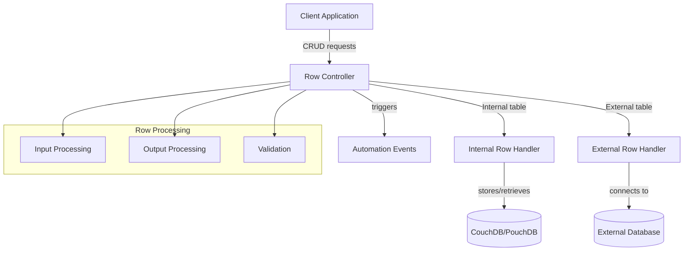
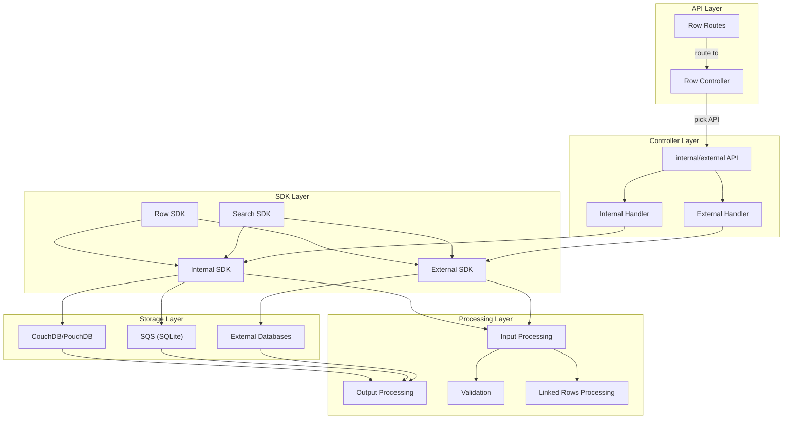
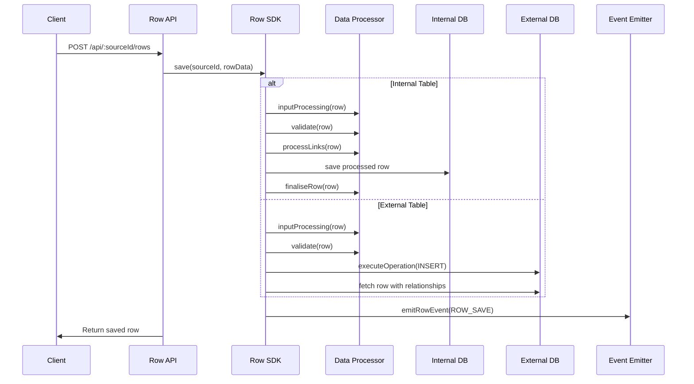
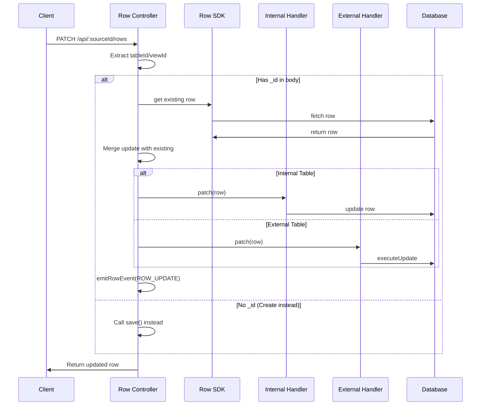
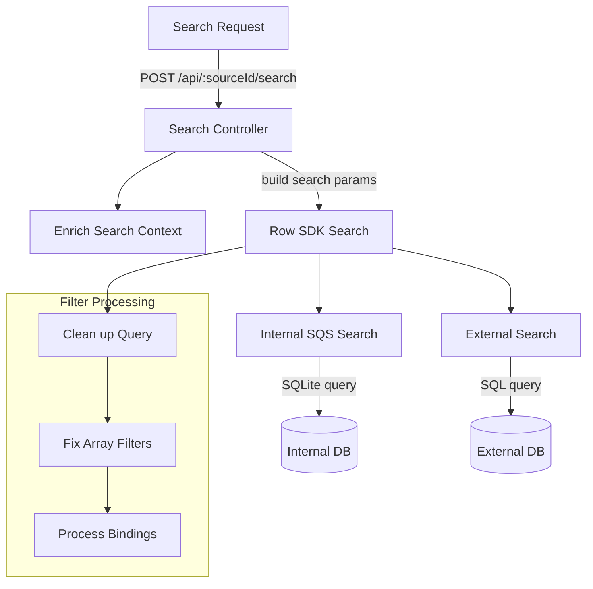

# Rows and CRUD Operations

<details>
<summary>Relevant source files</summary>

The following files were used as context for generating this wiki page:

- [packages/backend-core/src/sql/sql.ts](https://github.com/Budibase/budibase/blob/e981536b/packages/backend-core/src/sql/sql.ts)
- [packages/backend-core/src/sql/tests/utils.spec.ts](https://github.com/Budibase/budibase/blob/e981536b/packages/backend-core/src/sql/tests/utils.spec.ts)
- [packages/backend-core/src/sql/utils.ts](https://github.com/Budibase/budibase/blob/e981536b/packages/backend-core/src/sql/utils.ts)
- [packages/server/src/api/controllers/row/external.ts](https://github.com/Budibase/budibase/blob/e981536b/packages/server/src/api/controllers/row/external.ts)
- [packages/server/src/api/controllers/row/index.ts](https://github.com/Budibase/budibase/blob/e981536b/packages/server/src/api/controllers/row/index.ts)
- [packages/server/src/api/controllers/row/internal.ts](https://github.com/Budibase/budibase/blob/e981536b/packages/server/src/api/controllers/row/internal.ts)
- [packages/server/src/api/controllers/row/utils/basic.ts](https://github.com/Budibase/budibase/blob/e981536b/packages/server/src/api/controllers/row/utils/basic.ts)
- [packages/server/src/api/controllers/row/utils/sqlUtils.ts](https://github.com/Budibase/budibase/blob/e981536b/packages/server/src/api/controllers/row/utils/sqlUtils.ts)
- [packages/server/src/api/controllers/row/utils/tests/sqlUtils.spec.ts](https://github.com/Budibase/budibase/blob/e981536b/packages/server/src/api/controllers/row/utils/tests/sqlUtils.spec.ts)
- [packages/server/src/api/controllers/row/utils/utils.ts](https://github.com/Budibase/budibase/blob/e981536b/packages/server/src/api/controllers/row/utils/utils.ts)
- [packages/server/src/api/controllers/row/views.ts](https://github.com/Budibase/budibase/blob/e981536b/packages/server/src/api/controllers/row/views.ts)
- [packages/server/src/api/routes/row.ts](https://github.com/Budibase/budibase/blob/e981536b/packages/server/src/api/routes/row.ts)
- [packages/server/src/api/routes/tests/row.spec.ts](https://github.com/Budibase/budibase/blob/e981536b/packages/server/src/api/routes/tests/row.spec.ts)
- [packages/server/src/api/routes/tests/search.spec.ts](https://github.com/Budibase/budibase/blob/e981536b/packages/server/src/api/routes/tests/search.spec.ts)
- [packages/server/src/db/utils.ts](https://github.com/Budibase/budibase/blob/e981536b/packages/server/src/db/utils.ts)
- [packages/server/src/sdk/app/rows/external.ts](https://github.com/Budibase/budibase/blob/e981536b/packages/server/src/sdk/app/rows/external.ts)
- [packages/server/src/sdk/app/rows/internal.ts](https://github.com/Budibase/budibase/blob/e981536b/packages/server/src/sdk/app/rows/internal.ts)
- [packages/server/src/sdk/app/rows/rows.ts](https://github.com/Budibase/budibase/blob/e981536b/packages/server/src/sdk/app/rows/rows.ts)
- [packages/server/src/sdk/app/rows/search.ts](https://github.com/Budibase/budibase/blob/e981536b/packages/server/src/sdk/app/rows/search.ts)
- [packages/server/src/sdk/app/rows/search/external.ts](https://github.com/Budibase/budibase/blob/e981536b/packages/server/src/sdk/app/rows/search/external.ts)
- [packages/server/src/sdk/app/rows/search/internal/sqs.ts](https://github.com/Budibase/budibase/blob/e981536b/packages/server/src/sdk/app/rows/search/internal/sqs.ts)
- [packages/server/src/tests/utilities/api/row.ts](https://github.com/Budibase/budibase/blob/e981536b/packages/server/src/tests/utilities/api/row.ts)
- [packages/shared-core/jest.config.ts](https://github.com/Budibase/budibase/blob/e981536b/packages/shared-core/jest.config.ts)
- [packages/shared-core/src/filters.ts](https://github.com/Budibase/budibase/blob/e981536b/packages/shared-core/src/filters.ts)
- [packages/shared-core/src/tests/cron.test.ts](https://github.com/Budibase/budibase/blob/e981536b/packages/shared-core/src/tests/cron.test.ts)
- [packages/shared-core/src/utils.ts](https://github.com/Budibase/budibase/blob/e981536b/packages/shared-core/src/utils.ts)
- [packages/types/src/api/web/searchFilter.ts](https://github.com/Budibase/budibase/blob/e981536b/packages/types/src/api/web/searchFilter.ts)
- [packages/types/src/sdk/row.ts](https://github.com/Budibase/budibase/blob/e981536b/packages/types/src/sdk/row.ts)
- [packages/types/src/sdk/search.ts](https://github.com/Budibase/budibase/blob/e981536b/packages/types/src/sdk/search.ts)

</details>


This page describes how row data is created, read, updated, and deleted (CRUD operations) through Budibase's API and SDK layers. It covers both internal tables (stored in Budibase's internal database) and external tables (connected to external data sources like SQL databases). For information about table and schema management, see [Tables and Schemas](#3.1), and for information about views, see [Views](#3.3).

## Overview of Row Operations

Rows are the fundamental data entities in Budibase applications. Every row belongs to a table (either internal or external) and contains fields defined by that table's schema. Budibase provides a unified interface for performing CRUD operations on rows, regardless of whether they're stored in the internal database or an external data source.



Sources: [packages/server/src/api/controllers/row/index.ts:1-442](https://github.com/Budibase/budibase/blob/e981536b/packages/server/src/api/controllers/row/index.ts#L1-L442). [packages/server/src/api/controllers/row/internal.ts:1-244](https://github.com/Budibase/budibase/blob/e981536b/packages/server/src/api/controllers/row/internal.ts#L1-L244). [packages/server/src/api/controllers/row/external.ts:1-198](https://github.com/Budibase/budibase/blob/e981536b/packages/server/src/api/controllers/row/external.ts#L1-L198).

## Row Controller Architecture

The row controller follows a layered architecture that separates concerns and handles different types of data sources appropriately. At the highest level, the architecture consists of:

1. **API Layer**: HTTP endpoints for CRUD operations
2. **Controller Layer**: Handles requests and delegates to the appropriate handler
3. **SDK Layer**: Provides programmatic access to row operations
4. **Processing Layer**: Transforms data between application and storage formats
5. **Storage Layer**: Interacts with the underlying storage system



Sources: [packages/server/src/api/routes/row.ts:1-99](https://github.com/Budibase/budibase/blob/e981536b/packages/server/src/api/routes/row.ts#L1-L99). [packages/server/src/api/controllers/row/index.ts:1-442](https://github.com/Budibase/budibase/blob/e981536b/packages/server/src/api/controllers/row/index.ts#L1-L442). [packages/server/src/sdk/app/rows/rows.ts:1-30](https://github.com/Budibase/budibase/blob/e981536b/packages/server/src/sdk/app/rows/rows.ts#L1-L30).

### Internal vs External Row Handling

Budibase handles rows differently depending on whether they belong to internal or external tables:

| Aspect | Internal Tables | External Tables |
| ------ | -------------- | --------------- |
| **Storage** | CouchDB/PouchDB | Various external databases (MySQL, PostgreSQL, etc.) |
| **ID Generation** | Budibase-generated IDs | Uses primary keys from external database |
| **Relationships** | Junction documents in internal DB | Uses foreign keys and SQL joins |
| **Formula Fields** | Computed using JavaScript | Some computation possible with database functions |
| **CRUD Implementation** | Direct DB operations | Uses data source integrations |
| **Search Capability** | Full query capabilities | Limited by underlying database |

## Basic Row CRUD Operations

### Creating Rows

When creating a new row, Budibase:
1. Determines if the table is internal or external
2. Processes input data (type conversion, default values, etc.)
3. Validates the row against the table schema
4. Stores the row in the appropriate database
5. Processes relationships
6. Emits events for automations
7. Returns the processed row



Sources: [packages/server/src/api/controllers/row/index.ts:91-124](https://github.com/Budibase/budibase/blob/e981536b/packages/server/src/api/controllers/row/index.ts#L91-L124). [packages/server/src/api/controllers/row/internal.ts:28-97](https://github.com/Budibase/budibase/blob/e981536b/packages/server/src/api/controllers/row/internal.ts#L28-L97). [packages/server/src/api/controllers/row/external.ts:45-112](https://github.com/Budibase/budibase/blob/e981536b/packages/server/src/api/controllers/row/external.ts#L45-L112).

Example of creating a row:

```javascript
// Creating a row via the API
const response = await fetch(`/api/${tableId}/rows`, {
  method: 'POST',
  headers: { 'Content-Type': 'application/json' },
  body: JSON.stringify({
    name: "Test Row",
    description: "This is a test row"
  })
});
```

#### Default Values

When creating rows, Budibase supports default values for fields, including:

1. Static default values (specified in the field definition)
2. Dynamic values using bindings (e.g., `{{ [user].firstName }}`)
3. JavaScript expressions (e.g., `{{ js "return new Date()" }}`)

Default values are applied when a field value is not specified in the create request or is explicitly set to `null` or `undefined`.

Sources: [packages/server/src/api/routes/tests/row.spec.ts:391-732](https://github.com/Budibase/budibase/blob/e981536b/packages/server/src/api/routes/tests/row.spec.ts#L391-L732).

### Reading Rows

Budibase provides several ways to retrieve rows:

1. **Fetch a single row by ID**: `GET /api/:sourceId/rows/:rowId`
2. **Fetch all rows in a table**: `GET /api/:sourceId/rows`
3. **Search for rows with filters**: `POST /api/:sourceId/search`
4. **Fetch an enriched row with full relationship data**: `GET /api/:sourceId/:rowId/enrich`

When reading rows, Budibase:
1. Identifies the source (table or view)
2. Retrieves the raw data from the appropriate database
3. Processes the output (formatting, relationship enrichment, etc.)
4. Returns the processed rows to the client

Sources: [packages/server/src/api/controllers/row/index.ts:138-152](https://github.com/Budibase/budibase/blob/e981536b/packages/server/src/api/controllers/row/index.ts#L138-L152). [packages/server/src/api/controllers/row/utils/utils.ts:127-169](https://github.com/Budibase/budibase/blob/e981536b/packages/server/src/api/controllers/row/utils/utils.ts#L127-L169).

### Updating Rows

When updating an existing row, Budibase:
1. Retrieves the existing row
2. Merges the update data with the existing row
3. Processes the input data
4. Validates the updated row
5. Updates relationships if necessary
6. Stores the updated row
7. Emits events for automations
8. Returns the updated row



Sources: [packages/server/src/api/controllers/row/index.ts:58-89](https://github.com/Budibase/budibase/blob/e981536b/packages/server/src/api/controllers/row/index.ts#L58-L89). [packages/server/src/api/controllers/row/internal.ts:28-97](https://github.com/Budibase/budibase/blob/e981536b/packages/server/src/api/controllers/row/internal.ts#L28-L97). [packages/server/src/api/controllers/row/external.ts:45-112](https://github.com/Budibase/budibase/blob/e981536b/packages/server/src/api/controllers/row/external.ts#L45-L112).

### Deleting Rows

Budibase supports deleting single rows or multiple rows in a batch:

For single row deletion:
1. Retrieves the row to be deleted
2. Removes relationships to other rows
3. Deletes the row from the database
4. Cleans up any attachments
5. Emits events for automations

For bulk deletion:
1. Processes all rows to be deleted
2. Removes relationships for each row
3. Deletes all rows in a single operation
4. Cleans up attachments
5. Emits events for each deleted row

Sources: [packages/server/src/api/controllers/row/index.ts:224-241](https://github.com/Budibase/budibase/blob/e981536b/packages/server/src/api/controllers/row/index.ts#L224-L241). [packages/server/src/api/controllers/row/internal.ts:99-188](https://github.com/Budibase/budibase/blob/e981536b/packages/server/src/api/controllers/row/internal.ts#L99-L188). [packages/server/src/api/controllers/row/external.ts:115-147](https://github.com/Budibase/budibase/blob/e981536b/packages/server/src/api/controllers/row/external.ts#L115-L147).

## Search and Filtering

Budibase provides a powerful search system that works across both internal and external tables. The search functionality is exposed through the `/api/:sourceId/search` endpoint.



Sources: [packages/server/src/api/controllers/row/index.ts:243-278](https://github.com/Budibase/budibase/blob/e981536b/packages/server/src/api/controllers/row/index.ts#L243-L278). [packages/server/src/sdk/app/rows/search.ts:38-151](https://github.com/Budibase/budibase/blob/e981536b/packages/server/src/sdk/app/rows/search.ts#L38-L151). [packages/shared-core/src/filters.ts:538-808](https://github.com/Budibase/budibase/blob/e981536b/packages/shared-core/src/filters.ts#L538-L808).

### Search Filters Structure

The search system supports a variety of filter operators:

1. **Basic Operators**:
   - `equal`: Exact match
   - `notEqual`: Not equal to
   - `empty`: Field is empty/null
   - `notEmpty`: Field has a value
   - `string`: Text search (starts with)
   - `fuzzy`: Text search (contains)

2. **Array Operators**:
   - `oneOf`: Value is one of the provided options
   - `contains`: Array contains all specified values
   - `notContains`: Array doesn't contain specified values
   - `containsAny`: Array contains any of the specified values

3. **Range Operators**:
   - `range`: Value falls within a range (low, high)

4. **Logical Operators**:
   - `$and`: All conditions must match
   - `$or`: Any condition can match

Example search request:

```json
{
  "query": {
    "equal": {
      "status": "active"
    },
    "range": {
      "created_at": {
        "low": "2023-01-01T00:00:00.000Z",
        "high": "2023-12-31T23:59:59.999Z"
      }
    },
    "$and": {
      "conditions": [
        {
          "notEmpty": {
            "email": true
          }
        }
      ]
    }
  },
  "sort": "name",
  "sortOrder": "ascending",
  "limit": 50,
  "paginate": true
}
```

Sources: [packages/types/src/sdk/search.ts:1-230](https://github.com/Budibase/budibase/blob/e981536b/packages/types/src/sdk/search.ts#L1-L230). [packages/shared-core/src/filters.ts:296-507](https://github.com/Budibase/budibase/blob/e981536b/packages/shared-core/src/filters.ts#L296-L507).

### Search Implementation Differences

Search implementation differs significantly between internal and external tables:

| Aspect | Internal Tables | External Tables |
| ------ | -------------- | --------------- |
| **Query Backend** | SQLite (SQS) | Native database query |
| **Filter Processing** | Full filter support | Limited by database capabilities |
| **Sorting** | Handled by SQLite | Handled by database engine |
| **Pagination** | Implemented with limit/offset | Database-specific pagination |
| **Performance** | Good for small-medium datasets | Depends on external database optimization |
| **Relationship Handling** | Junction table joins | Foreign key joins |

Sources: [packages/server/src/sdk/app/rows/search/internal/sqs.ts:323-372](https://github.com/Budibase/budibase/blob/e981536b/packages/server/src/sdk/app/rows/search/internal/sqs.ts#L323-L372). [packages/server/src/sdk/app/rows/search/external.ts:62-150](https://github.com/Budibase/budibase/blob/e981536b/packages/server/src/sdk/app/rows/search/external.ts#L62-L150).

## Row Processing and Transformation

Row data undergoes several transformations as it moves between the client and storage layers:

### Input Processing

When data comes from a client:

1. **Type Conversion**: Converts JavaScript types to database-compatible types
2. **Default Values**: Applies default values for missing fields
3. **Bindings Evaluation**: Resolves bindings (e.g., `{{ [user].firstName }}`)
4. **Relationship Processing**: Prepares relationship links
5. **Auto Columns**: Handles auto-populated columns (timestamps, IDs, etc.)

Sources: [packages/server/src/api/controllers/row/utils/basic.ts:46-71](https://github.com/Budibase/budibase/blob/e981536b/packages/server/src/api/controllers/row/utils/basic.ts#L46-L71).

### Output Processing

When data is retrieved from storage:

1. **Type Conversion**: Converts database types to JavaScript types
2. **Relationship Enrichment**: Populates related data
3. **Formula Calculation**: Computes formula fields
4. **Field Selection**: Filters to include only requested fields
5. **Data Formatting**: Formats special types (dates, JSON, etc.)

Sources: [packages/server/src/api/controllers/row/utils/utils.ts:127-169](https://github.com/Budibase/budibase/blob/e981536b/packages/server/src/api/controllers/row/utils/utils.ts#L127-L169).

### Validation

Before saving data, Budibase validates it against the table schema:

1. **Required Fields**: Checks that all required fields have values
2. **Type Validation**: Ensures values match the field type
3. **Constraint Validation**: Validates against field constraints (min/max, regex, etc.)
4. **Relationship Validation**: Verifies that relationship references are valid

Source: [packages/server/src/api/controllers/row/index.ts:323-337]().

## Event Emission

Budibase emits events for row operations that can be used to trigger automations:

1. **Row Save**: Emitted when a row is created
2. **Row Update**: Emitted when a row is updated
3. **Row Delete**: Emitted when a row is deleted

Each event includes:
- The row data (before and after for updates)
- The table information
- The user who performed the action

Sources: [packages/server/src/api/controllers/row/index.ts:113-124](https://github.com/Budibase/budibase/blob/e981536b/packages/server/src/api/controllers/row/index.ts#L113-L124). [packages/server/src/api/controllers/row/index.ts:83-85](https://github.com/Budibase/budibase/blob/e981536b/packages/server/src/api/controllers/row/index.ts#L83-L85). [packages/server/src/api/controllers/row/index.ts:212-219](https://github.com/Budibase/budibase/blob/e981536b/packages/server/src/api/controllers/row/index.ts#L212-L219).

## Conclusion

The Rows and CRUD Operations system in Budibase provides a unified interface for managing data across different storage types. It handles the complexity of different data sources while offering consistent validation, processing, and event emission. This allows application developers to work with data using a single API, regardless of whether it's stored in Budibase's internal database or connected to external systems.

For more information about related functionality, see:
- [Tables and Schemas](#3.1) for information about table structure
- [Views](#3.3) for information about data views