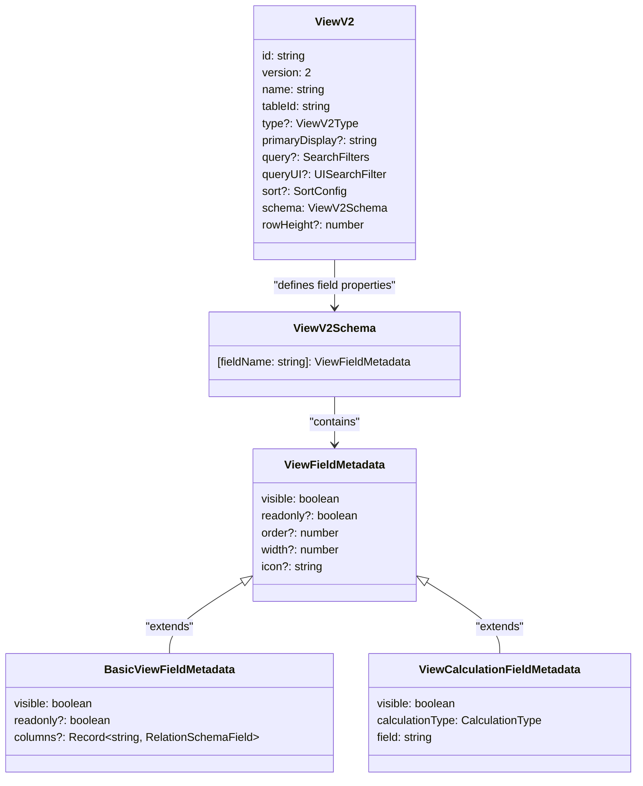
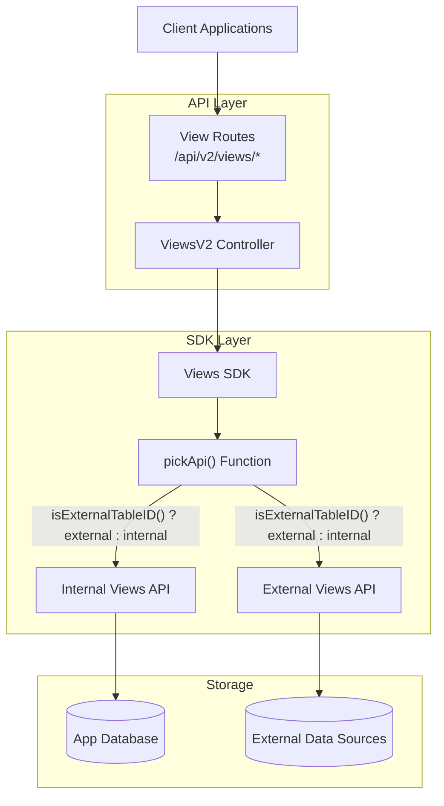
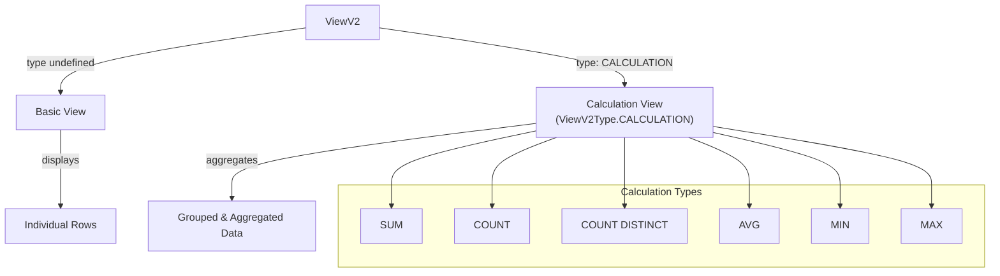
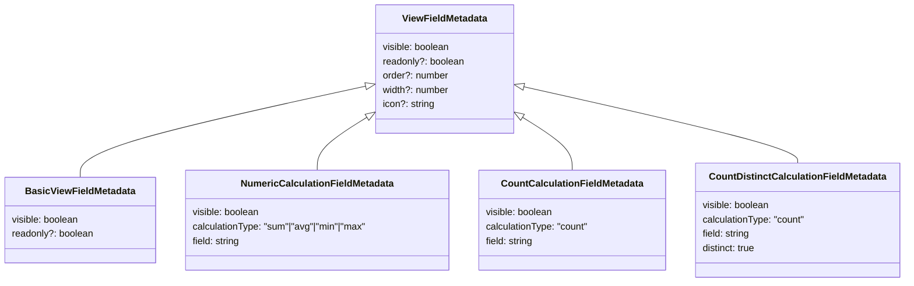
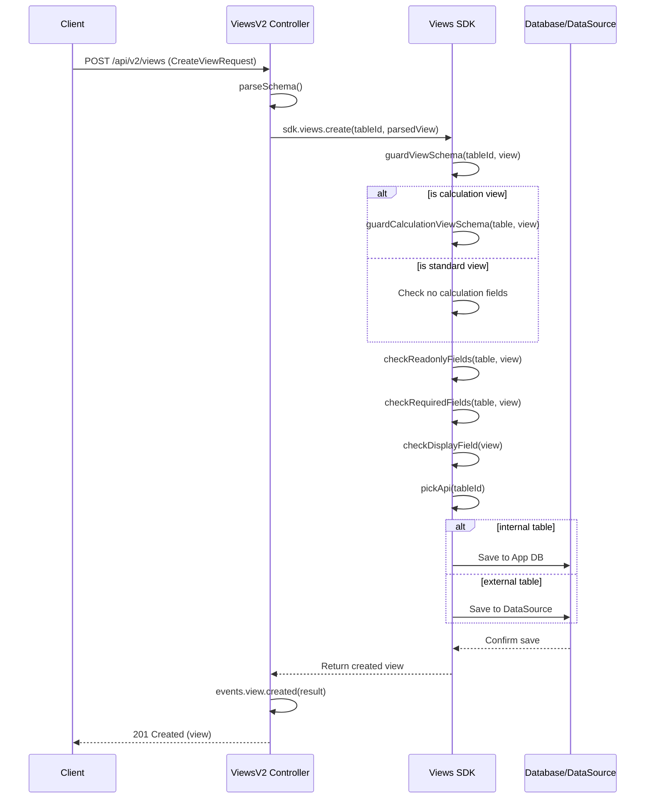
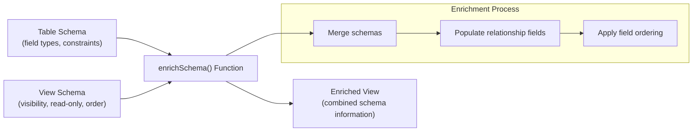

# Views

Relevant source files

The following files were used as context for generating this wiki page:

- [packages/backend-core/src/events/processors/posthog/PosthogProcessor.ts](https://github.com/Budibase/budibase/blob/e981536b/packages/backend-core/src/events/processors/posthog/PosthogProcessor.ts)
- [packages/backend-core/src/events/publishers/automation.ts](https://github.com/Budibase/budibase/blob/e981536b/packages/backend-core/src/events/publishers/automation.ts)
- [packages/backend-core/src/events/publishers/rowAction.ts](https://github.com/Budibase/budibase/blob/e981536b/packages/backend-core/src/events/publishers/rowAction.ts)
- [packages/backend-core/src/events/publishers/screen.ts](https://github.com/Budibase/budibase/blob/e981536b/packages/backend-core/src/events/publishers/screen.ts)
- [packages/backend-core/src/events/publishers/table.ts](https://github.com/Budibase/budibase/blob/e981536b/packages/backend-core/src/events/publishers/table.ts)
- [packages/backend-core/src/events/publishers/view.ts](https://github.com/Budibase/budibase/blob/e981536b/packages/backend-core/src/events/publishers/view.ts)
- [packages/server/src/api/controllers/view/index.ts](https://github.com/Budibase/budibase/blob/e981536b/packages/server/src/api/controllers/view/index.ts)
- [packages/server/src/api/controllers/view/views.ts](https://github.com/Budibase/budibase/blob/e981536b/packages/server/src/api/controllers/view/views.ts)
- [packages/server/src/api/controllers/view/viewsV2.ts](https://github.com/Budibase/budibase/blob/e981536b/packages/server/src/api/controllers/view/viewsV2.ts)
- [packages/server/src/api/routes/tests/view.spec.ts](https://github.com/Budibase/budibase/blob/e981536b/packages/server/src/api/routes/tests/view.spec.ts)
- [packages/server/src/api/routes/tests/viewV2.spec.ts](https://github.com/Budibase/budibase/blob/e981536b/packages/server/src/api/routes/tests/viewV2.spec.ts)
- [packages/server/src/api/routes/view.ts](https://github.com/Budibase/budibase/blob/e981536b/packages/server/src/api/routes/view.ts)
- [packages/server/src/sdk/app/tables/getters.ts](https://github.com/Budibase/budibase/blob/e981536b/packages/server/src/sdk/app/tables/getters.ts)
- [packages/server/src/sdk/app/views/external.ts](https://github.com/Budibase/budibase/blob/e981536b/packages/server/src/sdk/app/views/external.ts)
- [packages/server/src/sdk/app/views/index.ts](https://github.com/Budibase/budibase/blob/e981536b/packages/server/src/sdk/app/views/index.ts)
- [packages/server/src/sdk/app/views/internal.ts](https://github.com/Budibase/budibase/blob/e981536b/packages/server/src/sdk/app/views/internal.ts)
- [packages/server/src/sdk/app/views/utils.ts](https://github.com/Budibase/budibase/blob/e981536b/packages/server/src/sdk/app/views/utils.ts)
- [packages/server/src/tests/utilities/api/legacyView.ts](https://github.com/Budibase/budibase/blob/e981536b/packages/server/src/tests/utilities/api/legacyView.ts)
- [packages/server/src/tests/utilities/api/viewV2.ts](https://github.com/Budibase/budibase/blob/e981536b/packages/server/src/tests/utilities/api/viewV2.ts)
- [packages/types/src/api/web/app/view.ts](https://github.com/Budibase/budibase/blob/e981536b/packages/types/src/api/web/app/view.ts)
- [packages/types/src/documents/app/view.ts](https://github.com/Budibase/budibase/blob/e981536b/packages/types/src/documents/app/view.ts)
- [packages/types/src/sdk/events/automation.ts](https://github.com/Budibase/budibase/blob/e981536b/packages/types/src/sdk/events/automation.ts)
- [packages/types/src/sdk/events/screen.ts](https://github.com/Budibase/budibase/blob/e981536b/packages/types/src/sdk/events/screen.ts)
- [packages/types/src/sdk/events/table.ts](https://github.com/Budibase/budibase/blob/e981536b/packages/types/src/sdk/events/table.ts)
- [packages/types/src/sdk/events/view.ts](https://github.com/Budibase/budibase/blob/e981536b/packages/types/src/sdk/events/view.ts)

Views in Budibase provide a way to define how data from tables is presented, filtered, and transformed within applications. They allow users to create custom representations of table data with controlled field visibility, sorting, filtering, and aggregation calculations. This document covers the core concepts, architecture, and functionality of the Views system in Budibase.

For information about the Data Grid component that often displays view data, see [Data Grid](#3.5).

## Core Concepts

Views in Budibase are representations of table data that can be customized in several ways:

1. **Field visibility and properties** - Control which fields are visible and how they appear
2. **Filtering** - Apply filters to show only specific data
3. **Sorting** - Define default sorting behavior
4. **Calculations** - Perform aggregations like sum, count, or average
5. **Read-only fields** - Prevent editing of specific fields

Views are always associated with a specific table and operate on that table's data.

### View Data Model

The diagram shows the structure of a View object in Budibase. Each view has a unique ID, a name, version (always 2 for current views), and references a table through `tableId`. The view's schema defines how each field should be displayed and behave.

Sources: [packages/types/src/documents/app/view.ts:86-103](https://github.com/Budibase/budibase/blob/e981536b/packages/types/src/documents/app/view.ts#L86-L103). [packages/types/src/documents/app/view.ts:36-73](https://github.com/Budibase/budibase/blob/e981536b/packages/types/src/documents/app/view.ts#L36-L73)

## View System Architecture

The View system follows Budibase's modular architecture pattern with clear separation between API routes, controllers, SDK, and persistence layers.

The Views system distinguishes between internal and external tables:
- **Internal tables**: Stored directly in Budibase's database
- **External tables**: Connected through data sources like SQL databases, REST APIs, etc.

The `pickApi()` function determines which implementation to use based on the table ID.

Sources: [packages/server/src/sdk/app/views/index.ts:32-37](https://github.com/Budibase/budibase/blob/e981536b/packages/server/src/sdk/app/views/index.ts#L32-L37). [packages/server/src/api/routes/view.ts:10-39](https://github.com/Budibase/budibase/blob/e981536b/packages/server/src/api/routes/view.ts#L10-L39), [packages/server/src/api/controllers/view/viewsV2.ts:139-164](https://github.com/Budibase/budibase/blob/e981536b/packages/server/src/api/controllers/view/viewsV2.ts#L139-L164)

## View Types and Fields

### Basic Views vs Calculation Views

Budibase supports two primary types of views:

1. **Basic Views**: Display table data with customized visibility and properties
2. **Calculation Views**: Perform aggregations on table data, grouping by specified fields

Calculation views have specific limitations:
- Maximum of 5 calculation fields per view
- No duplicate calculations of the same type on the same field
- Numeric calculations can only be applied to numeric fields
- Cannot have the same field type calculation multiple times

Sources: [packages/types/src/documents/app/view.ts:74-80](https://github.com/Budibase/budibase/blob/e981536b/packages/types/src/documents/app/view.ts#L74-L80). [packages/server/src/sdk/app/views/index.ts:146-160](https://github.com/Budibase/budibase/blob/e981536b/packages/server/src/sdk/app/views/index.ts#L146-L160), [packages/server/src/sdk/app/views/index.ts:93-144](https://github.com/Budibase/budibase/blob/e981536b/packages/server/src/sdk/app/views/index.ts#L93-L144)

### View Field Types

Fields in a view can have different configurations:

Each field in a view can be configured with various properties:
- **visible**: Whether the field should be displayed
- **readonly**: Whether the field can be edited
- **order**: Position in the display order
- **width**: Width of the field in the UI
- **icon**: Icon to display with the field

Calculation fields include additional properties defining the calculation type and target field.

Sources: [packages/types/src/documents/app/view.ts:36-73](https://github.com/Budibase/budibase/blob/e981536b/packages/types/src/documents/app/view.ts#L36-L73). [packages/server/src/api/controllers/view/viewsV2.ts:24-79](https://github.com/Budibase/budibase/blob/e981536b/packages/server/src/api/controllers/view/viewsV2.ts#L24-L79)

## Creating and Updating Views

### View Creation Process

The view creation process involves validation checks to ensure:
1. Fields exist in the table schema
2. Required fields remain visible
3. Read-only fields are visible
4. The primary display field is visible
5. Calculation views have valid calculation fields

Sources: [packages/server/src/api/controllers/view/viewsV2.ts:139-168](https://github.com/Budibase/budibase/blob/e981536b/packages/server/src/api/controllers/view/viewsV2.ts#L139-L168). [packages/server/src/sdk/app/views/index.ts:316-331](https://github.com/Budibase/budibase/blob/e981536b/packages/server/src/sdk/app/views/index.ts#L316-L331)

### View Schema Validation

The SDK performs several validations when creating or updating views:

| Validation | Description |
|------------|-------------|
| `guardViewSchema` | Main validation function for all views |
| `guardCalculationViewSchema` | Specific validation for calculation views |
| `checkReadonlyFields` | Ensures read-only fields are visible and exist |
| `checkRequiredFields` | Ensures required fields are visible and not read-only |
| `checkDisplayField` | Ensures the primary display field is visible |

Key validation rules include:
- Required fields cannot be hidden
- Required fields cannot be made read-only
- Read-only fields must be visible
- Display fields must be visible
- Calculation views can have at most 5 fields
- No duplicate calculations of the same type on the same field

Sources: [packages/server/src/sdk/app/views/index.ts:211-314](https://github.com/Budibase/budibase/blob/e981536b/packages/server/src/sdk/app/views/index.ts#L211-L314)

## View Usage

Once created, views can be used to:

1. **Filter data**: Only show rows matching specific criteria
2. **Transform presentation**: Control which fields are visible and how they appear
3. **Aggregate data**: For calculation views, perform aggregations on data
4. **Control editability**: Make specific fields read-only

### View Enrichment

When a view is used to display data, it goes through an enrichment process that combines table schema with view schema:

The enrichment process:
1. Combines the table's field definitions with the view's field properties
2. Populates relationship fields with their related table schema
3. Ensures the correct field order is maintained
4. Applies UI-specific metadata like icons and width

Sources: [packages/server/src/sdk/app/views/index.ts:371-477](https://github.com/Budibase/budibase/blob/e981536b/packages/server/src/sdk/app/views/index.ts#L371-L477), [packages/server/src/sdk/app/tables/getters.ts:176-193](https://github.com/Budibase/budibase/blob/e981536b/packages/server/src/sdk/app/tables/getters.ts#L176-L193)

## Internal vs External Views Implementation

Budibase handles views differently depending on where the underlying table is stored:

| Aspect | Internal Views | External Views |
|--------|----------------|----------------|
| Storage | Stored in the table document in CouchDB | Stored in the datasource document in CouchDB |
| Implementation | `internal.ts` module | `external.ts` module |
| Table Identification | Direct table ID | Composed of datasourceId and tableName |
| Schema Access | Direct from table document | Through datasource entities |

The `pickApi()` function determines which implementation to use based on the table ID format.

Sources: [packages/server/src/sdk/app/views/internal.ts:33-54](https://github.com/Budibase/budibase/blob/e981536b/packages/server/src/sdk/app/views/internal.ts#L33-L54). [packages/server/src/sdk/app/views/external.ts:42-63](https://github.com/Budibase/budibase/blob/e981536b/packages/server/src/sdk/app/views/external.ts#L42-L63), [packages/server/src/sdk/app/views/index.ts:32-37](https://github.com/Budibase/budibase/blob/e981536b/packages/server/src/sdk/app/views/index.ts#L32-L37)

## View Events

The Views system publishes various events that can be used for analytics and monitoring:

| Event | Triggered When |
|-------|---------------|
| VIEW_CREATED | A new view is created |
| VIEW_UPDATED | A view is updated |
| VIEW_DELETED | A view is deleted |
| VIEW_FILTER_UPDATED | A view's filters are updated |
| VIEW_CALCULATION_CREATED | A calculation is added to a view |
| VIEW_JOIN_CREATED | A view exposes columns from a relationship |

These events help track how users are utilizing the platform's features.

Sources: [packages/backend-core/src/events/publishers/view.ts:23-135](https://github.com/Budibase/budibase/blob/e981536b/packages/backend-core/src/events/publishers/view.ts#L23-L135). [packages/server/src/api/controllers/view/viewsV2.ts:170-207](https://github.com/Budibase/budibase/blob/e981536b/packages/server/src/api/controllers/view/viewsV2.ts#L170-L207)

## Conclusion