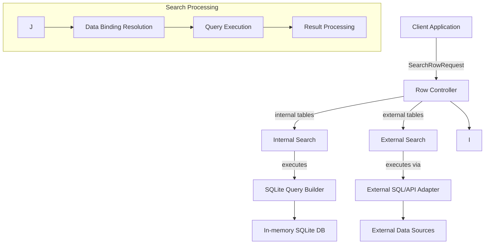
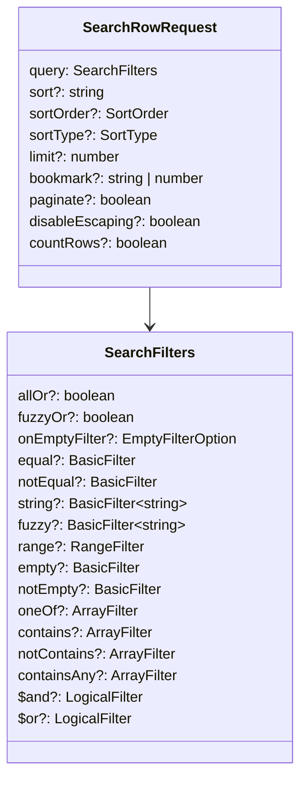
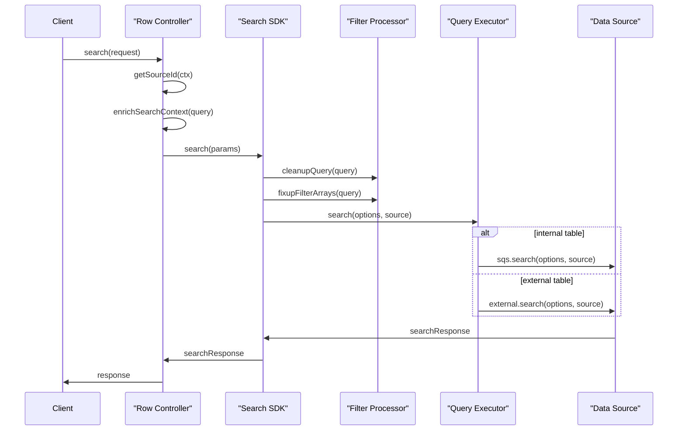
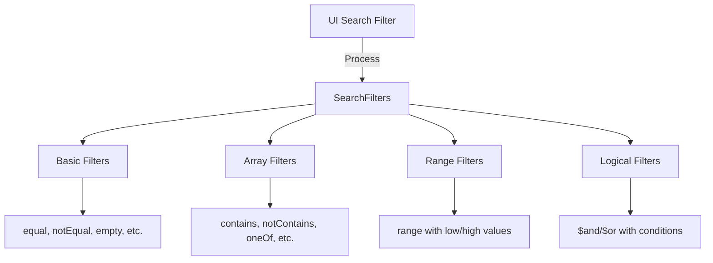
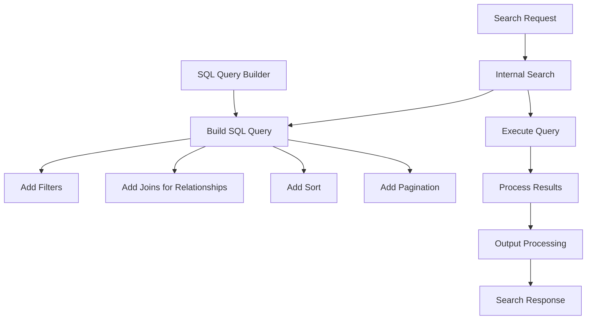
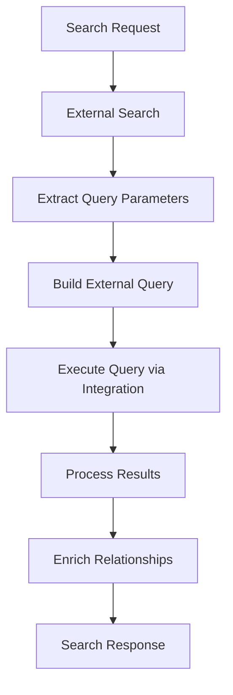
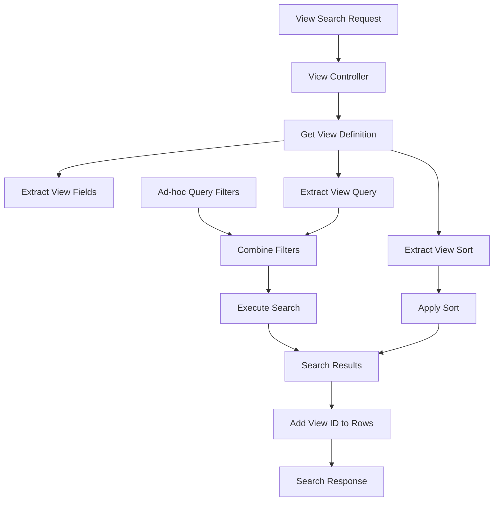
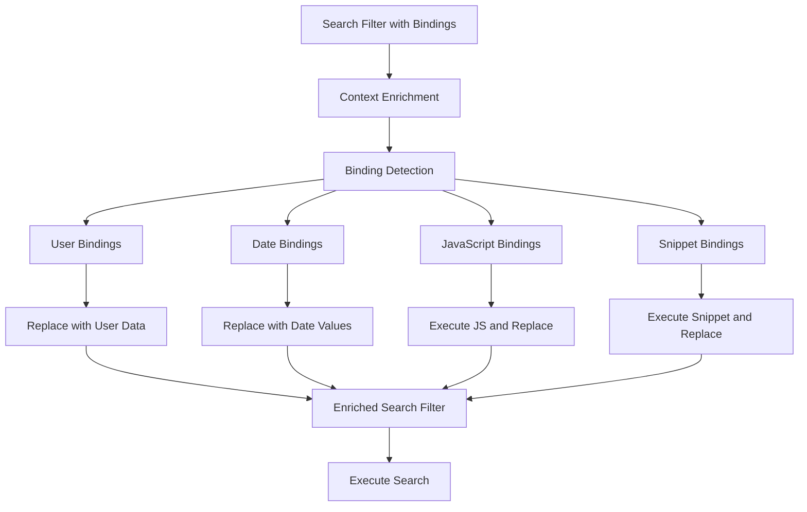
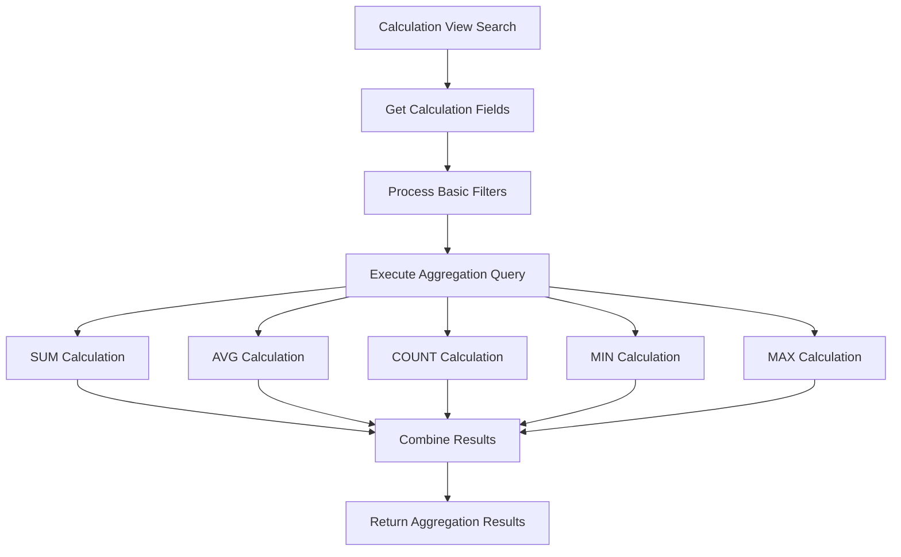
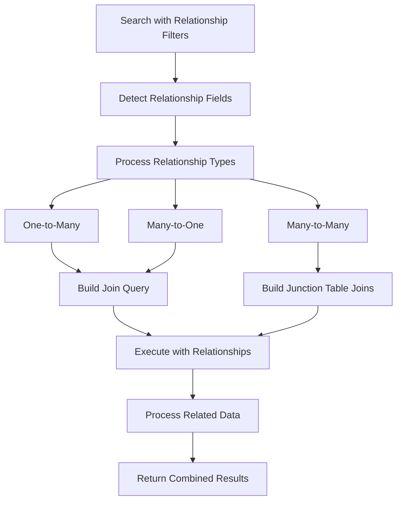

# Search and Filtering

<details>
<summary>Relevant source files</summary>

The following files were used as context for generating this wiki page:

- [packages/backend-core/src/events/processors/posthog/PosthogProcessor.ts](https://github.com/Budibase/budibase/blob/e981536b/packages/backend-core/src/events/processors/posthog/PosthogProcessor.ts)
- [packages/backend-core/src/events/publishers/automation.ts](https://github.com/Budibase/budibase/blob/e981536b/packages/backend-core/src/events/publishers/automation.ts)
- [packages/backend-core/src/events/publishers/rowAction.ts](https://github.com/Budibase/budibase/blob/e981536b/packages/backend-core/src/events/publishers/rowAction.ts)
- [packages/backend-core/src/events/publishers/screen.ts](https://github.com/Budibase/budibase/blob/e981536b/packages/backend-core/src/events/publishers/screen.ts)
- [packages/backend-core/src/events/publishers/table.ts](https://github.com/Budibase/budibase/blob/e981536b/packages/backend-core/src/events/publishers/table.ts)
- [packages/backend-core/src/events/publishers/view.ts](https://github.com/Budibase/budibase/blob/e981536b/packages/backend-core/src/events/publishers/view.ts)
- [packages/backend-core/src/sql/sql.ts](https://github.com/Budibase/budibase/blob/e981536b/packages/backend-core/src/sql/sql.ts)
- [packages/backend-core/src/sql/tests/utils.spec.ts](https://github.com/Budibase/budibase/blob/e981536b/packages/backend-core/src/sql/tests/utils.spec.ts)
- [packages/backend-core/src/sql/utils.ts](https://github.com/Budibase/budibase/blob/e981536b/packages/backend-core/src/sql/utils.ts)
- [packages/server/src/api/controllers/row/external.ts](https://github.com/Budibase/budibase/blob/e981536b/packages/server/src/api/controllers/row/external.ts)
- [packages/server/src/api/controllers/row/index.ts](https://github.com/Budibase/budibase/blob/e981536b/packages/server/src/api/controllers/row/index.ts)
- [packages/server/src/api/controllers/row/internal.ts](https://github.com/Budibase/budibase/blob/e981536b/packages/server/src/api/controllers/row/internal.ts)
- [packages/server/src/api/controllers/row/utils/basic.ts](https://github.com/Budibase/budibase/blob/e981536b/packages/server/src/api/controllers/row/utils/basic.ts)
- [packages/server/src/api/controllers/row/utils/sqlUtils.ts](https://github.com/Budibase/budibase/blob/e981536b/packages/server/src/api/controllers/row/utils/sqlUtils.ts)
- [packages/server/src/api/controllers/row/utils/tests/sqlUtils.spec.ts](https://github.com/Budibase/budibase/blob/e981536b/packages/server/src/api/controllers/row/utils/tests/sqlUtils.spec.ts)
- [packages/server/src/api/controllers/row/utils/utils.ts](https://github.com/Budibase/budibase/blob/e981536b/packages/server/src/api/controllers/row/utils/utils.ts)
- [packages/server/src/api/controllers/row/views.ts](https://github.com/Budibase/budibase/blob/e981536b/packages/server/src/api/controllers/row/views.ts)
- [packages/server/src/api/controllers/view/index.ts](https://github.com/Budibase/budibase/blob/e981536b/packages/server/src/api/controllers/view/index.ts)
- [packages/server/src/api/controllers/view/views.ts](https://github.com/Budibase/budibase/blob/e981536b/packages/server/src/api/controllers/view/views.ts)
- [packages/server/src/api/controllers/view/viewsV2.ts](https://github.com/Budibase/budibase/blob/e981536b/packages/server/src/api/controllers/view/viewsV2.ts)
- [packages/server/src/api/routes/row.ts](https://github.com/Budibase/budibase/blob/e981536b/packages/server/src/api/routes/row.ts)
- [packages/server/src/api/routes/tests/row.spec.ts](https://github.com/Budibase/budibase/blob/e981536b/packages/server/src/api/routes/tests/row.spec.ts)
- [packages/server/src/api/routes/tests/search.spec.ts](https://github.com/Budibase/budibase/blob/e981536b/packages/server/src/api/routes/tests/search.spec.ts)
- [packages/server/src/api/routes/tests/view.spec.ts](https://github.com/Budibase/budibase/blob/e981536b/packages/server/src/api/routes/tests/view.spec.ts)
- [packages/server/src/api/routes/tests/viewV2.spec.ts](https://github.com/Budibase/budibase/blob/e981536b/packages/server/src/api/routes/tests/viewV2.spec.ts)
- [packages/server/src/api/routes/view.ts](https://github.com/Budibase/budibase/blob/e981536b/packages/server/src/api/routes/view.ts)
- [packages/server/src/db/utils.ts](https://github.com/Budibase/budibase/blob/e981536b/packages/server/src/db/utils.ts)
- [packages/server/src/sdk/app/rows/external.ts](https://github.com/Budibase/budibase/blob/e981536b/packages/server/src/sdk/app/rows/external.ts)
- [packages/server/src/sdk/app/rows/internal.ts](https://github.com/Budibase/budibase/blob/e981536b/packages/server/src/sdk/app/rows/internal.ts)
- [packages/server/src/sdk/app/rows/rows.ts](https://github.com/Budibase/budibase/blob/e981536b/packages/server/src/sdk/app/rows/rows.ts)
- [packages/server/src/sdk/app/rows/search.ts](https://github.com/Budibase/budibase/blob/e981536b/packages/server/src/sdk/app/rows/search.ts)
- [packages/server/src/sdk/app/rows/search/external.ts](https://github.com/Budibase/budibase/blob/e981536b/packages/server/src/sdk/app/rows/search/external.ts)
- [packages/server/src/sdk/app/rows/search/internal/sqs.ts](https://github.com/Budibase/budibase/blob/e981536b/packages/server/src/sdk/app/rows/search/internal/sqs.ts)
- [packages/server/src/sdk/app/tables/getters.ts](https://github.com/Budibase/budibase/blob/e981536b/packages/server/src/sdk/app/tables/getters.ts)
- [packages/server/src/sdk/app/views/external.ts](https://github.com/Budibase/budibase/blob/e981536b/packages/server/src/sdk/app/views/external.ts)
- [packages/server/src/sdk/app/views/index.ts](https://github.com/Budibase/budibase/blob/e981536b/packages/server/src/sdk/app/views/index.ts)
- [packages/server/src/sdk/app/views/internal.ts](https://github.com/Budibase/budibase/blob/e981536b/packages/server/src/sdk/app/views/internal.ts)
- [packages/server/src/sdk/app/views/utils.ts](https://github.com/Budibase/budibase/blob/e981536b/packages/server/src/sdk/app/views/utils.ts)
- [packages/server/src/tests/utilities/api/legacyView.ts](https://github.com/Budibase/budibase/blob/e981536b/packages/server/src/tests/utilities/api/legacyView.ts)
- [packages/server/src/tests/utilities/api/row.ts](https://github.com/Budibase/budibase/blob/e981536b/packages/server/src/tests/utilities/api/row.ts)
- [packages/server/src/tests/utilities/api/viewV2.ts](https://github.com/Budibase/budibase/blob/e981536b/packages/server/src/tests/utilities/api/viewV2.ts)
- [packages/shared-core/jest.config.ts](https://github.com/Budibase/budibase/blob/e981536b/packages/shared-core/jest.config.ts)
- [packages/shared-core/src/filters.ts](https://github.com/Budibase/budibase/blob/e981536b/packages/shared-core/src/filters.ts)
- [packages/shared-core/src/tests/cron.test.ts](https://github.com/Budibase/budibase/blob/e981536b/packages/shared-core/src/tests/cron.test.ts)
- [packages/shared-core/src/utils.ts](https://github.com/Budibase/budibase/blob/e981536b/packages/shared-core/src/utils.ts)
- [packages/types/src/api/web/app/view.ts](https://github.com/Budibase/budibase/blob/e981536b/packages/types/src/api/web/app/view.ts)
- [packages/types/src/api/web/searchFilter.ts](https://github.com/Budibase/budibase/blob/e981536b/packages/types/src/api/web/searchFilter.ts)
- [packages/types/src/documents/app/view.ts](https://github.com/Budibase/budibase/blob/e981536b/packages/types/src/documents/app/view.ts)
- [packages/types/src/sdk/events/automation.ts](https://github.com/Budibase/budibase/blob/e981536b/packages/types/src/sdk/events/automation.ts)
- [packages/types/src/sdk/events/screen.ts](https://github.com/Budibase/budibase/blob/e981536b/packages/types/src/sdk/events/screen.ts)
- [packages/types/src/sdk/events/table.ts](https://github.com/Budibase/budibase/blob/e981536b/packages/types/src/sdk/events/table.ts)
- [packages/types/src/sdk/events/view.ts](https://github.com/Budibase/budibase/blob/e981536b/packages/types/src/sdk/events/view.ts)
- [packages/types/src/sdk/row.ts](https://github.com/Budibase/budibase/blob/e981536b/packages/types/src/sdk/row.ts)
- [packages/types/src/sdk/search.ts](https://github.com/Budibase/budibase/blob/e981536b/packages/types/src/sdk/search.ts)

</details>


This document describes the search and filtering system in Budibase, which enables querying and filtering data across both internal and external data sources. It covers how search queries are constructed, processed, and executed across different table types. For information about displaying filtered data in the UI, see [Data Grid](#3.5).

## Overview

The search and filtering system in Budibase provides a unified interface for querying data across different types of data sources while maintaining consistent behavior. It supports:

- Filtering by multiple conditions using various operators
- Searching across internal (Budibase-managed) and external (SQL databases, APIs) data sources
- Complex logical combinations of filters (AND/OR operations)
- Sorting and pagination
- Data binding for dynamic filter values
- View-based filtering with predefined query conditions



Sources: 
- `packages/server/src/api/controllers/row/index.ts`
- `packages/server/src/sdk/app/rows/search.ts`
- `packages/server/src/sdk/app/rows/search/internal/sqs.ts`
- `packages/server/src/sdk/app/rows/search/external.ts`

## Search Request Structure

A search request in Budibase consists of a query object with filter conditions, sorting parameters, and pagination options.



Sources:
- `packages/types/src/sdk/search.ts`
- `packages/server/src/api/controllers/row/index.ts:243-278`

### Filter Operators

Budibase provides various operators for constructing search filters:

| Operator Type | Operators | Description |
|---------------|-----------|-------------|
| Basic | `equal`, `notEqual`, `empty`, `notEmpty`, `fuzzy`, `string` | Basic comparison operators |
| Array | `contains`, `notContains`, `containsAny`, `oneOf` | Operators for array fields |
| Range | `range` | Range operator for numeric and date ranges |
| Logical | `$and`, `$or` | Logical operators for combining conditions |

Example search query with multiple filter types:

```json
{
  "query": {
    "equal": { "status": "active" },
    "range": { "age": { "low": 18, "high": 65 } },
    "contains": { "tags": ["important"] },
    "$and": {
      "conditions": [
        { "notEqual": { "department": "HR" } },
        { "notEmpty": { "email": true } }
      ]
    }
  },
  "sort": "lastName",
  "sortOrder": "ascending",
  "limit": 50
}
```

Sources:
- `packages/types/src/sdk/search.ts:8-53`
- `packages/shared-core/src/filters.ts:38-42`

## Search Processing Flow

The search process in Budibase follows a consistent flow regardless of the data source:



Sources:
- `packages/server/src/api/controllers/row/index.ts:243-278`
- `packages/server/src/sdk/app/rows/search.ts:38-151`

### Key Steps in Search Processing

1. **Request Parsing**: Parse the search request to extract query, sort, and pagination parameters.
2. **Source Identification**: Determine if the search is for a table or a view, and whether it's an internal or external source.
3. **Query Enrichment**: Enrich the query with context variables (e.g., current user data).
4. **Filter Processing**: Clean up filters, fix array filters, and validate the query structure.
5. **Query Execution**: Execute the query against the appropriate data source.
6. **Result Processing**: Process and format the search results.
7. **Response Building**: Build the final response with pagination information.

Sources:
- `packages/server/src/sdk/app/rows/search.ts:38-151`
- `packages/shared-core/src/filters.ts:152-176`

## Filter Building and Processing

### Building Queries from UI Filters

The UI provides a filter builder interface that creates search filters. These filters are converted into a structured query object that the backend can process:



Sources:
- `packages/shared-core/src/filters.ts:297-500`
- `packages/types/src/api/web/searchFilter.ts`

### Filter Processing Steps

1. **Filter Cleaning**: Remove empty or invalid filters that could cause inconsistent behavior.

```typescript
// Cleanup process removes:
// - Empty strings in string filters
// - Empty arrays in array filters
// - Null or undefined values
```

2. **Array Fixup**: Ensure array filters contain arrays, converting single values to arrays if needed.

3. **Data Binding Resolution**: Resolve bindings in filter values, such as `{{ [user]._id }}` or date expressions.

4. **Type Conversion**: Convert filter values to the appropriate type based on field schema.

Sources:
- `packages/shared-core/src/filters.ts:152-176`
- `packages/shared-core/src/filters.ts:507-536`
- `packages/server/src/api/controllers/row/utils.ts:255-277`

## Internal vs External Search

Budibase handles search differently depending on whether the data source is internal or external:

### Internal Search (SQLite)

For internal tables, Budibase uses an in-memory SQLite database and builds SQL queries to execute the search:



Key components of internal search:
- SQL query building with filters, relationships, and pagination
- Support for complex relationships through joins
- Result processing to match Budibase's expected format

Sources:
- `packages/server/src/sdk/app/rows/search/internal/sqs.ts:165-444`
- `packages/backend-core/src/sql/sql.ts:621-716`

### External Search

For external data sources (like PostgreSQL, MySQL, etc.), Budibase delegates the search to the appropriate database adapter:



External search handling includes:
- Adapting Budibase's search filters to the external database's query format
- Handling pagination differences between databases
- Processing relationship data from external sources

Sources:
- `packages/server/src/sdk/app/rows/search/external.ts:62-159`
- `packages/server/src/api/controllers/row/external.ts`

## View-Based Search

Views in Budibase provide a way to define preset filters, sorting, and field visibility for tables. The search system integrates with views to combine view filters with ad-hoc search filters:



When searching through a view:
1. The system loads the view definition
2. Combines the view's predefined filters with any ad-hoc filters in the request
3. Applies the view's sorting if no sort is specified in the request
4. Filters the response to only include fields visible in the view

Sources:
- `packages/server/src/api/controllers/row/views.ts:12-82`
- `packages/server/src/sdk/app/rows/search.ts:86-110`

## Data Binding in Search

Budibase supports dynamic values in search filters through data binding expressions. These expressions are resolved before executing the search:

### Binding Types

1. **User Bindings**: References to the current user, such as `{{ [user]._id }}` or `{{ [user].firstName }}`
2. **Date Bindings**: Date functions like `{{ [now] }}` or `{{ date now "YYYY-MM-DD" }}`
3. **JavaScript Bindings**: Custom JavaScript code enclosed in `{{ js "..." }}`
4. **Application Snippets**: Reusable code snippets defined at the application level



Example of bindings in search filters:

```json
{
  "equal": { "assignedTo": "{{ [user]._id }}" },
  "range": { 
    "dueDate": { 
      "low": "{{ [now] }}", 
      "high": "{{ date now 'add' 7 'days' }}" 
    } 
  }
}
```

Sources:
- `packages/server/src/api/routes/tests/search.spec.ts:480-781`
- `packages/server/src/api/controllers/row/utils.ts:255-277`

## Aggregation and Calculation Views

Budibase supports calculation views that can perform aggregations on data. When searching through these views, the system can execute calculations like COUNT, SUM, AVG, MIN, MAX on the filtered data:



Calculation views have special handling in search to ensure they return the aggregated values rather than individual rows.

Sources:
- `packages/server/src/api/controllers/view/viewsV2.ts:30-78`
- `packages/server/src/sdk/app/views/index.ts:93-209`
- `packages/types/src/documents/app/view.ts:65-81`

## API Endpoints

The Search and Filtering system exposes these primary REST API endpoints:

| Endpoint | Method | Description |
|----------|--------|-------------|
| `/api/:tableId/search` | POST | Search rows in a table |
| `/api/:tableId/rows` | GET | Fetch all rows from a table |
| `/api/:viewId/search` | POST | Search rows through a view |
| `/api/:viewId/rows` | GET | Fetch all rows through a view |

Sources:
- `packages/server/src/api/routes/row.ts`
- `packages/server/src/api/routes/view.ts`

## Advanced Search Features

### Relationship Filtering

The search system supports filtering based on related data:



Example filter with relationship:
```json
{
  "equal": { "category.name": "Electronics" }
}
```

Sources:
- `packages/backend-core/src/sql/sql.ts:509-618`
- `packages/server/src/api/controllers/row/utils/sqlUtils.ts:33-93`

### Empty Filter Behavior

Budibase provides options for how to handle empty filters:
- `RETURN_ALL`: Return all rows when no filters are specified (default)
- `RETURN_NONE`: Return no rows when no filters are specified

```json
{
  "query": {
    "onEmptyFilter": "returnNone",
    "equal": { "status": "active" }
  }
}
```

Sources:
- `packages/shared-core/src/filters.ts:581-587`
- `packages/types/src/sdk/search.ts:394-397`

## Performance Considerations

When working with the search and filtering system, it's important to consider:

1. **Limit Usage**: Always specify a reasonable limit to avoid retrieving too many rows.
2. **Filter Specificity**: Use more specific filters to reduce the amount of data processed.
3. **Appropriate Operators**: Choose the most efficient operators for your data type.
4. **View Aggregations**: Be cautious with calculation views on large datasets.
5. **Relationship Depth**: Deep relationship queries can impact performance.

Sources:
- `packages/backend-core/src/sql/sql.ts:52-64`
- `packages/server/src/sdk/app/rows/search/internal/sqs.ts:56-58`

## Conclusion

The Search and Filtering system in Budibase provides a powerful and flexible way to query data across different data sources. It supports various filter types, logical operations, data binding, and integration with views to enable complex data retrieval patterns while maintaining a consistent API.