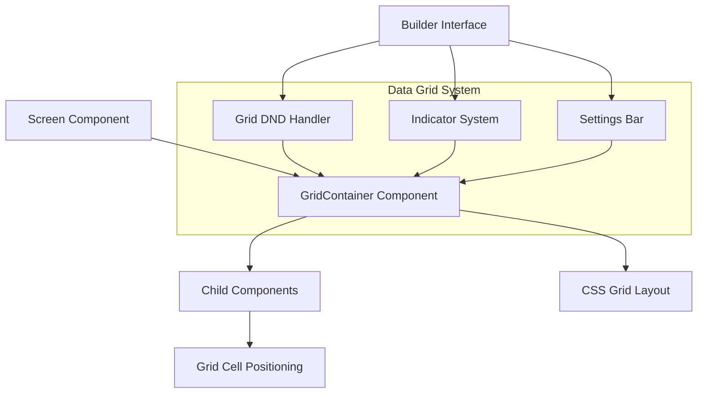
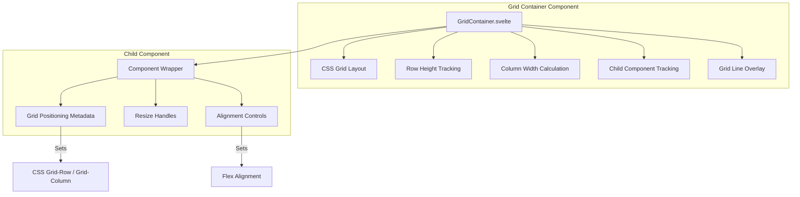
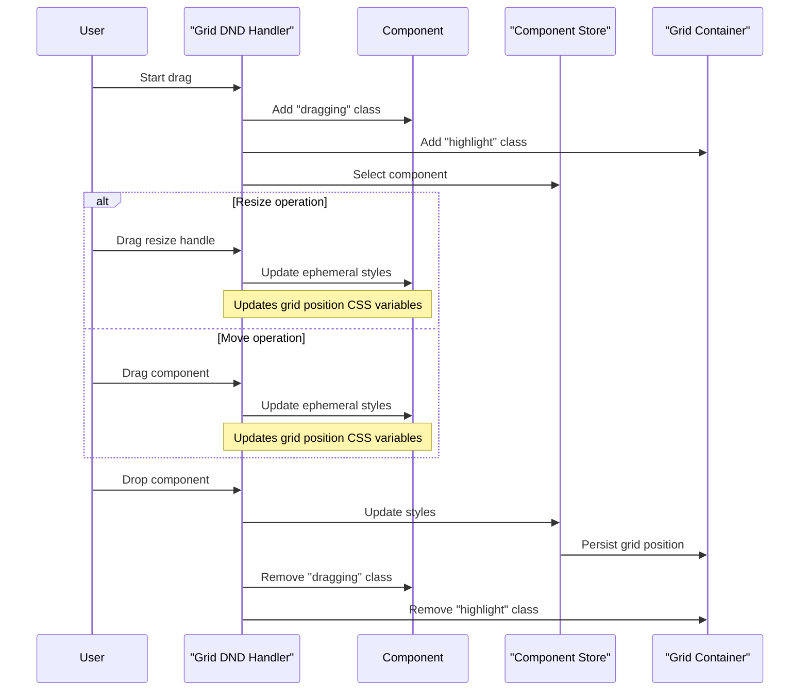
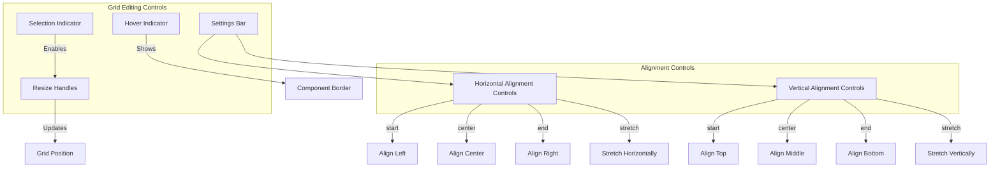
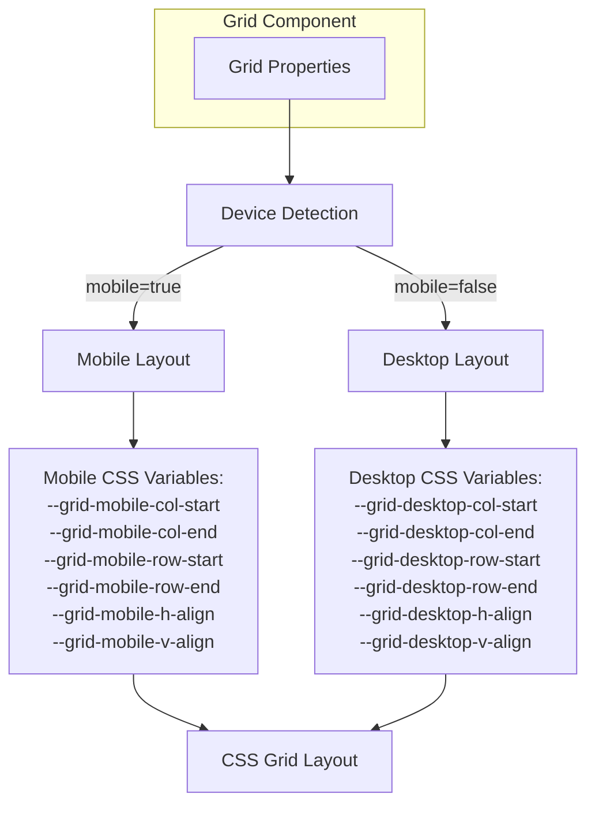
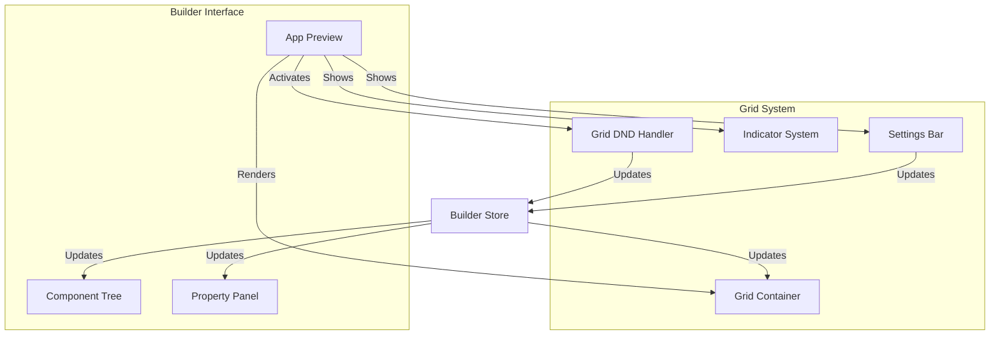
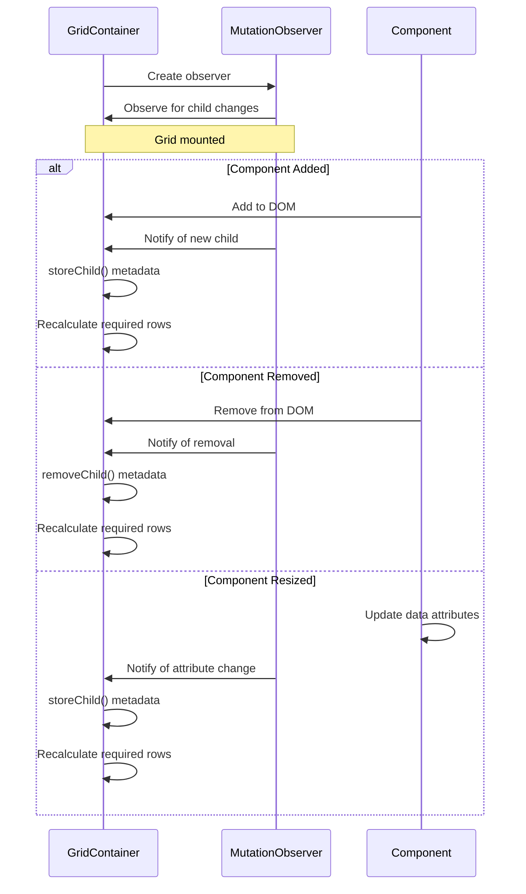

# Data Grid

<details>
<summary>Relevant source files</summary>

The following files were used as context for generating this wiki page:

- [packages/builder/src/pages/builder/app/[application]/design/[screenId]/_components/AppPreview.svelte](packages/builder/src/pages/builder/app/[application]/design/[screenId]/_components/AppPreview.svelte)
- [packages/client/src/components/Component.svelte](https://github.com/Budibase/budibase/blob/e981536b/packages/client/src/components/Component.svelte)
- [packages/client/src/components/app/container/GridContainer.svelte](https://github.com/Budibase/budibase/blob/e981536b/packages/client/src/components/app/container/GridContainer.svelte)
- [packages/client/src/components/preview/DNDHandler.svelte](https://github.com/Budibase/budibase/blob/e981536b/packages/client/src/components/preview/DNDHandler.svelte)
- [packages/client/src/components/preview/GridDNDHandler.svelte](https://github.com/Budibase/budibase/blob/e981536b/packages/client/src/components/preview/GridDNDHandler.svelte)
- [packages/client/src/components/preview/GridStylesButton.svelte](https://github.com/Budibase/budibase/blob/e981536b/packages/client/src/components/preview/GridStylesButton.svelte)
- [packages/client/src/components/preview/HoverIndicator.svelte](https://github.com/Budibase/budibase/blob/e981536b/packages/client/src/components/preview/HoverIndicator.svelte)
- [packages/client/src/components/preview/Indicator.svelte](https://github.com/Budibase/budibase/blob/e981536b/packages/client/src/components/preview/Indicator.svelte)
- [packages/client/src/components/preview/IndicatorSet.svelte](https://github.com/Budibase/budibase/blob/e981536b/packages/client/src/components/preview/IndicatorSet.svelte)
- [packages/client/src/components/preview/SelectionIndicator.svelte](https://github.com/Budibase/budibase/blob/e981536b/packages/client/src/components/preview/SelectionIndicator.svelte)
- [packages/client/src/components/preview/SettingsBar.svelte](https://github.com/Budibase/budibase/blob/e981536b/packages/client/src/components/preview/SettingsBar.svelte)
- [packages/client/src/components/preview/SettingsButton.svelte](https://github.com/Budibase/budibase/blob/e981536b/packages/client/src/components/preview/SettingsButton.svelte)
- [packages/client/src/components/preview/SettingsColorPicker.svelte](https://github.com/Budibase/budibase/blob/e981536b/packages/client/src/components/preview/SettingsColorPicker.svelte)
- [packages/client/src/components/preview/SettingsPicker.svelte](https://github.com/Budibase/budibase/blob/e981536b/packages/client/src/components/preview/SettingsPicker.svelte)
- [packages/client/src/stores/components.js](https://github.com/Budibase/budibase/blob/e981536b/packages/client/src/stores/components.js)
- [packages/client/src/stores/screens.js](https://github.com/Budibase/budibase/blob/e981536b/packages/client/src/stores/screens.js)
- [packages/client/src/utils/styleable.js](https://github.com/Budibase/budibase/blob/e981536b/packages/client/src/utils/styleable.js)

</details>


The Data Grid is a core layout system in Budibase that provides a grid-based interface for positioning and manipulating components within screens. It enables precise placement and sizing of UI elements through a drag-and-drop interface and grid-based coordinates.

## Overview

The Data Grid provides a flexible, CSS Grid-based layout system that allows components to be positioned with exact coordinates rather than flowing sequentially. This enables the creation of complex, responsive layouts where components can be precisely positioned and sized.



Sources: 
- [packages/client/src/components/app/container/GridContainer.svelte:1-280](https://github.com/Budibase/budibase/blob/e981536b/packages/client/src/components/app/container/GridContainer.svelte#L1-L280)
- [packages/client/src/components/preview/GridDNDHandler.svelte:1-316](https://github.com/Budibase/budibase/blob/e981536b/packages/client/src/components/preview/GridDNDHandler.svelte#L1-L316)
- [packages/client/src/components/preview/IndicatorSet.svelte:1-245](https://github.com/Budibase/budibase/blob/e981536b/packages/client/src/components/preview/IndicatorSet.svelte#L1-L245)

## Grid Architecture

The Data Grid is implemented using CSS Grid layout and incorporates a row and column system with fixed-height rows and configurable columns. It provides a visual overlay in the builder to assist with component placement and sizing.



Sources:
- [packages/client/src/components/app/container/GridContainer.svelte:1-280](https://github.com/Budibase/budibase/blob/e981536b/packages/client/src/components/app/container/GridContainer.svelte#L1-L280)
- [packages/client/src/components/preview/GridStylesButton.svelte:1-43](https://github.com/Budibase/budibase/blob/e981536b/packages/client/src/components/preview/GridStylesButton.svelte#L1-L43)

## Grid Structure and Styling

The grid container creates a layout with the following key properties:

- Fixed row height (determined by the `GridRowHeight` constant)
- Configurable number of columns (default is `GridColumns` constant)
- Dynamically calculated column width based on container size
- Auto-expanding height based on component placement
- Different alignment settings for mobile and desktop views

The CSS Grid is configured with the following properties:

```css
display: grid;
grid-template-rows: repeat(var(--rows), calc(var(--row-size) * 1px));
grid-template-columns: repeat(var(--cols), calc(var(--col-size) * 1px));
```

Child components within the grid are positioned using CSS Grid's row and column placement:

```css
grid-column-start: min(max(1, var(--col-start)), var(--cols)) !important;
grid-column-end: min(max(2, var(--col-end)), calc(var(--cols) + 1)) !important;
grid-row-start: max(1, var(--row-start)) !important;
grid-row-end: max(2, var(--row-end)) !important;
```

Sources:
- [packages/client/src/components/app/container/GridContainer.svelte:158-176](https://github.com/Budibase/budibase/blob/e981536b/packages/client/src/components/app/container/GridContainer.svelte#L158-L176)
- [packages/client/src/components/app/container/GridContainer.svelte:227-242](https://github.com/Budibase/budibase/blob/e981536b/packages/client/src/components/app/container/GridContainer.svelte#L227-L242)

## Component Positioning and Drag and Drop

Components within the grid are positioned using grid coordinates that define their starting and ending row/column positions. The builder interface provides drag-and-drop functionality to manipulate these positions visually.



The drag and drop system works by:

1. Capturing drag events on components or their resize handles
2. Calculating new grid coordinates based on mouse movement
3. Applying temporary styles during dragging
4. Persisting changes to the component's styles when dropped

Sources:
- [packages/client/src/components/preview/GridDNDHandler.svelte:80-154](https://github.com/Budibase/budibase/blob/e981536b/packages/client/src/components/preview/GridDNDHandler.svelte#L80-L154)
- [packages/client/src/components/preview/GridDNDHandler.svelte:279-290](https://github.com/Budibase/budibase/blob/e981536b/packages/client/src/components/preview/GridDNDHandler.svelte#L279-L290)
- [packages/client/src/components/Component.svelte:622-626](https://github.com/Budibase/budibase/blob/e981536b/packages/client/src/components/Component.svelte#L622-L626)

## Grid Indicators and Controls

When editing in the builder, the grid system provides visual indicators and controls for component manipulation:

1. **Selection Indicator**: Shows the currently selected component with a blue border
2. **Hover Indicator**: Shows a light blue border when hovering over components
3. **Resize Handles**: Eight handles around selected components for resizing
4. **Settings Bar**: Provides alignment controls specific to grid components



Sources:
- [packages/client/src/components/preview/IndicatorSet.svelte:1-245](https://github.com/Budibase/budibase/blob/e981536b/packages/client/src/components/preview/IndicatorSet.svelte#L1-L245)
- [packages/client/src/components/preview/Indicator.svelte:1-238](https://github.com/Budibase/budibase/blob/e981536b/packages/client/src/components/preview/Indicator.svelte#L1-L238)
- [packages/client/src/components/preview/SettingsBar.svelte:1-368](https://github.com/Budibase/budibase/blob/e981536b/packages/client/src/components/preview/SettingsBar.svelte#L1-L368)
- [packages/client/src/components/preview/GridStylesButton.svelte:1-43](https://github.com/Budibase/budibase/blob/e981536b/packages/client/src/components/preview/GridStylesButton.svelte#L1-L43)

## Responsive Grid Behavior

The grid system supports different layouts for mobile and desktop views, with specific CSS variables for each device type:



The system handles responsive layouts by:

1. Detecting the device type through the context
2. Using device-specific grid parameters (mobile or desktop)
3. Applying the appropriate CSS variables for positioning
4. Implementing fallbacks when device-specific settings are missing

Sources:
- [packages/client/src/components/app/container/GridContainer.svelte:26-39](https://github.com/Budibase/budibase/blob/e981536b/packages/client/src/components/app/container/GridContainer.svelte#L26-L39)
- [packages/client/src/components/app/container/GridContainer.svelte:227-242](https://github.com/Budibase/budibase/blob/e981536b/packages/client/src/components/app/container/GridContainer.svelte#L227-L242)
- [packages/client/src/components/app/container/GridContainer.svelte:250-257](https://github.com/Budibase/budibase/blob/e981536b/packages/client/src/components/app/container/GridContainer.svelte#L250-L257)

## Component Styling and Grid Layout

Components within the grid can be styled with various alignment settings:

1. **Horizontal Alignment**: left, center, right, or stretch
2. **Vertical Alignment**: top, middle, bottom, or stretch
3. **Component Dimensions**: controlled by grid position

The component's content is managed using flexbox inside the grid cell:

```css
/* Flex container styles */
flex-direction: column;
align-items: var(--h-align);
justify-content: var(--v-align);
```

When a component is configured to stretch, it uses `flex: 1 1 0` to fill the available space in the grid cell.

Sources:
- [packages/client/src/components/app/container/GridContainer.svelte:244-248](https://github.com/Budibase/budibase/blob/e981536b/packages/client/src/components/app/container/GridContainer.svelte#L244-L248)
- [packages/client/src/components/app/container/GridContainer.svelte:264-272](https://github.com/Budibase/budibase/blob/e981536b/packages/client/src/components/app/container/GridContainer.svelte#L264-L272)

## Grid Integration with Builder Interface

The grid system integrates with the Budibase builder interface to provide a visual editing experience:



Key interactions:

1. Builder renders the grid and associated controls
2. User interacts with the grid using drag and drop or settings
3. Changes are stored in the Builder Store
4. Grid Container reflects the updated layout

Sources:
- [packages/builder/src/pages/builder/app/[application]/design/[screenId]/_components/AppPreview.svelte:1-395]()
- [packages/client/src/components/preview/GridDNDHandler.svelte:1-316](https://github.com/Budibase/budibase/blob/e981536b/packages/client/src/components/preview/GridDNDHandler.svelte#L1-L316)
- [packages/client/src/components/preview/IndicatorSet.svelte:1-245](https://github.com/Budibase/budibase/blob/e981536b/packages/client/src/components/preview/IndicatorSet.svelte#L1-L245)
- [packages/client/src/components/preview/SettingsBar.svelte:1-368](https://github.com/Budibase/budibase/blob/e981536b/packages/client/src/components/preview/SettingsBar.svelte#L1-L368)

## Grid Events and Lifecycle

The grid container uses several event handling and lifecycle mechanisms:

1. **Mount**: Sets up mutation observers to track child components
2. **Child Addition/Removal**: Updates the grid size based on child components
3. **Style Changes**: Adjusts the grid when component positions change



The grid monitors changes to child components using a MutationObserver that watches for:
- Additions and removals of child components
- Changes to grid-related data attributes
- Updates to component styles

Sources:
- [packages/client/src/components/app/container/GridContainer.svelte:78-123](https://github.com/Budibase/budibase/blob/e981536b/packages/client/src/components/app/container/GridContainer.svelte#L78-L123)

## Conclusion

The Data Grid system in Budibase provides a powerful, grid-based layout mechanism that enables precise positioning of components. It combines CSS Grid for layout with an intuitive drag-and-drop interface for editing, making it possible to create complex screen layouts that are both visually appealing and responsive.

The grid system is tightly integrated with the builder interface, providing real-time visual feedback during editing and a consistent experience between the builder and the published application.