# Automation System

<details>
<summary>Relevant source files</summary>

The following files were used as context for generating this wiki page:

- [packages/builder/src/components/automation/AutomationBuilder/DraggableCanvas.svelte](https://github.com/Budibase/budibase/blob/e981536b/packages/builder/src/components/automation/AutomationBuilder/DraggableCanvas.svelte)
- [packages/builder/src/components/automation/AutomationBuilder/FlowChart/ActionModal.svelte](https://github.com/Budibase/budibase/blob/e981536b/packages/builder/src/components/automation/AutomationBuilder/FlowChart/ActionModal.svelte)
- [packages/builder/src/components/automation/AutomationBuilder/FlowChart/BranchNode.svelte](https://github.com/Budibase/budibase/blob/e981536b/packages/builder/src/components/automation/AutomationBuilder/FlowChart/BranchNode.svelte)
- [packages/builder/src/components/automation/AutomationBuilder/FlowChart/DragZone.svelte](https://github.com/Budibase/budibase/blob/e981536b/packages/builder/src/components/automation/AutomationBuilder/FlowChart/DragZone.svelte)
- [packages/builder/src/components/automation/AutomationBuilder/FlowChart/FlowChart.svelte](https://github.com/Budibase/budibase/blob/e981536b/packages/builder/src/components/automation/AutomationBuilder/FlowChart/FlowChart.svelte)
- [packages/builder/src/components/automation/AutomationBuilder/FlowChart/FlowItem.svelte](https://github.com/Budibase/budibase/blob/e981536b/packages/builder/src/components/automation/AutomationBuilder/FlowChart/FlowItem.svelte)
- [packages/builder/src/components/automation/AutomationBuilder/FlowChart/FlowItemActions.svelte](https://github.com/Budibase/budibase/blob/e981536b/packages/builder/src/components/automation/AutomationBuilder/FlowChart/FlowItemActions.svelte)
- [packages/builder/src/components/automation/AutomationBuilder/FlowChart/FlowItemHeader.svelte](https://github.com/Budibase/budibase/blob/e981536b/packages/builder/src/components/automation/AutomationBuilder/FlowChart/FlowItemHeader.svelte)
- [packages/builder/src/components/automation/AutomationBuilder/FlowChart/StepNode.svelte](https://github.com/Budibase/budibase/blob/e981536b/packages/builder/src/components/automation/AutomationBuilder/FlowChart/StepNode.svelte)
- [packages/builder/src/components/automation/AutomationBuilder/FlowChart/TestDataModal.svelte](https://github.com/Budibase/budibase/blob/e981536b/packages/builder/src/components/automation/AutomationBuilder/FlowChart/TestDataModal.svelte)
- [packages/builder/src/components/automation/AutomationBuilder/TestDisplay.svelte](https://github.com/Budibase/budibase/blob/e981536b/packages/builder/src/components/automation/AutomationBuilder/TestDisplay.svelte)
- [packages/builder/src/components/automation/AutomationBuilder/TestPanel.svelte](https://github.com/Budibase/budibase/blob/e981536b/packages/builder/src/components/automation/AutomationBuilder/TestPanel.svelte)
- [packages/builder/src/components/automation/AutomationPanel/AutomationNavItem.svelte](https://github.com/Budibase/budibase/blob/e981536b/packages/builder/src/components/automation/AutomationPanel/AutomationNavItem.svelte)
- [packages/builder/src/components/automation/AutomationPanel/AutomationPanel.svelte](https://github.com/Budibase/budibase/blob/e981536b/packages/builder/src/components/automation/AutomationPanel/AutomationPanel.svelte)
- [packages/builder/src/components/automation/AutomationPanel/CreateAutomationModal.svelte](https://github.com/Budibase/budibase/blob/e981536b/packages/builder/src/components/automation/AutomationPanel/CreateAutomationModal.svelte)
- [packages/builder/src/components/automation/SetupPanel/AutomationBlockSetup.svelte](https://github.com/Budibase/budibase/blob/e981536b/packages/builder/src/components/automation/SetupPanel/AutomationBlockSetup.svelte)
- [packages/builder/src/components/automation/SetupPanel/AutomationSchemaLayout.svelte](https://github.com/Budibase/budibase/blob/e981536b/packages/builder/src/components/automation/SetupPanel/AutomationSchemaLayout.svelte)
- [packages/builder/src/components/automation/SetupPanel/AutomationSelector.svelte](https://github.com/Budibase/budibase/blob/e981536b/packages/builder/src/components/automation/SetupPanel/AutomationSelector.svelte)
- [packages/builder/src/components/automation/SetupPanel/ExecuteScriptV2.svelte](https://github.com/Budibase/budibase/blob/e981536b/packages/builder/src/components/automation/SetupPanel/ExecuteScriptV2.svelte)
- [packages/builder/src/components/automation/SetupPanel/FieldSelector.svelte](https://github.com/Budibase/budibase/blob/e981536b/packages/builder/src/components/automation/SetupPanel/FieldSelector.svelte)
- [packages/builder/src/components/automation/SetupPanel/PropField.svelte](https://github.com/Budibase/budibase/blob/e981536b/packages/builder/src/components/automation/SetupPanel/PropField.svelte)
- [packages/builder/src/components/automation/SetupPanel/QueryParamSelector.svelte](https://github.com/Budibase/budibase/blob/e981536b/packages/builder/src/components/automation/SetupPanel/QueryParamSelector.svelte)
- [packages/builder/src/components/automation/SetupPanel/QuerySelector.svelte](https://github.com/Budibase/budibase/blob/e981536b/packages/builder/src/components/automation/SetupPanel/QuerySelector.svelte)
- [packages/builder/src/components/automation/SetupPanel/RowSelector.svelte](https://github.com/Budibase/budibase/blob/e981536b/packages/builder/src/components/automation/SetupPanel/RowSelector.svelte)
- [packages/builder/src/components/automation/SetupPanel/RowSelectorTypes.svelte](https://github.com/Budibase/budibase/blob/e981536b/packages/builder/src/components/automation/SetupPanel/RowSelectorTypes.svelte)
- [packages/builder/src/components/backend/DataTable/RowFieldControl.svelte](https://github.com/Budibase/budibase/blob/e981536b/packages/builder/src/components/backend/DataTable/RowFieldControl.svelte)
- [packages/builder/src/components/common/LinkedRowSelector.svelte](https://github.com/Budibase/budibase/blob/e981536b/packages/builder/src/components/common/LinkedRowSelector.svelte)
- [packages/builder/src/components/common/UndoRedoControl.svelte](https://github.com/Budibase/budibase/blob/e981536b/packages/builder/src/components/common/UndoRedoControl.svelte)
- [packages/builder/src/components/common/bindings/DrawerBindableCodeEditorField.svelte](https://github.com/Budibase/budibase/blob/e981536b/packages/builder/src/components/common/bindings/DrawerBindableCodeEditorField.svelte)
- [packages/builder/src/components/common/bindings/DrawerBindableSlot.svelte](https://github.com/Budibase/budibase/blob/e981536b/packages/builder/src/components/common/bindings/DrawerBindableSlot.svelte)
- [packages/builder/src/pages/builder/app/[application]/automation/_layout.svelte](packages/builder/src/pages/builder/app/[application]/automation/_layout.svelte)
- [packages/builder/src/stores/builder/automations.ts](https://github.com/Budibase/budibase/blob/e981536b/packages/builder/src/stores/builder/automations.ts)
- [packages/builder/src/stores/builder/history.ts](https://github.com/Budibase/budibase/blob/e981536b/packages/builder/src/stores/builder/history.ts)
- [packages/builder/src/types/automations.ts](https://github.com/Budibase/budibase/blob/e981536b/packages/builder/src/types/automations.ts)
- [packages/server/src/api/controllers/automation.ts](https://github.com/Budibase/budibase/blob/e981536b/packages/server/src/api/controllers/automation.ts)
- [packages/server/src/api/routes/tests/automation.spec.ts](https://github.com/Budibase/budibase/blob/e981536b/packages/server/src/api/routes/tests/automation.spec.ts)
- [packages/server/src/automations/automationUtils.ts](https://github.com/Budibase/budibase/blob/e981536b/packages/server/src/automations/automationUtils.ts)
- [packages/server/src/automations/steps/executeScriptV2.ts](https://github.com/Budibase/budibase/blob/e981536b/packages/server/src/automations/steps/executeScriptV2.ts)
- [packages/server/src/automations/tests/executeScriptV2.spec.ts](https://github.com/Budibase/budibase/blob/e981536b/packages/server/src/automations/tests/executeScriptV2.spec.ts)
- [packages/server/src/automations/tests/utilities/AutomationTestBuilder.ts](https://github.com/Budibase/budibase/blob/e981536b/packages/server/src/automations/tests/utilities/AutomationTestBuilder.ts)
- [packages/server/src/automations/triggers.ts](https://github.com/Budibase/budibase/blob/e981536b/packages/server/src/automations/triggers.ts)
- [packages/server/src/automations/utils.ts](https://github.com/Budibase/budibase/blob/e981536b/packages/server/src/automations/utils.ts)
- [packages/server/src/definitions/automations.ts](https://github.com/Budibase/budibase/blob/e981536b/packages/server/src/definitions/automations.ts)
- [packages/server/src/sdk/app/automations/crud.ts](https://github.com/Budibase/budibase/blob/e981536b/packages/server/src/sdk/app/automations/crud.ts)
- [packages/server/src/tests/utilities/TestConfiguration.ts](https://github.com/Budibase/budibase/blob/e981536b/packages/server/src/tests/utilities/TestConfiguration.ts)
- [packages/server/src/tests/utilities/api/webhook.ts](https://github.com/Budibase/budibase/blob/e981536b/packages/server/src/tests/utilities/api/webhook.ts)
- [packages/server/src/tests/utilities/structures.ts](https://github.com/Budibase/budibase/blob/e981536b/packages/server/src/tests/utilities/structures.ts)
- [packages/server/src/threads/automation.ts](https://github.com/Budibase/budibase/blob/e981536b/packages/server/src/threads/automation.ts)
- [packages/shared-core/src/sdk/documents/automations.ts](https://github.com/Budibase/budibase/blob/e981536b/packages/shared-core/src/sdk/documents/automations.ts)
- [packages/types/src/documents/app/automation/StepInputsOutputs.ts](https://github.com/Budibase/budibase/blob/e981536b/packages/types/src/documents/app/automation/StepInputsOutputs.ts)
- [packages/types/src/documents/app/automation/automation.ts](https://github.com/Budibase/budibase/blob/e981536b/packages/types/src/documents/app/automation/automation.ts)
- [packages/types/src/documents/app/automation/schema.ts](https://github.com/Budibase/budibase/blob/e981536b/packages/types/src/documents/app/automation/schema.ts)
- [packages/types/src/documents/app/webhook.ts](https://github.com/Budibase/budibase/blob/e981536b/packages/types/src/documents/app/webhook.ts)
- [packages/types/src/sdk/automations/index.ts](https://github.com/Budibase/budibase/blob/e981536b/packages/types/src/sdk/automations/index.ts)
- [packages/types/src/ui/stores/automations.ts](https://github.com/Budibase/budibase/blob/e981536b/packages/types/src/ui/stores/automations.ts)

</details>


The Automation System in Budibase provides a framework for creating, configuring, and executing automated workflows. This document covers the architecture, components, and execution flow of the automation system, including the UI for designing automations and the backend mechanisms that process and run them.

For information about automation UI details, please see [Builder Interface](#5) and [Component System](#6).

## Architecture Overview

The Automation System consists of several key components working together to enable workflow automation:

- **Builder UI**: Visual interface for creating and editing automations
- **Automation Store**: Manages state of automations in the builder
- **Trigger Handlers**: Process events that initiate automations
- **Automation Queue**: Manages and schedules automation jobs
- **Orchestrator**: Executes automation jobs, handling their lifecycle
- **Steps Library**: Collection of predefined actions for automations

### System Architecture Diagram

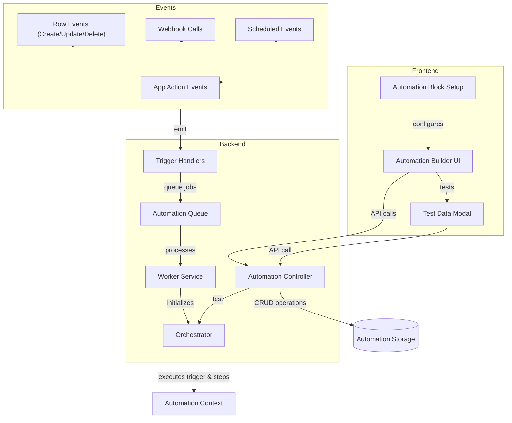

Sources: [packages/server/src/threads/automation.ts:206-636](https://github.com/Budibase/budibase/blob/e981536b/packages/server/src/threads/automation.ts#L206-L636). [packages/server/src/automations/triggers.ts:61-177](https://github.com/Budibase/budibase/blob/e981536b/packages/server/src/automations/triggers.ts#L61-L177). [packages/builder/src/components/automation/AutomationBuilder/FlowChart/FlowChart.svelte:1-349](https://github.com/Budibase/budibase/blob/e981536b/packages/builder/src/components/automation/AutomationBuilder/FlowChart/FlowChart.svelte#L1-L349).

## Automation Structure

An automation consists of a trigger and a series of steps. The trigger defines when the automation will run, and the steps define the actions to be performed.

### Automation Model

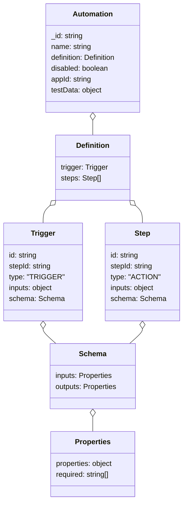

Sources: [packages/types/src/documents/app/automation/automation.ts:1-31](https://github.com/Budibase/budibase/blob/e981536b/packages/types/src/documents/app/automation/automation.ts#L1-L31). [packages/server/src/tests/utilities/structures.ts:214-305](https://github.com/Budibase/budibase/blob/e981536b/packages/server/src/tests/utilities/structures.ts#L214-L305). [packages/automations/tests/utilities/AutomationTestBuilder.ts:35-109](https://github.com/Budibase/budibase/blob/e981536b/packages/automations/tests/utilities/AutomationTestBuilder.ts#L35-L109).

### Trigger Types

Automations can be initiated by various trigger types:

| Trigger Type | Description | Event ID |
|--------------|-------------|----------|
| Row Created | Triggered when a new row is saved | `ROW_SAVE` |
| Row Updated | Triggered when a row is updated | `ROW_UPDATE` |
| Row Deleted | Triggered when a row is deleted | `ROW_DELETE` |
| Row Action | Triggered by a row action in the UI | `ROW_ACTION` |
| App Action | Triggered by an app action | `APP` |
| Webhook | Triggered by an external HTTP request | `WEBHOOK` |
| Cron | Triggered on a schedule | `CRON` |

Sources: [packages/server/src/automations/triggers.ts:32-59](https://github.com/Budibase/budibase/blob/e981536b/packages/server/src/automations/triggers.ts#L32-L59). [packages/builder/src/components/automation/AutomationPanel/AutomationPanel.svelte:1-172](https://github.com/Budibase/budibase/blob/e981536b/packages/builder/src/components/automation/AutomationPanel/AutomationPanel.svelte#L1-L172).

### Step Types

Steps represent actions performed during automation execution:

| Step Type | Description | Step ID |
|-----------|-------------|---------|
| Create Row | Creates a new row in a table | `CREATE_ROW` |
| Update Row | Updates an existing row | `UPDATE_ROW` |
| Delete Row | Deletes a row | `DELETE_ROW` |
| Query Rows | Queries rows from a table | `QUERY_ROWS` |
| Branch | Conditional logic to split execution path | `BRANCH` |
| Loop | Iterates over an array or string | `LOOP` |
| Execute Script | Runs JavaScript code | `EXECUTE_SCRIPT` or `EXECUTE_SCRIPT_V2` |
| Send Email | Sends an email | `SEND_EMAIL_SMTP` |
| Server Log | Logs a message to the server | `SERVER_LOG` |
| Collect | Returns data from the automation | `COLLECT` |

Sources: [packages/builder/src/components/automation/AutomationBuilder/FlowChart/ActionModal.svelte:25-122](https://github.com/Budibase/budibase/blob/e981536b/packages/builder/src/components/automation/AutomationBuilder/FlowChart/ActionModal.svelte#L25-L122). [packages/server/src/threads/automation.ts:410-436](https://github.com/Budibase/budibase/blob/e981536b/packages/server/src/threads/automation.ts#L410-L436).

## Execution Engine

The execution engine is responsible for running automations when they are triggered.

### Orchestrator

The core execution component is the `Orchestrator` class, which handles automation execution:

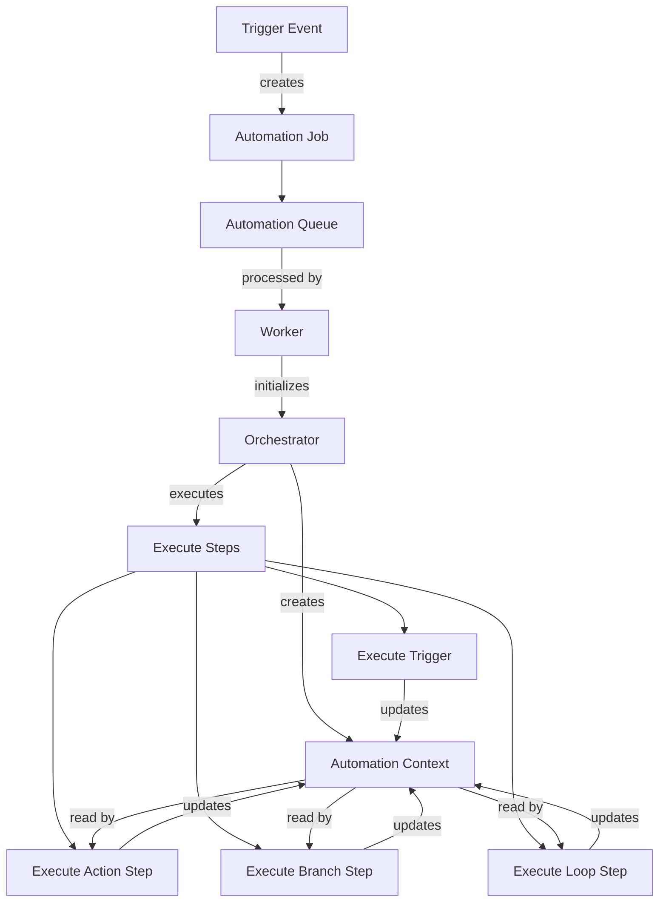

Sources: [packages/server/src/threads/automation.ts:206-591](https://github.com/Budibase/budibase/blob/e981536b/packages/server/src/threads/automation.ts#L206-L591). [packages/server/src/automations/utils.ts:38-92](https://github.com/Budibase/budibase/blob/e981536b/packages/server/src/automations/utils.ts#L38-L92).

### Step Execution Flow

```mermaid
sequenceDiagram
    participant Job as Automation Job
    participant Orchestrator as Orchestrator
    participant Trigger as Trigger Step
    participant Context as Context
    participant Step as Action Step
    participant Branch as Branch Step
    participant Loop as Loop Step
    
    Job->>Orchestrator: execute()
    
    Orchestrator->>Context: Initialize
    Orchestrator->>Trigger: Execute trigger
    Trigger->>Context: Populate with trigger data
    
    opt Normal Step
        Orchestrator->>Step: executeStep()
        Step->>Context: Read inputs
        Step->>Context: Write outputs
    end
    
    opt Branch Step
        Orchestrator->>Branch: executeBranchStep()
        Branch->>Context: Evaluate condition
        Branch->>Orchestrator: Execute branch children
    end
    
    opt Loop Step
        Orchestrator->>Loop: executeLoopStep()
        Loop->>Context: Get iterable data
        loop For each item
            Loop->>Context: Set current item
            Loop->>Step: Execute looped step
            Step->>Context: Write outputs
        end
    end
    
    Orchestrator->>Job: Return results
```

Sources: [packages/server/src/threads/automation.ts:375-590](https://github.com/Budibase/budibase/blob/e981536b/packages/server/src/threads/automation.ts#L375-L590). [packages/server/src/threads/automation.ts:87-98](https://github.com/Budibase/budibase/blob/e981536b/packages/server/src/threads/automation.ts#L87-L98).

### Context and Data Binding

The Automation Context is a central object that stores data during execution and enables data sharing between steps:

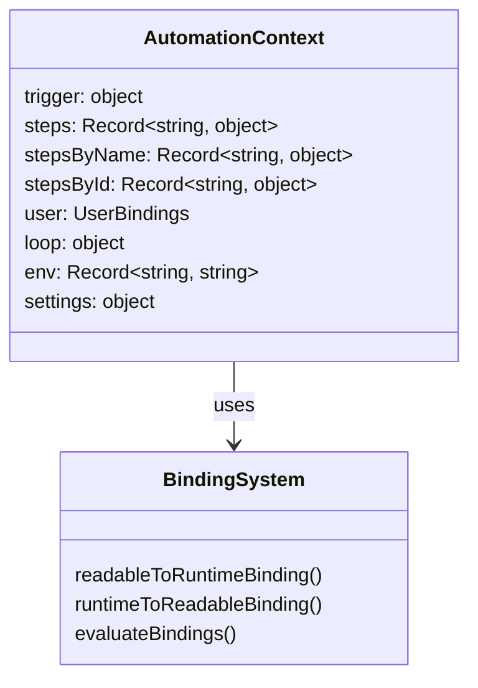

Steps read inputs from and write outputs to this context, with data bindings providing a way to reference values dynamically.

Sources: [packages/server/src/threads/automation.ts:180-193](https://github.com/Budibase/budibase/blob/e981536b/packages/server/src/threads/automation.ts#L180-L193). [packages/builder/src/components/automation/SetupPanel/RowSelector.svelte:62-70](https://github.com/Budibase/budibase/blob/e981536b/packages/builder/src/components/automation/SetupPanel/RowSelector.svelte#L62-L70).

## Triggering and Queueing

Automations are triggered by events in the system and executed asynchronously through a job queue.

### Trigger Process

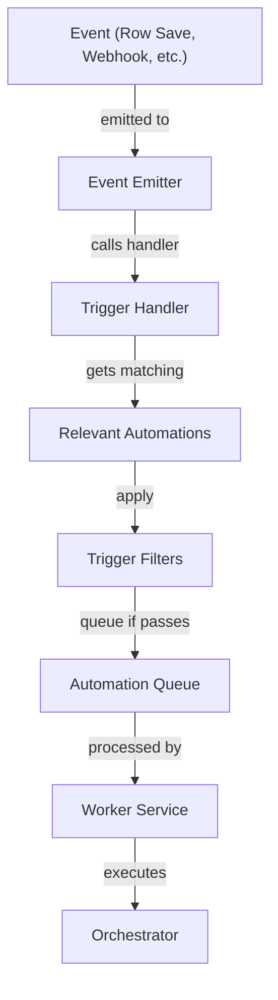

Sources: [packages/server/src/automations/triggers.ts:138-163](https://github.com/Budibase/budibase/blob/e981536b/packages/server/src/automations/triggers.ts#L138-L163). [packages/server/src/automations/utils.ts:38-92](https://github.com/Budibase/budibase/blob/e981536b/packages/server/src/automations/utils.ts#L38-L92).

### Filter Mechanism

Trigger filters allow automations to run only when specific conditions are met:

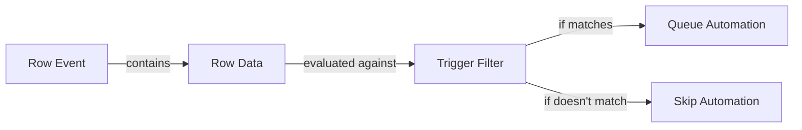

Filters can be configured in the automation builder to control when automations are triggered based on data conditions.

Sources: [packages/server/src/automations/triggers.ts:165-169](https://github.com/Budibase/budibase/blob/e981536b/packages/server/src/automations/triggers.ts#L165-L169). [packages/server/src/threads/automation.ts:141-178](https://github.com/Budibase/budibase/blob/e981536b/packages/server/src/threads/automation.ts#L141-L178).

## Builder Interface

The Automation Builder provides a visual interface for creating and configuring automations.

### UI Components

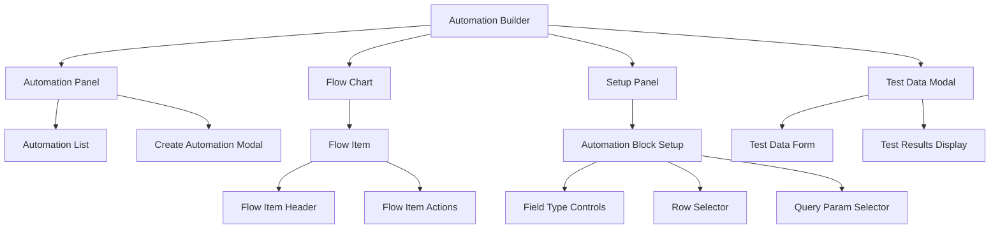

Sources: [packages/builder/src/components/automation/AutomationBuilder/FlowChart/FlowChart.svelte:1-349](https://github.com/Budibase/budibase/blob/e981536b/packages/builder/src/components/automation/AutomationBuilder/FlowChart/FlowChart.svelte#L1-L349). [packages/builder/src/components/automation/SetupPanel/AutomationBlockSetup.svelte:1-1146](https://github.com/Budibase/budibase/blob/e981536b/packages/builder/src/components/automation/SetupPanel/AutomationBlockSetup.svelte#L1-L1146). [packages/builder/src/components/automation/AutomationBuilder/FlowChart/TestDataModal.svelte:1-199](https://github.com/Budibase/budibase/blob/e981536b/packages/builder/src/components/automation/AutomationBuilder/FlowChart/TestDataModal.svelte#L1-L199).

### Automation Flow Example

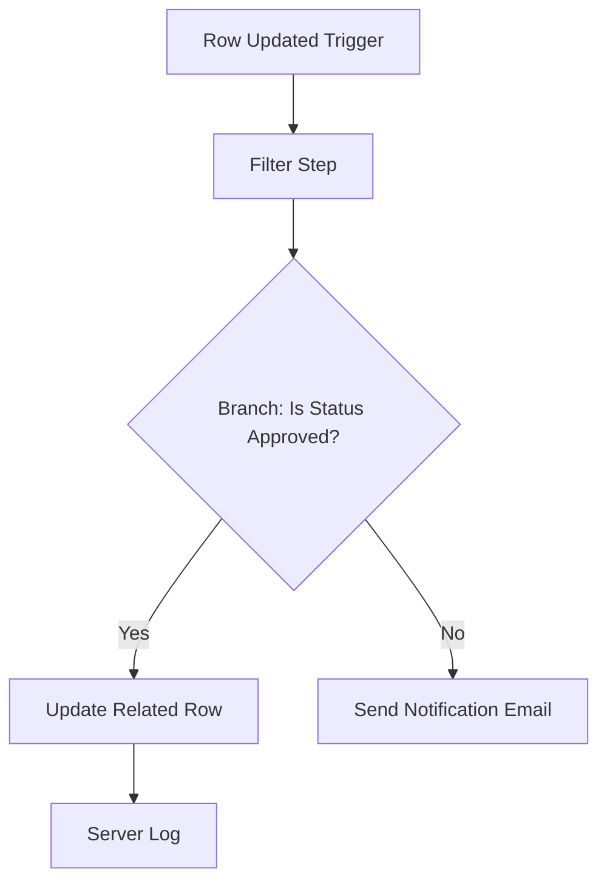

Sources: [packages/builder/src/components/automation/AutomationBuilder/FlowChart/FlowItem.svelte:1-339](https://github.com/Budibase/budibase/blob/e981536b/packages/builder/src/components/automation/AutomationBuilder/FlowChart/FlowItem.svelte#L1-L339). [packages/builder/src/components/automation/AutomationBuilder/FlowChart/ActionModal.svelte:1-289](https://github.com/Budibase/budibase/blob/e981536b/packages/builder/src/components/automation/AutomationBuilder/FlowChart/ActionModal.svelte#L1-L289).

## API Interface

The automation system exposes API endpoints for managing and triggering automations.

### Core Endpoints

| Method | Endpoint | Description |
|--------|----------|-------------|
| GET | `/api/automations` | Fetch all automations |
| GET | `/api/automations/:id` | Get a specific automation |
| POST | `/api/automations` | Create a new automation |
| PUT | `/api/automations` | Update an existing automation |
| DELETE | `/api/automations/:id` | Delete an automation |
| POST | `/api/automations/:id/trigger` | Trigger an automation |
| POST | `/api/automations/:id/test` | Test an automation |
| GET | `/api/automations/definitions/actions` | Get action definitions |
| GET | `/api/automations/definitions/triggers` | Get trigger definitions |
| GET | `/api/automations/logs` | Search automation logs |

Sources: [packages/server/src/api/controllers/automation.ts:1-262](https://github.com/Budibase/budibase/blob/e981536b/packages/server/src/api/controllers/automation.ts#L1-L262). [packages/server/src/sdk/app/automations/crud.ts:1-25](https://github.com/Budibase/budibase/blob/e981536b/packages/server/src/sdk/app/automations/crud.ts#L1-L25).

## Special Automation Types

### Looping Automations

The Loop step allows automations to iterate over collections of data:

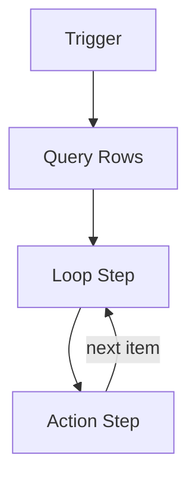

Loop configuration options:
- Array bindings (loop over array items)
- String bindings (split string and loop)
- Maximum iterations setting
- Failure condition setting

Sources: [packages/server/src/threads/automation.ts:50-98](https://github.com/Budibase/budibase/blob/e981536b/packages/server/src/threads/automation.ts#L50-L98). [packages/server/src/tests/utilities/structures.ts:247-305](https://github.com/Budibase/budibase/blob/e981536b/packages/server/src/tests/utilities/structures.ts#L247-L305).

### Branching Automations

The Branch step enables conditional logic in automations:

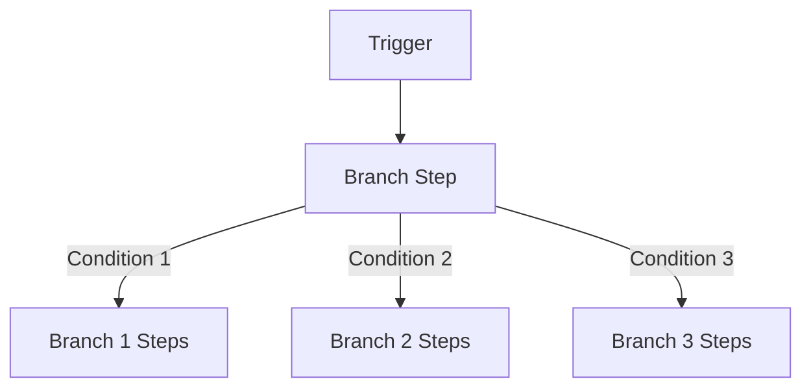

Branch steps evaluate conditions against the automation context and execute the corresponding branch's steps if the condition is met.

Sources: [packages/server/src/threads/automation.ts:141-178](https://github.com/Budibase/budibase/blob/e981536b/packages/server/src/threads/automation.ts#L141-L178). [packages/server/src/threads/automation.ts:504-527](https://github.com/Budibase/budibase/blob/e981536b/packages/server/src/threads/automation.ts#L504-L527).

## Testing Automations

The system provides functionality to test automations directly in the builder:

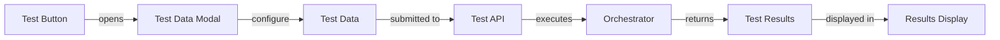

Test execution runs the automation with the provided test data without requiring an actual trigger event, allowing developers to verify automation logic during development.

Sources: [packages/builder/src/components/automation/AutomationBuilder/FlowChart/TestDataModal.svelte:1-199](https://github.com/Budibase/budibase/blob/e981536b/packages/builder/src/components/automation/AutomationBuilder/FlowChart/TestDataModal.svelte#L1-L199). [packages/server/src/api/controllers/automation.ts:229-262](https://github.com/Budibase/budibase/blob/e981536b/packages/server/src/api/controllers/automation.ts#L229-L262).

## Debugging and Logging

Automations include built-in logging and debugging capabilities:

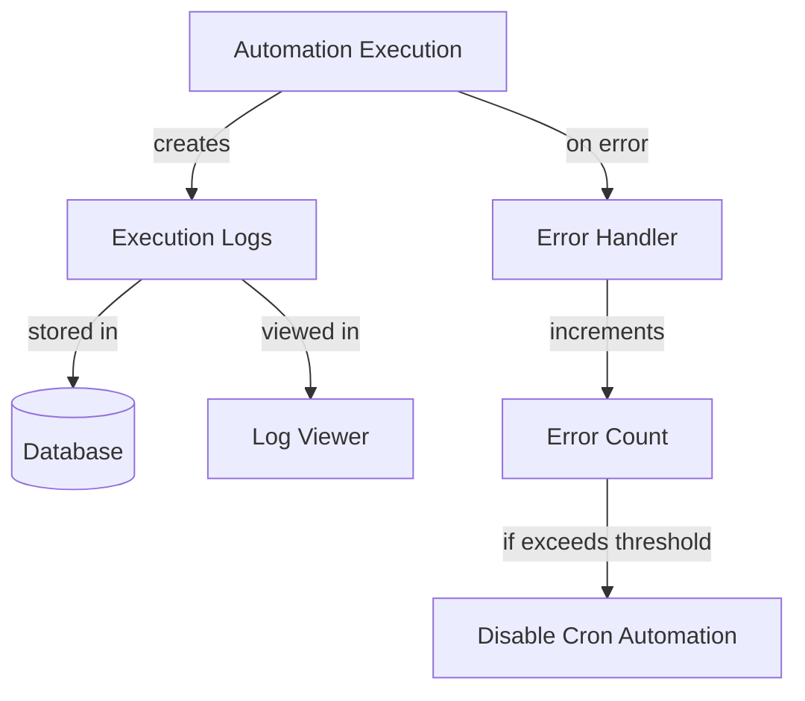

For debugging automations, the system offers:
- Step-by-step execution logs
- Error tracking and reporting
- Test execution with custom data
- Server log action for adding custom log points

Sources: [packages/server/src/threads/automation.ts:254-290](https://github.com/Budibase/budibase/blob/e981536b/packages/server/src/threads/automation.ts#L254-L290). [packages/server/src/automations/utils.ts:94-113](https://github.com/Budibase/budibase/blob/e981536b/packages/server/src/automations/utils.ts#L94-L113).

## Conclusion

The Automation System in Budibase provides a powerful framework for creating automated workflows. It combines a user-friendly visual builder with a robust execution engine, offering a wide range of triggers and actions to automate business processes.