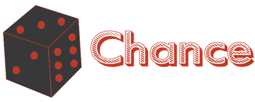
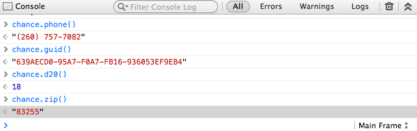

# 

**Chance** is a minimalist generator of random <a href="#true-random">[1]</a>
strings, numbers, etc. to help reduce some monotony particularly while writing
automated tests or anywhere else you need anything random.

**Chance** is open source software and is released under the developer and
business-friendly [MIT License](http://en.wikipedia.org/wiki/MIT_License)

**Chance** is loaded on this site so you can just open the console on your
browser and play!

<a class="twitter-share-button"
    href="https://twitter.com/share"
    data-size="large"
    data-text="Chance - Utility library to generate random things for JavaScript"
    data-hashtags="chancejs,javascript"
    data-url="http://chancejs.com/"
    data-count="horizontal"
    data-via="victorquinn">
    Tweet
</a>

<iframe src="https://ghbtns.com/github-btn.html?user=chancejs&repo=chancejs&type=star&count=true" allowtransparency="true" frameborder="0" scrolling="0" width="170px" height="20px"></iframe>

Written by [Victor Quinn](https://www.victorquinn.com)

<ul class=downloads>
    <li>
      <a href="chance.js" class="download" download="chance.js">chance.js (for development)</a>
      - <i>95KB uncompressed</i>
    </li>
    <li>
      <a href="chance.min.js" class="download">chance.min.js (for production)</a>
      – <i>55KB, 17KB when gzipped</i>
    </li>
  </ul>

Or move on to the [Usage](usage/bower.md) section for many other ways to get and use Chance.

## Acknowledgements & Thanks

Thank you to [Sean McCullough](https://github.com/banksean) for your [Mersenne Twister gist](https://gist.github.com/banksean/300494) on which almost the entirety of this library is dependent. And to Takuji Nishimura and Makoto Matsumoto who wrote the original C version on which Sean's JavaScript gist is based.

And of course a monster thank you to all of the [Contributors](https://github.com/chancejs/chancejs/graphs/contributors) to this project!

<small>© 2013 [Victor Quinn](https://www.victorquinn.com)
Chance and this documentation are released under the terms of the [MIT license](http://opensource.org/licenses/MIT).</small>

<a id="true-random">[1]</a> Of course true mathematicians out there would say that this ought to be considered as only generating pseudo-random things, not true random. For that we'd need some external entropy, not depending on a Mersenne Twister, blah, blah, blah. However, for most practical uses of this library for which it was created and intended, such as generating random names and addresses for automated tests, our random is good enough. But it should probably NOT be used for any cryptographic applications requiring true-random. See [Wikipedia's article](http://vq.io/12hBd84) for more info.

